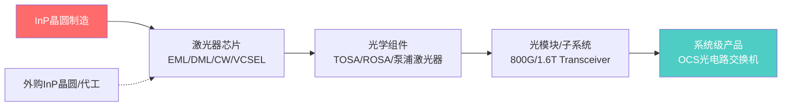
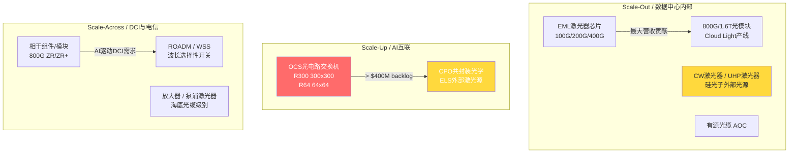

# Lumentum Holdings Inc. (NASDAQ: LITE) 深度调研报告

> 更新日期: 2026-05-12 | 股价: ~$1,053 | 市值: ~$75B

---

## 一、公司基本概况

### 1.1 公司简介

Lumentum Holdings Inc. 是全球领先的光学和光子学产品设计与制造商，总部位于加州圣何塞。公司2015年从 JDS Uniphase (JDSU) 分拆独立上市，经过近十年发展，已成为AI基础设施光互联领域最核心的供应商之一。

- **股票代码**: NASDAQ: LITE
- **成立**: 2015年 (继承自JDSU近50年光子学积累)
- **CEO**: Michael Hurlston
- **员工**: 全球R&D、制造、销售网络
- **纳入标普500**: 2026年3月

### 1.2 商业模式

Lumentum 的商业模式是 **垂直整合的光学平台**，覆盖从芯片（InP磷化铟晶圆）到组件再到子系统的完整价值链：

核心价值主张：**数据中心带宽每比特功耗持续下降要求更多光子学内容（Photonics Intensity）**，Lumentum是少数拥有完整InP光子集成能力的供应商。

### 1.3 关键并购历程

| 时间      | 标的                     | 战略意义                                      |
| ------- | ---------------------- | ----------------------------------------- |
| 2018    | Oclaro                 | 扩展激光器制造和晶圆厂能力                             |
| 2022.08 | NeoPhotonics           | 增加相干光学组件和InP平台能力                          |
| 2022.08 | IPG Photonics电信产品线     | 补充电信传输产品组合                                |
| 2023.11 | Cloud Light Technology | 进入数据中心光模块直接供应（从组件商升级为模块商），获得Google等超大规模客户 |

Cloud Light 收购是一个重要转折点——Lumentum 从只卖激光器芯片给光模块厂商（如Coherent、Innolight），变为自己也做光模块，直接卖给超大规模云客户，但也因此产生了与传统客户的渠道冲突。

### 1.4 竞争格局

Lumentum 在光学网络领域的竞争版图：

| 层级 | 主要玩家 | 与LITE关系 |
|------|---------|-----------|
| **InP激光器芯片** | Lumentum, Broadcom, Mitsubishi | LITE自称全球最大100G/200G EML供应商 |
| **光模块** | Coherent (COHR), 中际旭创(Innolight), Lumentum | LITE是后来者（2023年才进入），体量小于COHR和旭创 |
| **OCS光电路交换** | Lumentum (主导), Calient (私有), Google (自研) | LITE先发优势明显 |
| **相干光学** | Ciena, Lumentum, Marvell, Coherent | LITE在相干组件端有优势 |
| **CPO共封装光学** | Lumentum, Marvell, Broadcom, Coherent | 多家赛跑，LITE外部激光源(ELS)方案突出 |

核心竞争对手：
- **Coherent Corp. (COHR)**: 最直接的peer，也是垂直整合InP+光模块，目前是光模块出货量第一
- **中际旭创 (300308.SZ)**: 全球光模块出货量最大厂商，成本优势明显
- **Ciena (CIEN)**: 光网络系统级竞争对手
- **Fabrinet (FN)**: 代工商，关系复杂——历史上帮LITE代工，但随着LITE自建组装能力，关系趋于微妙

---

## 二、财务数据分析

### 2.1 收入趋势（季频）

| 季度 | 总营收 ($M) | 环比 | 同比 | Cloud & Networking | Industrial Tech |
|------|-----------|------|------|--------------------|-----------------|
| **FY2025 Q1** (Sep 2024) | 336.9 | - | - | 282.3 | 54.6 |
| **FY2025 Q2** (Dec 2024) | 402.2 | +19% | - | - | - |
| **FY2025 Q3** (Mar 2025) | 425.2 | +6% | +16% | 365.2 | 60.0 |
| **FY2025 Q4** (Jun 2025) | 480.7 | +13% | +56% | 424.1 | 56.6 |
| **FY2026 Q1** (Sep 2025) | 533.8 | +11% | +58% | - | - |
| **FY2026 Q2** (Dec 2025) | 665.5 | +25% | +65% | - | - |
| **FY2026 Q3** (Mar 2026) | **808.4** | **+21%** | **+90%** | - | - |
| **FY2026 Q4E** (Jun 2026) | **~985** | +22% | +105% | - | - |

**全年数据**：
- FY2024: $1,359.2M
- FY2025: $1,645.0M (+21.0%)
- FY2026E: ~$3.0B (以Q1-Q3已实现 $2,007.7M + Q4指引中位 $985M 推算，约 $2,993M，**同比+82%**)

### 2.2 利润率趋势（Non-GAAP）

| 季度 | Non-GAAP Gross Margin | Non-GAAP Operating Margin | Non-GAAP EPS |
|------|----------------------|---------------------------|--------------|
| FY2025 Q1 | 32.8% | 3.0% | $0.18 |
| FY2025 Q2 | 32.3% | 7.9% | $0.42 |
| FY2025 Q3 | 35.2% | 10.8% | $0.57 |
| FY2025 Q4 | 37.8% | 15.0% | $0.88 |
| FY2026 Q1 | 39.4% | 18.7% | $1.10 |
| FY2026 Q2 | 42.5% | 25.2% | $1.67 |
| FY2026 Q3 | **47.9%** | **32.2%** | **$2.37** |
| FY2026 Q4E | ~48-50%* | 35.0-36.0% | $2.85-3.05 |

> *Q4毛利率为推测值，指引仅给出OM和EPS

**核心趋势：毛利率和运营利润率同步快速扩张**，FY2026 Q3比FY2025 Q1毛利率扩张了15个百分点，运营利润率扩张了29个百分点。驱动因素：
1. 产能利用率大幅提升（从FY2023-2024的低谷回升）
2. 产品组合向高毛利的数通激光芯片倾斜
3. 部分产品实现提价（供需紧张下的议价能力）
4. 规模效应——营收增长远超费用增长（Q3 OpEx仅占营收15.6%）

### 2.3 资产负债表（截至FY2026 Q3: Mar 28, 2026）

| 项目 | 金额 ($M) | 备注 |
|------|-----------|------|
| **现金及等价物** | 2,617.8 | QoQ +$1,960M，主要是NVIDIA $2B投资 |
| 短期投资 | 554.5 | |
| **现金+短期投资** | **3,172.3** | 历史最高 |
| 应收账款 | ~388 | |
| 存货 | 632.8 | 为支撑增长主动增加 |
| 总流动资产 | ~4,300+ | |
| PP&E (净值) | ~860 | |
| 商誉+无形资产 | ~1,450 | Cloud Light / NeoPhotonics 并购产生 |
| **总资产** | **~6,500** | |
| | | |
| 应付账款 | 392.7 | |
| **流动负债中长期债务** | 3,238.6 | 可转债因触发转换条款重分类为流动 |
| 总流动负债 | 3,865.3 | |
| 长期债务 | 43.2 | 大部分已重分类至流动 |
| **总负债** | **4,054.5** | |
| **股东权益** | **~2,400+** | NVIDIA优先股计入权益 |
| | | |
| **总债务** | ~3,282 | 主要为可转债 |
| **净现金** | 负 (~110M) | 但含可转债的特殊性 |

**债务结构特别说明**：Lumentum 的 ~$3.3B 债务主要是三批可转换票据（Convertible Notes），因为股价大幅上涨触发转股条件，根据会计准则全部重分类为流动负债。但实际的合同到期日分布在2026-2029年，且转股权在持有人手中。**NVIDIA的$2B投资（优先股，转股价$695.31）已大幅改善了资本结构**。

关键偿债指标（NVIDIA投资后）：
- 总债务/权益: ~0.06（改善显著，因权益端大幅增加）
- 流动比率: ~1.1
- 运营现金流（9M FY2026）: $388.4M
- CapEx (Q3 FY2026): $125M（产能扩张高峰期）

---

## 三、核心业务拆分

### 3.1 Cloud & Networking (~88%收入) — AI时代的核心引擎

该板块覆盖三类产品：

**关键产品要点**：

| 产品线 | 市场定位 | Q3 FY2026趋势 |
|-------|---------|--------------|
| **EML激光器** (100G/200G/400G) | 全球最大供应商，产量自FY2023增长8倍 | Components营收 $533M (+20% QoQ, +77% YoY) |
| **UHP/SHP激光器** (400mW→800mW) | CPO和硅光子ELS方案核心，多亿美元采购订单 | 连续9季度增长，+120% YoY |
| **光模块** (800G出货/1.6T即将量产出货) | 3家超大规模客户，泰国工厂扩产 | 计入Systems营收 (+24% QoQ, +121% YoY) |
| **OCS光电路交换机** (R300/R64) | MEMS方案市占率领先，backlog >$400M | 从FY2026 H2开始大量交付， >$400M backlog待消化 |
| **CPO外部激光源** | 多亿美元PO，2027 H1开始交付 | 即将进入revenue阶段 |
| **800G ZR+ / L-band模块** | DCI和城域/长途传输 | 受益AI数据中心互联需求 |

**按产品类型收入拆分（Q3 FY2026）**：

| 类型 | 收入 ($M) | 占比 | QoQ | YoY |
|------|-----------|------|-----|-----|
| **Components** | 533.3 | 66% | +20% | +77% |
| **Systems** | 275.1 | 34% | +24% | +121% |
| **合计** | **808.4** | 100% | +21.5% | +90.1% |

管理层表示 Components **"未来可见期内实际上已售罄"**，公司正在与客户锁定长期协议。Systems增长主要由Cloud Light光模块业务和OCS交付驱动。

### 3.2 Industrial Tech (~12%收入) — 现金牛但增长有限

| 细分 | 产品 | 终端 |
|------|------|------|
| **3D Sensing** | VCSEL激光器 | 消费电子（Apple Face ID等） |
| **工业激光** | 短脉冲固体激光器、千瓦级光纤激光器、气体激光器 | 半导体制造、PCB加工、EV电池焊接 |
| **先进制造应用** | FemtoBlade激光器 | 薄膜加工、先进显示、芯片封装 |

FY2025全年该板块营收 $234.2M，同比 -14.6%。受工业宏观周期疲软影响，FY2026预计保持平稳。**该板块已从公司估值核心驱动变为次要业务**。

---

## 四、近期催化剂

### 4.1 NVIDIA战略合作（2026年3月2日公告）—— 历史级催化剂

NVIDIA与Lumentum签署**多年期战略合作协议**，内容包括：
- **NVIDIA $2B直接投资**：以$695.31/股购买约288万股A系列可转换优先股（1:1转普通股），资金用于美国本土制造扩产和R&D
- **数十亿美元采购承诺**：锁定先进激光器组件长期供应
- **未来产能访问权**：保障NVIDIA在AI光学互联领域的供应安全
- **联合R&D**：下一代数据中心光学和硅光子技术

**战略意义**：这本质上是NVIDIA对AI基础设施供应链的"对冲"——光模块和激光器正在成为GPU集群规模化的瓶颈，NVIDIA用实际行动锁定最稀缺的InP光子学产能。

### 4.2 S&P 500加入（2026年3月）

2026年3月10日宣布加入标普500指数，3月23日正式交易。纳入后：
- 被动指数基金强制买入（约$5-8B增量资金估算）
- 提升机构关注度和研究覆盖
- 94%浮存已由机构持有，纳入后进一步提升

### 4.3 产品周期与产能扩张

| 催化剂 | 时间 | 预期影响 |
|-------|------|---------|
| **1.6T光模块量产出货** | FY2026 Q4 (2026年夏) | Systems收入高增长，部分含自有CW激光器，毛利率改善 |
| **400G/lane EML (支持3.2T)** | FY2026-2027 | 复用现有InP平台，ASP更高，巩固EML龙头地位 |
| **OCS $400M+ backlog交付** | FY2026 H2 | 系统收入新支柱，MEMS架构利润率极高 |
| **CPO多亿美元PO执行** | FY2027 H1交付 | 新收入来源，ELS模式锁定硅光子客户 |
| **800mW SHP激光器** | 2026 OFC展示 | 下一代CPO光引擎更高的光功率需求 |
| **第五座InP晶圆厂 (Greensboro, NC)** | 2028年量产 | 收购Qorvo现有工厂（棕地），主攻UHP产能，大幅扩展美国制造能力 |
| **泰国工厂扩产** | 持续推进 | 光模块组装产能，规避关税风险 |

### 4.4 管理层给的远期目标

在2026年3月的分析师活动日上，管理层给出了非常激进的目标：
- **近期**：季度营收 $1.25B，运营利润率 ~35%（注：Q4 FY2026指引已接近此目标）
- **中期**：季度营收 $2B，Non-GAAP运营利润率 ~40%
- FY2025 OFC Investor Briefing给出的远景：年营收 >$3B，运营利润率 >20%（已经达成/超越）

---

## 五、估值分析

### 5.1 当前估值水平（2026年5月12日前后）

| 指标 | 数值 | 备注 |
|------|------|------|
| 股价 | ~$1,053 | 5/11收盘价，当日+16.5% |
| 52周范围 | $60.38 - $1,073.33 | 区间涨幅 >17x |
| 过去12个月涨幅 | ~1,500% | |
| YTD 2026涨幅 | ~140% | |
| 市值 | ~$75B | |
| 企业价值(EV) | ~$72B | |
| | | |
| **Trailing P/E (GAAP)** | ~525x | FY2025 GAAP EPS $0.37上基础上 |
| **Trailing P/E (Non-GAAP)** | ~510x | FY2025 Non-GAAP EPS $2.06基础上 |
| **NTM P/E (Forward)** | **~70-80x** | 基于FY2026E EPS ~$6-7 |
| **P/S (TTM)** | ~30x | |
| **EV/EBITDA (TTM)** | ~242x | |
| **P/B** | ~30x | |

### 5.2 按FY2026 Q3年化推算Forward估值

如果按Q3 FY2026 Non-GAAP年化（激进假设）：

- 年化 EPS: $2.37 × 4 = $9.48
- Forward P/E: $1,053 / $9.48 = **111x**
- 但如果计入Q4指引（$2.85-3.05），H2年化更高

基于实际分析一致预期（FY2026全年 Non-GAAP EPS ~$7-8）：
- Forward P/E: $1,053 / $7.50 ≈ **140x**

### 5.3 同业估值对比

| 公司 | Ticker | 市值 ($B) | Forward P/E | EV/Revenue (LTM) | 营收增速 (LTM) | 运营利润率 |
|------|--------|-----------|-------------|------------------|---------------|-----------|
| **Lumentum** | LITE | ~75 | **~70-140x** | ~25-30x | ~50-90% | ~21% GAAP / 32% Non-GAAP |
| Coherent | COHR | ~44 | ~36x | ~10-12x | ~23% | ~18% |
| Ciena | CIEN | ~72 | ~45x | ~14x | ~20%+ | ~15% |
| Fabrinet | FN | ~15 | ~22x | ~3x | ~15% | ~11% |
| Arista Networks | ANET | ~206 | ~59x | ~23x | ~25% | ~40%+ |
| 中际旭创 | 300308 | ~125 (¥900B) | ~84x | ~24x | ~50%+ | ~25%+ |

**核心发现**：
- Lumentum 在AI光通信组中获得了**最高的估值溢价**，Forward P/E显著高于Coherent（最直接的peer）
- 溢价来源：更快的营收增速（90% vs Coherent 23%）、更高的毛利率扩张斜率、OCS/CPO等独占性增长期权
- 但 Lumentum 的Forward P/E已经接近甚至超过Arista（有40%+运营利润率的成熟AI网络龙头）
- **估值已将2027-2028年的完美执行大部分定价**

### 5.4 历史估值区间

| 时期 | P/E (TTM GAAP) | EV/Sales | 背景 |
|------|---------------|----------|------|
| FY2023 | 负值 (亏损) | ~2x | 行业下行周期，工业+电信双杀 |
| FY2024 | 负值 (亏损) | ~3x | 开始复苏，Cloud Light并表 |
| FY2025 H1 | ~200-500x | ~8-10x | AI需求爆发，收入加速 |
| FY2025 Q3 (当前) | ~525x | ~30x | NVIDIA投资+S&P 500+AII叙事顶峰 |

从历史均值看，Lumentum在"正常"年份（FY2017-2019）的P/E在15-25x，EV/Sales在2-4x。当前估值已完全脱离历史框架，反映市场将其视为**AI基础设施平台**而非传统周期光组件公司。

### 5.5 DCF参考

多个独立模型给出的内在价值估算：
- 2025年11月（OpportunityCosts Substack）：内在价值 ~$126/股（股价 $242，**高估92%**）
- 2025年12月（Simply Wall St）：内在价值 ~$234/股（股价 $370，**高估41%**）
- 2026年3月（Atlas Peak Research）：分析师目标价中值 $622，均值 $670（股价 $558，**低估10-20%**）
- 2026年5月（Alpha Spread）：同行倍数法估值 ~$116/股（股价 $894，**高估87%**）

**注意**：大多数DCF模型在2025年下半年撰写，当时的营收增速预期远低于后来实际实现的90%增速。Q3 FY2026（May 2026）的超强业绩大幅上调了增长曲线。

---

## 六、风险因素

### 6.1 CRITICAL 级别风险

**1. 估值极端化 —— 已定价完美执行**

当前Lumentum市值 ~$75B，对应FY2026全年营收约$3B（~25x P/S）。相比之下：
- Coherent 市值为$44B，营收 $5B+（~9x P/S）
- 中际旭创 市值约$125B，但营收 $8B+

即使假设FY2027营收翻倍至$6B（激进乐观），当前估值仍为 ~12.5x Forward P/S——这在光通信硬件历史上是**闻所未闻**的水平。任何季度miss都可能导致30-50%级别回调。

**2. 客户集中度 —— "砍掉"小客户的代价**

管理层明确表示因为供不应求，正在"砍掉"小客户以集中服务2-3家超大规模云厂商和NVIDIA。这意味着：
- 营收高度依赖少数客户的CapEx周期
- 如果某一家大客户暂停部署（哪怕一个季度），会留下"收入空洞"
- FY2023-2024的低谷期部分原因正是大客户去库存

**3. 供应瓶颈 —— 成也稀缺，败也稀缺**

Q1 FY2026管理层指出存在25-30%的供应缺口（demand far exceeding supply）。虽然这带来了定价权，但也意味着：
- 实际的营收增长被产能上限锁死
- 如果竞争对手（Coherent、Broadcom、旭创）更快扩产，Lumentum的市场份额可能见顶
- 泰国工厂和Greensboro工厂的爬坡必须完美执行

### 6.2 HIGH 级别风险

**4. 竞争加剧**

所有主要对手都在疯狂扩产：
- Coherent：InP + 光模块同样垂直整合，2025年底也有大规模产能扩张
- 中际旭创：成本结构更低，在1.6T模块上出货速度可能快于Lumentum
- Broadcom/Marvell：虽然不是纯激光器厂，但在CPO市场上是强大的系统级对手
- Google自研OCS尚不确定会否外溢或自用

**5. 关税与地缘政治**

Lumentum在FY2025 Q4指引中明确提到**关税带来100bps的毛利率逆风**，主要是运往美国目的地的物料成本和关税。FY2026的营收爆发很大程度来自泰国工厂和中国境外产能——但中美贸易政策仍是不确定因素。

**6. 可转债稀释风险**

~$3.3B的可转债大多已触发转股条件（因股价远超转换价130%门槛）。如果全部转股，将显著稀释现有股东。管理层在分析师日没有给出清晰的稀释管理方案。

### 6.3 MEDIUM 级别风险

**7. 行业周期性**

光通信历史上是高度周期性的行业，受电信和数据中心CapEx周期驱动。虽然当前AI叙事"这次不一样"，但Seeking Alpha等多位分析师警告不可忽视下行周期。

**8. 量产爬坡执行风险**

五大增长引擎同时爬坡（EML扩产、1.6T模块、OCS交付、CPO准备、UHP/SHP激光器），再加上新晶圆厂建设——管理层的执行带宽被拉到极限。

**9. 高空头头寸**

空头头寸约16%（历史上较高水平），如果出现任何预期差，空头回补的"踩踏"会双向放大波动。

---

## 七、投资结论

### 7.1 核心投资逻辑

**多头论点 (Bull Case)**：
1. Lumentum是**AI基础设施最稀缺层级的核心供应商**——InP磷化铟激光器的供需缺口可能持续到2028年
2. 公司正在从"组件供应商"升级为"光学系统平台"，**TAM从 $10B扩展到 $30B+**
3. **NVIDIA的$2B战略投资是"盖章认证"**——全球最懂AI基础设施的公司用真金白银投票
4. 财务模型展示**罕见的Operating Leverage**：营收+90%时运营利润率从3%扩张到32%，未来向40%推进
5. **OCS和CPO是两个尚未被定价的增长期权**：OCS backlog>$400M，CPO多亿美元PO
6. Q4 FY2026指引（$985M中位/35-36% OM）意味着**增长远未见顶**

**空头论点 (Bear Case)**：
1. **估值极度膨胀**——Forward P/E 100x+、P/S 25-30x，已将2028年的增长大部分折现
2. 即使管理层$2B季度营收/40% OM的目标实现（FY2028-2029），当前估值也不便宜（$8B年利润 × 25x P/E = $200B市值，仅2.7x upside）
3. **"砍掉小客户"意味着极高集中度**——当大客户完成部署周期，收入断崖风险巨大
4. 所有竞争者也都在扩产，**供需缺口可能在2027-2028年收窄**，届时定价权消退
5. 光通信历史上从不缺少"这次不一样"的叙事，但**周期总是回来**
6. $3.3B可转债+空头16% = **高波动性双重风险**

### 7.2 合理估值区间测算

基于不同情景：

| 情景 | FY2027E Revenue | FY2027E Non-GAAP OM | FY2027E Non-GAAP EPS | 适用P/E | 目标股价 | vs 当前 |
|------|----------------|---------------------|---------------------|---------|---------|--------|
| **极度悲观** (AI CapEx骤停，竞争加剧) | $2.5B | 15% | ~$4.00 | 20x (周期均值) | **$80** | -92% |
| **悲观** (增速放缓，份额流失) | $3.5B | 22% | ~$8.00 | 25x | **$200** | -81% |
| **基准** (稳健增长，正常竞争) | $4.5B | 30% | ~$12.00 | 30x | **$360** | -66% |
| **乐观** (持续超预期，OCS/CPO规模化) | $5.5B | 35% | ~$18.00 | 35x | **$630** | -40% |
| **极度乐观** (管理层$2B季度目标完全实现) | $7.0B | 40% | ~$26.00 | 40x | **$1,040** | -1% |

**我的判断**：

Lumentum是一家**卓越的公司**，处于**AI基础设施最关键的瓶颈位置**，管理层执行力和战略眼光出色。但**当前股价已基本定价了中度乐观到极度乐观情景之间的一切**。

- **基本面评级: A** — 产品矩阵、竞争壁垒、增长动能均属顶级
- **估值评级: D-** — 在当前估值下，即使是乐观情景也只提供有限的上行空间，而任何低于完美的情况都会带来巨幅下行
- **综合评级: Hold (持有)** — 如果已持有，继续持有享受AI顺风（设置止损）；如果未持有，**等待一个更好的进场点**（例如Q4 FY2026若出现"sell the news"回调至$600-700区间）

### 7.3 关键监控指标

持续跟踪以下信号以判断多空转折：
1. **季度营收增速**：若从90%+减速至50%以下，警惕
2. **Non-GAAP毛利率**：若连续两季停滞或下降，peer产能可能已释放
3. **OCS backlog消化进度**：> $400M需在FY2026 H2实现，若延迟则估值承压
4. **大型云厂商CapEx指引**：Google/Microsoft/Meta的AI基础设施开支是LITE的核心先行指标
5. **Coherent业绩**：作为最直接peer，COHR的指引是对LITE叙事的验证/证伪
6. **Greensboro工厂进展**：2028年量产，期间的执行风险
7. **可转债转换进度**：稀释影响

---

## 附录：关键数据速查

| 项目 | 数值 |
|------|------|
| 当前股价 (May 11, 2026) | $1,053.09 |
| 52周最低 | $60.38 |
| 52周最高 | $1,073.33 |
| 过去12月涨幅 | ~1,500% |
| YTD 2026 涨幅 | ~140% |
| 市值 | ~$75B |
| 流通股数 | ~71.4M (不含优先股转换) |
| Beta | 1.53 |
| 空头比例 | ~16% |
| FY2025全年营收 | $1.645B |
| FY2026E全年营收 | ~$3.0B |
| FY2026 Q3 Non-GAAP EPS | $2.37 |
| FY2026 Q4E Non-GAAP EPS | $2.85-3.05 |

---

> **免责声明**: 本报告仅供研究参考，不构成任何投资建议。作者可能持有或不持有LITE仓位。数据截至2026年5月12日。股票历史表现不代表未来收益。光通信行业具有高度周期性和波动性，投资需谨慎。