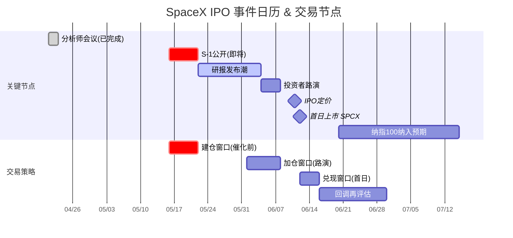

# SpaceX IPO 与太空经济板块调研

> 更新于 2026-05-16 · 聚焦 SpaceX IPO 事件驱动 + 太空经济各板块龙头速览

---

## 核心结论

**SpaceX IPO 已确认，时间表加速至 6/12。这是人类历史上最大 IPO（$75B / $1.75T），将重塑全球太空板块估值体系。短期最直接受益：DXYZ/BPTRX（已有敞口）、RKLB（唯一纯发射替代标的）、LUNR（基础设施对标）。风险在于 $1.75T 估值对应 110× PS，需要 Starlink 增长不减速 + Starship 不炸 + Musk 不出事。**

- 🔥 **IPO 时间表已锁定**：S-1 公开 5/20 前后 → 路演 6/4 → 定价 6/11 → 上市 6/12（Nasdaq: SPCX）
- 🔥 **估值争议巨大**：$1.75T 对应 Starlink $11.4B 收入 ≈ 150× PS，但 63% EBITDA margin + 10M 订阅用户增长迅猛
- 🔥 **催化链清晰**：IPO 前 S-1 公开（5/20）→ 分析师研报潮（6月初）→ 路演定价（6/11）→ 首日交易（6/12）→ 纳指100纳入

---

## Part 1: SpaceX IPO 传闻核实

### 1.1 时间表（已确认，非传闻）

| 节点 | 日期 | 状态 |
|:---|:---|:---|
| 合并 xAI | 2026年2月 | ✅ 已完成 |
| 机密 S-1 提交 SEC | 2026年4月1日 | ✅ 已确认 (CNBC, Reuters) |
| 分析师会议 (Wall Street teach-in) | 2026年4月21-23日 | ✅ 已完成 |
| **公开 S-1 发布** | **2026年5月15-22日** | ⏳ 本周/下周 |
| 投资者路演 | 2026年6月4-8日 | 📅 待启动 |
| IPO 定价 | 2026年6月11日 | 📅 待定价 |
| **首日上市 (Nasdaq)** | **2026年6月12日** | 🎯 目标日 |

> Reuters 5/15 独家：SEC 审查速度快于预期，时间表从原定 6 月下旬提前至 6/12。Musk 2025年12月确认 IPO 报道"准确"(accurate)。

### 1.2 IPO 核心参数

| 指标 | 数据 | 对比 |
|:---|:---|:---|
| 目标估值 | **$1.75万亿** | 沙特阿美 2019 IPO 估值 $1.7T |
| 募资额 | **$500-750亿** | 沙特阿美 $294亿 (历史纪录) |
| 预计股价 | **$525-530/股** | — |
| 交易代码 | **SPCX** (Nasdaq) | — |
| 散户配售 | **30%**（约 $225亿） | 远超行业惯例 ~10% |
| 主承销商 | Morgan Stanley, BofA, Citi, JPMorgan, Goldman | 16家副承销商 |

### 1.3 估值拆解

```
SpaceX $1.75T 估值 = Starlink (~$1.4T) + 发射服务 (~$200B) + xAI/其他 (~$150B)
```

**Starlink 是估值核心**（占 ~80%）：

| Starlink 关键指标 | 2025实际 | 2026预测 |
|:---|:---|:---|
| 订阅用户 | 10M+ (2026年2月) | 16.8M |
| 收入 | $11.4B | $15.9B |
| EBITDA | $7.2B (63% margin) | ~$11B |
| 自由现金流 | — | ~$8.1B (pro forma) |

**估值合理性两面看**：
- 🟢 牛市逻辑：63% EBITDA margin 碾压传统电信 (平均 38%)，用户年增 100%+，Starshield 国防合同未定价，Starship 打开深空经济
- 🔴 熊市逻辑：$1.75T / $11.4B = **153× 2025 PS**，即便按 2026 预估 $15.9B 也是 110× PS。NVIDIA 巅峰时才 ~40× PS

### 1.4 关键风险矩阵

| 风险 | 严重度 | 说明 |
|:---|:---|:---|
| **SEC 审查 / CFIUS** | 🔴 高 | xAI 合并的披露要求 + Musk 与 SEC 的对抗历史 |
| **Musk 政治风险** | 🔴 高 | Musk 与特朗普政府的关系、DOGE 角色引发争议，可能影响政府合同 |
| **估值泡沫** | 🟡 中 | 110× PS 需要完美执行，任何 Starlink 增速放缓都可能导致重估 |
| **Starship 进度** | 🟡 中 | Flight 12 结果影响深空叙事 |
| **市场条件** | 🟡 中 | $75B 抽血效应可能压制整体市场，尤其是太空板块 |
| **单一人物风险** | 🟡 中 | Musk 个人言论/行为直接影响股价 |
| **竞争加剧** | 🟢 低 | RKLB Neutron、Blue Origin New Glenn 提供替代，但 SpaceX 领先优势巨大 |

---

## Part 2: 板块龙头速览

> 评级体系：🔥 强烈关注 | 👀 关注 | 😐 观望 | ⛔ 回避
>
> 已有深度报告的标的标注 📝，详见附录。

### 2.1 🚀 发射服务

| Ticker | 公司 | 市值 | 一句话定位 | 关键指标 | IPO关联 | 评级 |
|:---|:---|:---|:---|:---|:---|:---|
| **RKLB** 📝 | Rocket Lab | ~$45B | SpaceX 之外唯一可靠的商业发射替代，垂直整合 | Q1 2026 收入 $200M (+64% YoY),  backlog $2.2B, Neutron Q4 首飞 | ⭐⭐⭐ 最强替代标的 | 🔥 |
| **FLY** | Firefly Aerospace | ~$6B | 中型火箭挑战者，Northrop Grumman 合作 MLV | 2025年8月上市，Alpha 火箭 + MLV(2026首飞) + Blue Ghost 月球着陆器 | ⭐⭐ 次级替代 | 👀 |

**RKLB 核心逻辑**（详见 [[RocketLab深度调研]]）：
- Q1 2026 收入首破 $200M，Space Systems 占 68%（margin 43%），已不是纯发射故事
- Q1 签了 31 个 Electron + 5 个 Neutron 合同，超过 2025 全年
- Neutron Q4 首飞是最大催化剂——如果成功，TAM 从 small-lift 扩展到 medium-lift，估值逻辑重写
- 风险：$45B 市值对应 ~65× PS，Neutron 任何延迟都是重大利空

### 2.2 🛰 地球观测 / 空间成像

| Ticker | 公司 | 市值 | 一句话定位 | 关键指标 | IPO关联 | 评级 |
|:---|:---|:---|:---|:---|:---|:---|
| **PL** 📝 | Planet Labs | ~$14B | 全球最大地球观测星座，~200颗 Dove 卫星每日成像 | 收入中双位数增长，Pelican 下一代卫星部署中，政府/国防合同扩张 | ⭐ 间接受益 | 👀 |
| **BKSY** | BlackSky | ~$1.5B | AI 驱动实时情报，国防/情报客户为主 | Gen-3 卫星亚米级分辨率，2026年有望 GAAP 盈利 | ⭐⭐ 国防预算受益 | 👀 |
| **SATL** | Satellogic | ~$1B | 高分辨率多光谱低成本遥感，阿根廷起家 | 美国政府多年大合同提供收入可见度，现金消耗是主要风险 | ⭐ 间接受益 | 😐 |
| **SPIR** | Spire Global | ~$620M | 无线电掩星气象数据 + 海事追踪 (AIS) | 订阅制重复收入，NOAA/NASA 天气数据需求增长 | ⭐ 间接受益 | 😐 |
| **HAWK** | HawkEye 360 | 私有 | 射频 (RF) 地理定位，检测非法信号 | 2025年融资 ~$100M，国防和海事执法场景独特 | ⭐ 特殊场景 | 😐 |
| **GSAT** | Globalstar | ~$35B | LEO 卫星语音/数据 + Apple 合作伙伴 | Apple 使用其频谱做 iPhone 卫星 SOS，2025年收入 ~$250M | ⭐⭐ Apple生态 | 👀 |

> 地球观测板块总体偏小众，SpaceX IPO 的直接催化有限。核心逻辑是政府国防支出增长 + AI 分析增值。PL 体量最大但盈利拐点仍不确定，BKSY 小而精。

### 2.3 📡 卫星通信

| Ticker | 公司 | 市值 | 一句话定位 | 关键指标 | IPO关联 | 评级 |
|:---|:---|:---|:---|:---|:---|:---|
| **ASTS** 📝 | AST SpaceMobile | ~$27B | 手机直连卫星 (D2D) 先锋，AT&T/Vodafone 合作 | 5颗 BlueBird 卫星已部署，2026年商业服务启动，合作伙伴覆盖 28亿+ 用户 | ⭐⭐⭐ Starlink D2C 直接竞对 | 🔥 |
| **IRDM** | Iridium | ~$4B | LEO 语音/数据老牌运营商，66颗卫星 | 收入 ~$800M，稳定现金流，国防 + 海事 + IoT | ⭐ 现金流防御 | 👀 |
| **TSAT** | Telesat | ~$3B | 加拿大 LEO 宽带 (Lightspeed)，政府锚定客户 | Lightspeed 2026-27 初步服务，获得加拿大政府 $16亿 支持 | ⭐⭐ 替代宽带 | 👀 |
| **VSAT** | Viasat | ~$9B | GEO 卫星宽带，ViaSat-3 部署中 | 收入 ~$4B，政府/航空/住宅宽带，Inmarsat 收购整合 | ⭐ 传统业务 | 😐 |
| **SATS** 📝 | EchoStar | ~$36B | 卫星+地面无线融合，持有 SpaceX 直接股权 | DISH 合并后规模庞大，HughesNet + Boost Mobile，SpaceX 股权增值 | ⭐⭐⭐ 直接持股 | 🔥 |
| **GILT** | Gilat Satellite | ~$1.4B | 卫星地面终端/网关设备 | 受益于多星座建设潮，P/S ~3× 相对便宜 | ⭐⭐ 地面设施 | 👀 |
| **ETL** | Eutelsat | ~$3B | 欧洲 GEO/LEO 卫星运营商，OneWeb 合并 | 欧洲主权宽带替代方案，政府客户稳定 | ⭐ 欧洲替代 | 😐 |
| **SIDU** | Sidus Space | ~$260M | 微型卫星制造 + AI 数据分析 | 市值极小，高波动，高风险微型票 | ⭐ 极端投机 | ⛔ |

> 卫星通信板块中，**ASTS 是 Starlink D2C 最直接的对标和竞争者**——SpaceX IPO 会让市场重新审视 D2D 赛道的估值。**SATS (EchoStar) 直接持有 SpaceX 股权**，IPO 后这部分股权将大幅升值。详见 [[ASTS-AST太空移动深度调研]] 和 [[EchoStar-AST-SpaceMobile-深度调研-2026-05-14]]。

### 2.4 🏗 太空基础设施

| Ticker | 公司 | 市值 | 一句话定位 | 关键指标 | IPO关联 | 评级 |
|:---|:---|:---|:---|:---|:---|:---|
| **RDW** | Redwire | ~$2B | 太空关键零部件 + 在轨制造，收购驱动增长 | P/S ~6× 相对便宜，收购 Hera Systems + Edge Autonomy 扩张 | ⭐⭐ 基础设施需求 | 👀 |
| **LUNR** | Intuitive Machines | ~$6B | 月球经济龙头，NASA CLPS 最大赢家 | Q1 2026 收入 $187M (+3×),  backlog $1.1B, $800M收购 Lanteris, $180M 新 NASA CLPS 合同 | ⭐⭐⭐ 太空基建对标 | 🔥 |
| **MDA** | MDA Space | ~$8B | 加拿大太空机器人/卫星制造龙头 | Canadarm3 (Gateway), RADARSAT, 国防卫星订单稳定 | ⭐⭐ 国防+民用 | 👀 |
| **VOYG** | Voyager Space | ~$2B | 商业空间站 (Starlab) + 国防 | 2025年6月上市，与 Airbus/NASA 合作空间站，但股价 -62% | ⭐ 远期故事 | 😐 |

**LUNR 核心逻辑**（新发现，值得深入）：
- Q1 2026 完成 $800M 收购 Lanteris Space Systems（原 Maxar Space Systems），转型为垂直整合太空总包商
- 获得 $180.4M NASA CLPS 第五份合同（Nova-D 重型月球着陆器）
- 获得 SDA Tranche 3 导弹追踪卫星平台订单 (与 L3Harris 合作)
- 获得 US Space Force Andromeda IDIQ（上限 $6.2B）——太空态势感知星座
- 收购 Goonhilly 地球站，构建太空数据网络
- Record backlog $1.1B（+$842M QoQ）, Record revenue $187M
- 市场 cap ~$6B, P/S ~8×（考虑了收购），相比之下 RKLB ~65× PS

### 2.5 🛠 特种材料

| Ticker | 公司 | 市值 | 一句话定位 | 关键指标 | IPO关联 | 评级 |
|:---|:---|:---|:---|:---|:---|:---|
| **CRS** | Carpenter Technology | ~$10B | 特种金属(钛/镍合金), 航空发动机核心供应商 | 受益于航空制造 rate 提升 + 国防支出，FCF 稳健 | ⭐ 间接受益 | 👀 |
| **MTRN** | Materion | ~$4B | 铍合金/精密涂层/热管理材料 | P/S ~2×，航天热管理 + 半导体双驱动，估值合理 | ⭐⭐ 材料刚需 | 👀 |
| **HXL** | Hexcel | ~$6B | 碳纤维/蜂窝复合材料，A350/B787 主供应商 | 航空复材渗透率提升 + 航天结构减重趋势，周期性较强 | ⭐ 间接受益 | 😐 |
| **ATI** | ATI | ~$8B | 镍基合金/钛/精密锻件，发动机供应链 | 国防 + 航空双驱动，特种材料需求旺盛 | ⭐ 间接受益 | 👀 |
| **GLW** | Corning | ~$45B | 特种玻璃/陶瓷，航天舷窗+光纤 | 业务多元，航天占比小但技术垄断 | ⭐ 防御性 | 👀 |
| **PKE** | Park Aerospace | ~$300M | 航天级复合材料，小众精密制造 | 市值极小，流动性差，机构关注度低 | ⭐ 微型票 | 😐 |

> 特种材料板块的特点是：**航天业务占比普遍不高（<10%）**，主要驱动力仍是商业航空复苏 + 国防支出。SpaceX IPO 的直接催化有限，但长期受益于航天制造规模扩大。

### 2.6 🛡 航空航天国防

| Ticker | 公司 | 市值 | 一句话定位 | IPO关联 | 评级 |
|:---|:---|:---|:---|:---|:---|
| **RTX** | RTX (Raytheon) | ~$170B | 导弹/雷达/航发巨头，Pratt & Whitney + Collins | ⭐ 国防基础 | 👀 |
| **LMT** | Lockheed Martin | ~$115B | 全球最大国防承包商，F-35 + 太空系统 | ⭐ 国防基础 | 👀 |
| **NOC** | Northrop Grumman | ~$75B | B-21 隐形轰炸机 + 太空安全/导弹预警 | ⭐⭐ 太空国防 | 👀 |
| **LHX** | L3Harris | ~$50B | 电子战/卫星通信/火箭发动机 (Aerojet) | ⭐⭐ 太空组件 | 👀 |
| **KTOS** | Kratos Defense | ~$6B | 无人机/高超音速测试/卫星地面系统 | ⭐⭐ 高增长国防 | 👀 |
| **BA** | Boeing | ~$190B | 航空+航天+国防综合，Starliner + SLS | ⭐ 问题重重 | 😐 |
| **AIR** | Airbus | ~$140B | 欧洲航空+航天综合，OneSat + 国防 | ⭐ 欧洲对标 | 😐 |
| **HO** | Thales | ~$60B | 法国国防电子+卫星+网络安全 | ⭐ 欧洲防御 | 👀 |

> 国防巨头航天业务占比有限（通常 10-20%），但胜在现金流稳定 + 长期政府合同。SpaceX IPO 最大意义在于**让市场重新关注太空国防赛道**——SDA 的 PWSA 架构、Golden Dome 导弹防御、卫星通信抗干扰等是真正的增长点。

### 2.7 ⚙️ 太空零部件

| Ticker | 公司 | 市值 | 一句话定位 | IPO关联 | 评级 |
|:---|:---|:---|:---|:---|:---|
| **TDY** | Teledyne | ~$25B | 数字成像/航天电子/仪器仪表 | ⭐⭐ 航天成像 | 👀 |
| **APH** | Amphenol | ~$100B | 全球最大连接器/互连系统制造商 | ⭐ 航天连接器 | 👀 |
| **HEI** | Heico | ~$35B | 航空零部件 PMA + 国防电子 | ⭐ 防御性复利 | 👀 |
| **RBC** | RBC Bearings | ~$15B | 精密轴承，航天级薄壁轴承 | ⭐⭐ 航天轴承刚需 | 👀 |
| **PH** | Parker Hannifin | ~$80B | 液压/气动/流体控制，航天阀门 | ⭐ 航天流体 | 👀 |
| **AME** | AMETEK | ~$45B | 电子仪器/航天传感器 | ⭐ 航天仪表 | 👀 |
| **DCO** | Ducommun | ~$1B | 航天结构件/电子组装 | ⭐⭐ 航天结构 | 👀 |
| **ATRO** | Astronics | ~$700M | 航天电源/照明/测试系统 | ⭐ 微型票 | 😐 |
| **KRMN** | Karman Space | ~$300M | 航天级复合材料结构 | ⭐ 微型票 | 😐 |
| **VELO** | Velo3D | 退市风险 | 金属 3D 打印(火箭发动机) | ⚠️ 财务危机 | ⛔ |

> 零部件板块是**太空经济"卖铲人"**——不管谁赢，他们都卖零件。TDY、APH、HEI 是典型的优质复利企业，航天占比不高但稳定增长。其中 TDY（航天成像/传感器）和 RBC（航天轴承）是相对纯粹的航天零部件标的。

---

## Part 3: 综合评估

### 3.1 SpaceX IPO 的 Alpha 机会与风险

**Alpha 机会：**
1. **市场重新定价太空板块**：SpaceX $1.75T 估值锚定后，RKLB $45B 看起来"便宜"——Neutron 成功后可能重估至 $100B+
2. **S-1 公开（5/20前后）是关键催化剂**：首次披露合并后审计财务数据，市场将重新校准所有太空标的
3. **IPO 抽血效应反向机会**：$75B 融资可能导致太空板块资金短期流出，创造低位买入机会
4. **纳指 100 纳入预期**：SpaceX 选择 Nasdaq 部分原因是为了早期纳入纳指 100，被动资金流入将进一步推高太空板块

**核心风险：**
1. **SpaceX 定价过高，上市后破发**：$1.75T 对应 153× 2025 PS，Cerebras (CBRS) 首日 +108% 后估值 $56B / 110× PS 已被质疑。SpaceX 体量是 CBRS 的 31 倍，但估值倍数类似
2. **Musk 尾部风险**：一句话/一个 tweet 可能影响 $500B+ 市值，这在上市公司是不可控的
3. **SEC/监管延迟**：CFIUS 审查、xAI 合并披露、Musk 与 SEC 诉讼历史——任何一个都可能导致时间表推迟
4. **市场宏观条件**：如果 6 月利率环境恶化或出现地缘政治冲击，$75B IPO 可能折价甚至推迟

### 3.2 受 SpaceX IPO 催化最大的 Top 5

| 排名 | Ticker | 催化逻辑 | 评级 |
|:---|:---|:---|:---|
| 1 | **SATS (EchoStar)** | 直接持有 SpaceX 股权，IPO 后按市价重估，收益直接反映在资产负债表 | 🔥 |
| 2 | **RKLB (Rocket Lab)** | SpaceX $1.75T 估值锚定发射赛道天花板，RKLB 成为"穷人版 SpaceX"，Neutron 成功故事对标 Falcon 9 | 🔥 |
| 3 | **ASTS (AST SpaceMobile)** | Starlink D2C 是 SpaceX 第二增长曲线，ASTS 是同赛道唯一纯正对标 | 🔥 |
| 4 | **LUNR (Intuitive Machines)** | SpaceX IPO 让市场关注月球/深空经济，LUNR 是 NASA 月球计划最大纯正标的 | 🔥 |
| 5 | **DXYZ (Destiny Tech100)** | 封闭式基金，SpaceX 占比 ~50%，IPO 后 NAV 暴增，但注意折溢价风险 | 🔥 |

### 3.3 基本面最强的防御性 Top 5

| 排名 | Ticker | 防御逻辑 | 评级 |
|:---|:---|:---|:---|
| 1 | **APH (Amphenol)** | 全球连接器龙头，$100B 市值，航天占比 <5% 但绝对金额大，20年复利增长记录 | 👀 |
| 2 | **HEI (Heico)** | 航空零部件 PMA 垄断 + 国防电子，超高 ROIC，无论谁做火箭都需要维修零件 | 👀 |
| 3 | **LMT (Lockheed Martin)** | 全球最大国防承包商，太空系统年收入 $15B+，即使 SpaceX IPO 破发也不影响分红 | 👀 |
| 4 | **TDY (Teledyne)** | 航天成像/传感器是卫星刚需，业务多元分散，收购整合能力强 | 👀 |
| 5 | **IRDM (Iridium)** | LEO 卫星通信老牌运营商，$800M 稳定收入，现金流防御型，不靠炒作 | 👀 |

### 3.4 操作建议

```
风险偏好    策略
──────────────────────────────────────────────
激进型      S-1 公开前建仓 RKLB/ASTS/LUNR
            → IPO 路演期（6月初）加仓
            → 首日上市后视情况减仓

稳健型      持有 DXYZ/BPTRX 等已有 SpaceX 敞口
            + 配置 APH/HEI/TDY 等零部件防御标的
            + SpaceX IPO 后若回调 20-30% 再考虑参与

保守型      观望 SpaceX IPO 定价
            → 若估值 >$2T 或首日暴涨 >50%，回避
            → 若估值 <$1.2T 或破发，分批建仓
            → 不管怎样，不追高
```

### 3.5 时间表驱动交易日历



---

## 附录：已有深度报告索引

| 报告 | 日期 | 路径 |
|:---|:---|:---|
| Space Economy 航天板块全面调研 | 2026-05-10 | [[SpaceEconomy航天板块调研]] |
| Rocket Lab (RKLB) 深度调研 | 2026-05-10 | [[RocketLab深度调研]] |
| Planet Labs (PL) 调研 | 2026-05-11 | [[Planet-Labs调研]] |
| AST SpaceMobile (ASTS) 深度调研 | 2026-05-10 | [[ASTS-AST太空移动深度调研]] |
| EchoStar / AST SpaceMobile 深度调研 | 2026-05-14 | [[EchoStar-AST-SpaceMobile-深度调研-2026-05-14]] |
| 国内如何买到持有 SpaceX 的基金 | 2026-05-13 | [[spacex-funds-2026-05-13]] |
| Cerebras IPO 分析 | 2026-05-15 | [[Cerebras-IPO分析-2026-05-15]] |

---

*本调研基于公开信息整理，不构成投资建议。SpaceX S-1 公开后数据将大幅更新，建议届时重新评估所有结论。*