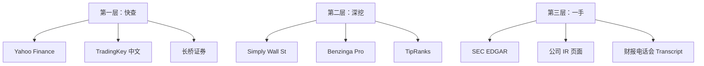

# 美股研究入门：机构评级与信息源

> 以理想汽车（LI）为例，介绍如何看懂机构评级、去哪查数据、怎样构建自己的研究流程。

---

## 一、信息源分层

做美股研究，信息源按深度分三层：



### 第一层：快查（不注册，10秒出数据）

| 平台 | 地址 | 特点 |
|:---|:---|:---|
| **Yahoo Finance** | `finance.yahoo.com/quote/LI/` | 免费，最有名的美股数据入口 |
| **TradingKey** | `tradingkey.com/zh-hans/markets/stocks/nasdaq-li` | 中文，含技术面+财务诊断+机构评级 |
| **长桥证券** | `longbridge.com/zh-CN/quote/LI.US` | 中文，分析师分布图清晰 |
| **Google Finance** | `google.com/finance/quote/LI:NASDAQ` | 简洁，快速看盘 |

### 第二层：深挖（更细的数据和可视化）

| 平台 | 地址 | 特点 |
|:---|:---|:---|
| **Simply Wall St** | `simplywall.st/stocks/us/automobiles/nasdaq-li/li-auto` | 可视化雪球图，估值/增长/健康一目了然 |
| **Benzinga** | `benzinga.com/quote/LI` | 实时新闻+技术面+分析师跟踪 |
| **TipRanks** | `tipranks.com/stocks/li` | 分析师历史准确率排名，知道谁靠谱 |
| **Seeking Alpha** | `seekingalpha.com/symbol/LI` | 社区深度分析，多空观点都有 |
| **MarketBeat** | `marketbeat.com/stocks/NASDAQ/LI/` | 评级汇总+机构买卖动向 |

### 第三层：一手数据（官方来源，最准确但也最耗时）

| 平台 | 说明 |
|:---|:---|
| **SEC EDGAR** | `sec.gov/cgi-bin/browse-edgar?action=getcompany&CIK=LI` — 季报/年报原始文件 |
| **公司 IR 页面** | `ir.lixiang.com` — 官方财报、交付数据 |
| **财报 Transcript** | Seeking Alpha / The Motley Fool 有电话会议逐字稿 |

---

## 二、机构评级体系

### 2.1 标准五档评级

华尔街主流投行使用五档评级：

| 评级 | 英文 | 含义 | 占组合比例 |
|:---|:---|:---|:---|
| 买入 / 强力买入 | Buy / Strong Buy | 明确看好，建议买入 | 比基准多 |
| 增持 / 超配 | Overweight | 看好但不到 Buy 程度 | 略多于基准 |
| 持有 / 中性 | Hold / Neutral / Equal-weight | 没有明确方向，保持现有仓位 | 与基准持平 |
| 减持 / 低配 | Underweight | 偏看空 | 略少于基准 |
| 卖出 / 跑输 | Sell / Underperform | 明确看空，建议卖出 | 比基准少/空仓 |

### 2.2 不同投行的叫法差异

| 投行 | 看好 | 中性 | 看空 |
|:---|:---|:---|:---|
| 摩根士丹利 | Overweight | Equal-weight | Underweight |
| 高盛 | Buy | Neutral | Sell |
| 摩根大通 | Overweight | Neutral | Underweight |
| 花旗 | Buy | Neutral | Sell |
| 美银美林 | Buy | Neutral | Underperform |
| Jefferies | Buy | Hold | Underperform |

> 同一评级不同投行表述不同，但本质逻辑一致：看好→中性→看空。

### 2.3 理想汽车（LI）当前分布

（2026年5月，27位分析师）

```
Buy        ████████ 8人  30%
Overweight  ███ 3人      11%
Hold        ████████████ 13人  48%  ← 主流
Underweight  █ 1人        4%
Sell        ██ 2人        7%
```

**共识**：Hold，均价目标 $21.15（比现价$16.69高 27%）

### 2.4 分析师追踪技巧

1. **看准确率（TipRanks）**：不是所有分析师都准，TipRanks 会按历史预测准确率排名
2. **看星级**：通常 4-5 星分析师更靠谱
3. **看方向一致吗**：多位分析师同时调升/调降目标价，通常意味着基本面在变
4. **注意利益冲突**：投行自己可能持有/做市该股票

---

## 三、看股票要看的核心指标

### 3.1 估值指标

| 指标 | 含义 | LI 当前值 | 行业均值 |
|:---|:---|:---|:---|
| PE（市盈率） | 股价÷每股盈利，越高越贵 | **109x** | 18.7x |
| PB（市净率） | 股价÷每股净资产 | 1.93 | ~2.0 |
| PS（市销率） | 市值÷营业收入 | 1.27 | ~1.2 |
| PEG | PE÷盈利增长率 | — | — |

> LI 的 PE 109x 远高于行业 18.7x。高 PE 不一定不能买（高增长可以撑高估值），但需要持续高增长兑现。

### 3.2 财务健康指标

| 指标 | 含义 | LI 当前值 |
|:---|:---|:---|
| 毛利率 | (收入-成本)/收入 | 16.8%（下降中） |
| 净利率 | 净利润/收入 | 1.0%（暴跌） |
| ROE | 净资产收益率 | 1.57% |
| 资产负债率 | 总负债/总资产 | 52.6% |
| 现金 | 账上现金 | $81.1亿 |
| 研发费率 | 研发/收入 | 25.3%（+YoY） |

### 3.3 技术面指标

| 指标 | 说明 |
|:---|:---|
| 移动均线（MA） | 20日/50日/100日/200日均线，判断趋势方向 |
| 支撑位/阻力位 | 历史上多次止跌/止涨的价格区间 |
| 成交量 | 放量上涨或下跌更有说服力 |
| RSI | 超买(>70)或超卖(<30)信号 |
| Beta | <1 波动小于大盘，>1 波动大于大盘（LI 的 Beta = 0.63） |

---

## 四、快速查一只股票的检查清单

拿到一个代码，10分钟内可以看完这些：

```
□ 股价和基本行情（Yahoo Finance 首页）
□ 52周高/低，当前处于什么位置
□ PE、PB 等估值指标 vs 行业均值
□ 近期财报：营收增速、毛利率、净利趋势
□ 分析师评级分布和平均目标价
□ 近 1 个月新闻（交付数据、产品发布、大行报告）
□ 技术面：均线排列、支撑/阻力
□ 机构持股变化（增加还是减持）
□ 近期催化剂（新产品、财报、政策变化）
```

---

## 五、利用 AnySearch 辅助研究

AnySearch 的垂直金融搜索可以直接查结构化数据：

```bash
# 查美股实时行情
anysearch_cli.py search "LI" --domain finance --sub_domain finance.us_stock --zone cn

# 并行查多只
anysearch_cli.py batch_search \
  --query "LI stock" --query "NIO stock" --query "XPEV stock"

# 查财报/论文/研报
anysearch_cli.py search "Li Auto Q1 2026 earnings" --content_types news --freshness week

# 全文提取深度文章
anysearch_cli.py extract "https://finance.yahoo.com/quote/LI/"
```

---

## 六、重要提醒

> ⚠️ 本文所有数据和评级仅为信息汇总，**不构成投资建议**。
>
> 投资有风险，入市需谨慎。评级和目标价是分析师的**观点**而非**事实**，历史表现不代表未来。做投资决策前请独立判断。