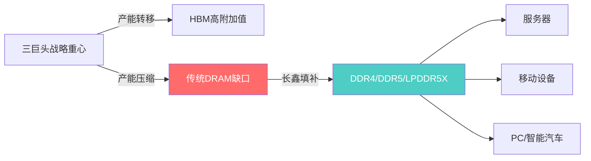
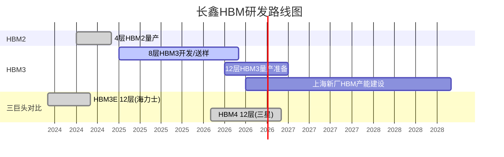
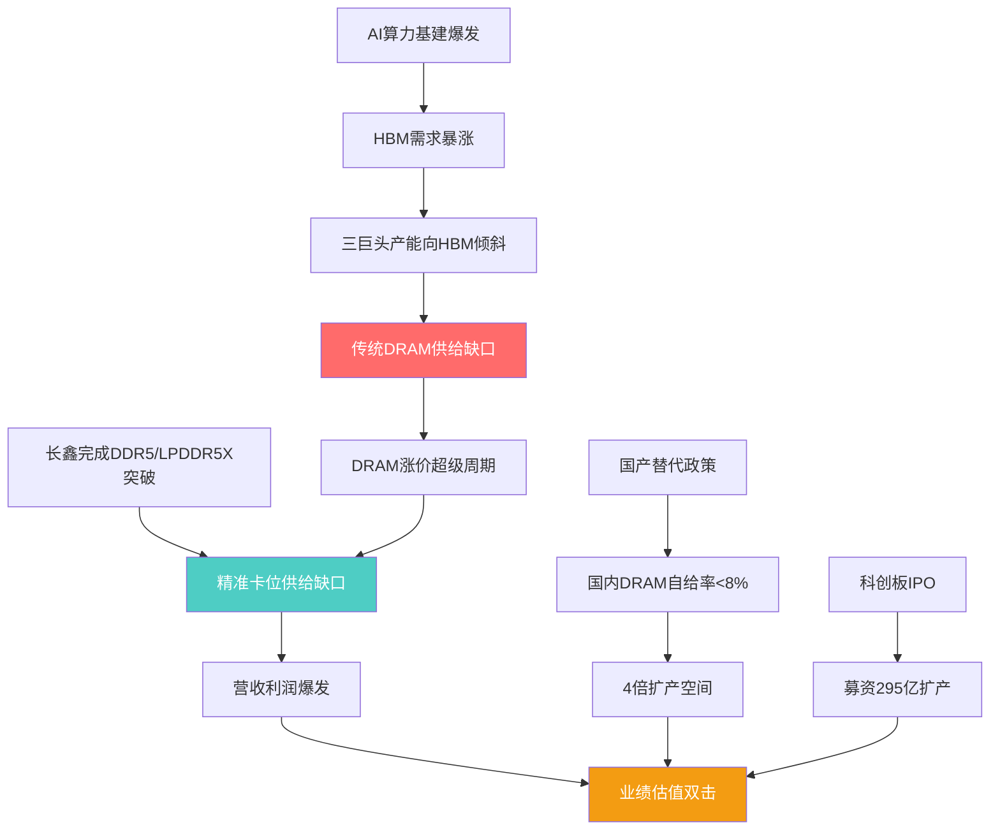

# 长鑫科技（CXMT）投研分析

## 一、公司概况

长鑫科技集团股份有限公司（CXMT）成立于2016年，总部位于安徽合肥，是中国大陆**唯一实现DRAM大规模量产的IDM企业**，覆盖设计、制造、封测全流程。公司在合肥、北京拥有3座12英寸DRAM晶圆厂，根据Omdia数据，按产能、出货量和销售额统计，已成为**中国第一、全球第四**的DRAM厂商。

- **上市进程**：2025年12月30日科创板IPO获受理 → 2026年5月17日更新招股书 → **5月27日上会审议**
- **保荐机构**：中金公司、中信建投
- **董事长**：朱一明（同时兼任兆易创新董事长）

### 主要股东结构（发行前）

| 股东 | 持股比例 | 性质 |
|------|---------|------|
| 清辉集电 | 21.67% | 员工持股平台 |
| 长鑫集成 | 11.71% | 合肥国资 |
| 合肥集鑫 | 8.37% | 员工持股平台 |
| 安徽省投 | 7.91% | 安徽国资 |
| 大基金二期 | 7.30% | 国家集成电路基金 |
| 阿里云计算 | 3.85% | 战略投资者 |
| 产投壹号 | 1.85% | 合肥产投 |
| 兆易创新 | 1.80% | A股存储龙头 |
| 和谐健康 | 1.50% | 险资 |
| 阿里网络 | 1.12% | 战略投资者 |

> 合肥国资整体持股约 **36.79%**，若以万亿市值推算，对应价值超3600亿元。

---

## 二、财务数据分析

### 核心财务指标（2022-2026E）

| 指标 | 2022 | 2023 | 2024 | 2025 | Q1 2026 | H1 2026E |
|------|------|------|------|------|---------|----------|
| 营业收入（亿元） | 82.87 | 90.87 | 241.78 | 617.99 | **508.00** | 1100-1200 |
| 营收YoY | — | 9.7% | 166.0% | 155.6% | **719.1%** | 613-677% |
| 归母净利润（亿元） | -83.28 | -163.40 | -71.45 | 18.75 | **247.62** | 500-570 |
| 净利润（亿元） | -91.71 | -192.25 | -90.51 | 71.44 | **330.12** | 660-750 |
| 毛利率 | — | -2.19% | 5.00% | 41.02% | ~57%* | — |
| 扣非归母净利润 | -86.26 | -167.52 | -78.70 | 53.16 | **263.41** | 520-580 |
| EBITDA（亿元） | — | — | — | — | **437** | — |
| 研发费用（亿元） | — | 46.7 | 63.4 | 95.9 | — | — |
| 资本开支（亿元） | — | 436.58 | 712.30 | 497.39 | — | — |

> *Q1 2026毛利率为市场估算，净利润率约65%，毛利率推算约57%。

### 关键趋势解读

1. **盈利拐点**：2022-2024连续三年亏损（累计超300亿），2025年首年盈利，2026年Q1单季利润超过2025全年利润的13倍
2. **毛利率跃升**：从2023年的-2.19% → 2025年的41.02% → 2026Q1估算57%，反映涨价红利+规模效应
3. **累计亏损**：截至2025年末累计未弥补亏损366.5亿元，预计2026年上半年可全部弥补
4. **产能利用率**：87.06%(2023) → 92.46%(2024) → 95.73%(2025)，接近满产
5. **固定资产**：2025年末1830亿元，占总资产54.34%；年折旧246.80亿元，重资产特征显著

### 全球DRAM厂商盈利对比（Q1 2026）

| 排名 | 公司 | Q1归母净利润（折合人民币） | 市值 |
|------|------|--------------------------|------|
| 1 | 三星电子 | ~2150亿 | ~2.5万亿 |
| 2 | SK海力士 | ~1837亿 | ~1.2万亿 |
| 3 | 美光科技 | ~939亿 | ~8200亿美元 |
| **4** | **长鑫科技** | **247.62亿** | **待上市** |

---

## 三、IPO核心要素

### 发行方案

| 项目 | 详情 |
|------|------|
| 拟募资额 | **295亿元**（科创板历史第二大，仅次于中芯国际532亿） |
| 发行股数 | 不超过106.22亿股（超额配售前） |
| 发行后总股本 | 不超过708.15亿股 |
| 每股面值 | 1.00元 |
| 发行后占比 | ≥10% |
| 上市板块 | 上交所科创板 |

### 募资用途

| 项目 | 金额 | 方向 |
|------|------|------|
| 存储器晶圆制造量产线技术升级改造 | 75亿 | 制造产能 |
| DRAM存储器技术升级 | 130亿 | 产品迭代 |
| 动态随机存取存储器前瞻技术研发 | 90亿 | 前沿技术（3年+周期） |

### 估值锚点分析

| 估值阶段 | 估值水平 | 备注 |
|----------|---------|------|
| 2024年6月融资 | 投前1400亿 | 融资108亿 |
| 2025年6月融资 | — | 阿里云领投61亿 |
| Pre-IPO | ~1500-1584亿 | 一级市场最后一轮 |
| IPO隐含估值 | ~2950亿 | 按2.8元/股 × 总股本 |
| 市场乐观预期 | 1-4万亿 | 二级市场预期 |

**估值情景分析**（假设2026全年归母净利润1000亿）：

| PE倍数 | 对应市值 | 逻辑 |
|--------|---------|------|
| 10x | 1万亿 | A股科技龙头折价 |
| 15x | 1.5万亿 | 保守情景 |
| 20x | 2万亿 | 对标三星(~20.8x)/海力士(~18.5x) |
| 30x | 3万亿 | 国产替代溢价 |
| 40x+ | 4万亿+ | 情绪驱动 |

> **关键判断**：当前利润高度依赖涨价周期，2026年可能是利润峰值年。稳态利润（周期正常化后）估计100-200亿，30x PE对应3000-6000亿市值。

---

## 四、行业格局分析

### 全球DRAM市场竞争格局

```mermaid
pie title 2025Q4全球DRAM市场份额（按销售额）
    "三星电子" : 40.35
    "SK海力士" : 33.19
    "美光科技" : 20.73
    "长鑫科技" : 7.67
    "其他" : -1.94
```

> 注：三星+海力士+美光合计约94%。其他为负值因前三家份额之和已超100%（统计口径差异）。

### 市场增长驱动

- **市场规模**：2025年$1505亿 → 2026E $3722亿 → 2030E $5710亿（CAGR 30.56%）
- **需求结构转变**：服务器DRAM占比从2025年50% → 2030年71%
- **AI驱动**：生成式AI引爆HBM需求，挤占传统DRAM产能，造成全市场供给缺口
- **供给端**：三巨头将产能向HBM倾斜，DDR4/DDR5/LPDDR产能被压缩

### DRAM价格周期

| 时期 | 价格走势 | 驱动力 |
|------|---------|--------|
| 2022-2023H1 | 暴跌50% | 库存高企、需求低迷 |
| 2023H2-2024 | 温和反弹 | 减产+AI需求萌芽 |
| 2025H2 | 加速上涨 | AI基建爆发 |
| 2026Q1 | **暴涨93-98% YoY** | 供给严重不足 |
| 2026Q2E | **再涨58-63%** | 产能售罄至2027 |

> TrendForce预测：DRAM紧缺涨价趋势可能延续至2028年，2026年产能已全部售罄。

### 长鑫的差异化竞争定位



**核心逻辑**：三巨头将产能转向HBM，传统DRAM（DDR4/DDR5/LPDDR5X）出现供给缺口 → 长鑫恰好在此窗口期完成产品迭代 → 填补缺口，承接国产替代需求。

**价格优势**：长鑫DRAM产品价格比韩国产品低 **15-20%**。

---

## 五、技术路线分析

### 工艺平台演进

| 代际 | 工艺节点 | 产品 | 状态 |
|------|---------|------|------|
| G1 | 19nm | DDR4 | 已量产 |
| G2 | 17nm | DDR4/LPDDR4X | 已量产 |
| G3 | 17.5nm | DDR5 | 已量产（良率~80%） |
| G4 | 16nm级 | DDR5/LPDDR5X/HBM3 | 已量产 |
| G5 | <14nm | 下一代全系 | 研发中（目标2026底/2027初） |

### 产品线矩阵

| 产品系列 | 最高速率 | 最高容量 | 应用场景 | 2025年收入占比 |
|----------|---------|---------|---------|---------------|
| DDR5 | 8000Mbps | 24Gb | 服务器/PC | DDR系列31.9% |
| DDR4 | 3200Mbps | 16Gb | 通用计算 | — |
| LPDDR5X | 10667Mbps | 16Gb | 旗舰手机 | — |
| LPDDR5 | 6400Mbps | 12Gb | 移动设备 | — |
| LPDDR4X | 4266Mbps | 8Gb | 中端移动 | LPDDR系列~70% |

> DDR5产品快速放量，DDR系列营收占比从2024年13.3%升至2025年31.9%；DDR5毛利率41.89%，高于LPDDR系列的37.25%。

### HBM研发进展



**HBM关键事实**：
- 长鑫2024下半年实现4层HBM2量产，仅用三年时间从零到12层HBM3
- 技术路线：MR-MUF封装（与SK海力士类似）
- **瓶颈**：HBM3目前仍处测试阶段，**尚未接到量级订单**；关键原料储备不足；TSV工艺良率仅60-65%（国际领先70-75%+）；量产可能推迟至2026年底
- 产能规划：2026年总产能20%转HBM（约6万片/月）；上海新厂HBM3专属产能5万片/月
- 技术差距：与韩国差距已缩小至约3年

### 专利储备

- 境内外专利合计 **5,589项**（截至2025年6月）
- 其中境内3,116项 + 境外2,473项
- 累计研发投入188.67亿元，研发人员占比超30%
- 2024年美国专利授权量全球第42位，中国企业第4位
- **技术来源**：合法收购破产德国内存巨头奇梦达（Qimonda）的数千万份技术文件和核心专利

### "跳代研发"策略

长鑫采取跳过中间代际的研发策略，从G1直跳G4，快速实现从DDR4/LPDDR4X到DDR5/LPDDR5X的产品覆盖。这一策略使其在较短时间内达到国际先进水平，在三巨头转移产能的窗口期实现了精准卡位。

### IDM模式优劣势

| 优势 | 劣势 |
|------|------|
| 设计与制造协同优化 | 资本开支巨大（年折旧~250亿） |
| 供应链自主可控 | 制程追赶投入高 |
| 产能保障 | 灵活性低于Fabless |
| 技术秘密保护 | 周期下行时亏损压力大 |

---

## 六、A股产业链映射

### 产业链全景图

```mermaid
graph TB
    CXMT[长鑫科技<br/>DRAM IDM龙头] --> IPO[IPO募资295亿<br/>扩产+技术升级]
    
    subgraph 上游_设备
        A1[北方华创<br/>刻蚀/薄膜/清洗]
        A2[中微公司<br/>刻蚀设备]
        A3[拓荆科技<br/>PECVD/ALD/SACVD]
        A4[盛美上海<br/>湿法清洗]
        A5[华海清科<br/>CMP抛光]
        A6[长川科技<br/>测试设备]
        A7[精智达<br/>存储测试]
        A8[芯源微<br/>涂胶显影]
        A9[中科飞测<br/>量检测]
    end
    
    subgraph 上游_材料
        B1[雅克科技<br/>前驱体/特气]
        B2[安集科技<br/>CMP抛光液]
        B3[鼎龙股份<br/>CMP抛光垫]
        B4[广钢气体<br/>电子大宗气体]
        B5[沪硅产业<br/>硅片]
        B6[江丰电子<br/>靶材]
        B7[有研新材<br/>靶材]
        B8[南大光电<br/>光刻胶]
        B9[华特气体<br/>电子特气]
        B10[金宏气体<br/>电子特气]
    end
    
    subgraph 中游_封测
        C1[长电科技<br/>封装测试]
        C2[通富微电<br/>封装测试]
        C3[华天科技<br/>封装测试]
        C4[深科技<br/>存储模组]
        C5[汇成股份<br/>DRAM封测]
    end
    
    subgraph 下游_模组终端
        D1[江波龙<br/>存储模组]
        D2[佰维存储<br/>存储模组]
        D3[朗科科技<br/>存储产品]
        D4[浪潮信息<br/>服务器]
        D5[中科曙光<br/>服务器]
    end
    
    subgraph 股权关联
        E1[兆易创新<br/>持股1.8%]
        E2[合肥城建]
        E3[上峰水泥]
    end
    
    CXMT --> A1 & A2 & A3 & A4 & A5 & A6 & A7 & A8 & A9
    CXMT --> B1 & B2 & B3 & B4 & B5 & B6 & B7 & B8 & B9 & B10
    CXMT --> C1 & C2 & C3 & C4 & C5
    CXMT --> D1 & D2 & D3 & D4 & D5
    CXMT -.-> E1 & E2 & E3
    
    IPO --> A1 & A2 & A3 & A4
    
    style CXMT fill:#e74c3c,color:#fff
    style IPO fill:#f39c12,color:#fff
    style E1 fill:#2ecc71,color:#fff
```



### 核心标的梳理

#### 赛道一：股权关联（IPO催化弹性最大）

| 标的 | 代码 | 关联逻辑 | 弹性评估 |
|------|------|---------|---------|
| **兆易创新** | 603986 | 持股1.8%，董事长同一人（朱一明）；2026年关联采购57亿(+483%) | ★★★★★ |
| 合肥城建 | — | 合肥本地股，间接受益 | ★★ |
| 上峰水泥 | — | 合肥本地股 | ★★ |

> **兆易创新双重受益逻辑**：既是长鑫第一大A股参股方，又是其DRAM核心代工客户。NOR Flash全球第二（份额23%），MCU国内第一。中航证券预测2026-2028年归母净利润59.94/72.25/85.98亿。

#### 赛道二：设备供应商（扩产最受益，确定性最强）

| 标的 | 代码 | 供应产品 | 核心逻辑 |
|------|------|---------|---------|
| **北方华创** | 002371 | 刻蚀/薄膜沉积/清洗 | 平台型龙头，深度参与长鑫产线 |
| **中微公司** | 688012 | 刻蚀设备(CCP/ICP) | 长鑫产线核心供应商，2026Q1净利+197% |
| **拓荆科技** | 688072 | PECVD/ALD/SACVD | 薄膜沉积国产替代龙头，Q1营收+57% |
| **盛美上海** | 688082 | 湿法清洗 | 已与长鑫形成稳定合作 |
| 华海清科 | 688120 | CMP抛光 | 已进入长鑫供应链 |
| 长川科技 | 300604 | 测试设备 | CP/FT/AOI检测 |
| 精智达 | 688627 | 存储测试 | 受益存储扩产 |
| 芯源微 | 688037 | 涂胶显影 | 前道设备 |
| 中科飞测 | 688361 | 量检测 | 国产替代 |

> 逻辑链：长鑫扩产 → 资本开支扩大 → 设备采购先行 → 2026-2027为国产设备黄金窗口期。**洁净室先行（柏诚股份），前道设备随后，封测设备弹性最强，材料最后放量。**

#### 赛道三：材料供应商（国产替代空间最大）

| 标的 | 代码 | 供应材料 | 备注 |
|------|------|---------|------|
| **雅克科技** | 002409 | 前驱体/特种气体 | 已供货合肥长鑫 |
| **安集科技** | 688019 | CMP抛光液 | 国产替代核心 |
| **鼎龙股份** | 300054 | CMP抛光垫 | 国产替代 |
| **广钢气体** | 688548 | 电子大宗气体 | 合肥长鑫大宗气站扩建中 |
| 沪硅产业 | 688126 | 硅片 | 国产大硅片 |
| 江丰电子 | 300666 | 靶材 | 国产靶材龙头 |
| 有研新材 | 600206 | 靶材 | — |
| 南大光电 | 300346 | 光刻胶 | 国产光刻胶 |
| 华特气体 | 688268 | 电子特气 | — |
| 金宏气体 | 688106 | 电子特气 | — |

> 长鑫2025年原材料采购结构：化学品37.29%（42.78亿）、光阻剂12.16%（13.95亿）、硅片8.55%（9.81亿）、电子特气5.10%（5.85亿）、靶材2.21%（2.53亿）。

#### 赛道四：封测/模组/洁净室

| 标的 | 代码 | 类别 | 核心逻辑 |
|------|------|------|---------|
| 长电科技 | 600584 | 封测 | 董事兼任长鑫董事，2025年关联销售16亿+ |
| 通富微电 | 002156 | 封测 | 存储封测 |
| 深科技 | 000021 | 存储模组 | 合肥沛顿配套长鑫 |
| 汇成股份 | 688403 | DRAM封测 | 联营企业配套长鑫，2027年6万片/月 |
| 江波龙 | 301308 | 存储模组 | 下游应用 |
| 佰维存储 | 688525 | 存储模组 | 下游应用 |
| 柏诚股份 | — | 洁净室 | 长鑫洁净室服务商，1-4月新签43.2亿超2025全年 |

#### 券商受益标的

7家上市券商通过直接/间接持股跻身股东名单：招商证券（穿透~0.84%，账面价值~192亿）、华安证券（穿透~0.44%，账面价值~101亿）、方正证券、中信建投、中金公司、国泰海通、国元证券。

---

## 七、投资逻辑与风险分析

### 核心投资逻辑



**四大驱动力**：
1. **国产替代**：国内DRAM自给率不足8%，需求占比30-35%，近4倍替代空间
2. **AI需求**：AI服务器驱动DRAM需求结构性增长，服务器占比从50%→71%
3. **涨价周期**：DRAM超级涨价周期，产能售罄至2027年，涨价趋势可能延续至2028年
4. **IPO催化**：募资295亿扩产，科创板稀缺DRAM标的，市场定价权重估

### 风险因素

| 风险类别 | 具体风险 | 严重程度 | 应对思路 |
|----------|---------|---------|---------|
| **周期反转** | DRAM强周期属性，价格见顶后利润可能大幅回落；2026年可能是利润峰值年 | ★★★★★ | 关注DRAM合约价趋势、三大原厂扩产节奏 |
| **地缘政治** | 美国出口管制升级风险，EUV设备受限，先进制程追赶受限 | ★★★★ | 关注中美科技政策动态 |
| **技术追赶** | HBM3量产推迟，与三巨头技术差距约3年；HBM3尚无批量订单 | ★★★★ | 跟踪HBM良率提升和客户导入进展 |
| **折旧压力** | 固定资产1830亿，年折旧247亿且持续增长；周期下行时亏损压力大 | ★★★ | 关注产能利用率和毛利率变化 |
| **IPO定价** | 按2.8元/股计算PE超90倍（基于2025年EPS），短期估值透支 | ★★★ | 关注最终发行定价和上市后估值消化 |
| **供应链** | 部分关键设备和材料依赖进口，国产替代进度不确定 | ★★★ | 跟踪设备材料国产化率 |
| **竞争加剧** | 三巨头可能重新关注传统DRAM市场；长江存储NAND竞争 | ★★ | 关注市场份额变化 |
| **累计亏损** | 历史累计亏损366.5亿，短期无法分红 | ★★ | 2026H1可弥补完毕 |

### 估值合理性判断

**乐观情景**（概率25%）：
- 假设：DRAM涨价延续至2027年，HBM3量产顺利，市占率升至15%
- 2026年归母净利润1000-1200亿
- 20x PE → 市值2-2.4万亿

**基准情景**（概率50%）：
- 假设：2026H2价格涨幅放缓但仍维持高位，HBM3小规模量产
- 2026年归母净利润800-1000亿
- 15x PE → 市值1.2-1.5万亿

**悲观情景**（概率25%）：
- 假设：2026Q4价格开始松动，周期拐点出现，HBM3量产继续推迟
- 稳态利润100-200亿
- 20-30x PE → 市值3000-6000亿

**核心矛盾**：当前业绩高度依赖周期红利（估算价格贡献6-7成利润），上市时点恰逢周期峰值。历史参照中芯国际A股上市后从7000亿跌至3000亿，经历5年才重回万亿。

---

## 八、机构观点汇总

| 机构 | 观点 | 关注方向 |
|------|------|---------|
| **中银证券** (2026-05-19) | 存储高景气扭转财务状况，IPO有望开启新一轮扩产周期 | 设备：北方华创/中微/拓荆；材料：雅克/鼎龙/安集 |
| **国盛证券** | DDR5快速放量，产能利用率94.63%，上市后加速扩产 | 设备及零部件直接受益 |
| **东方证券** | 海外存储巨头通用存储扩产有限，为长鑫带来历史性机遇 | DRAM高难度工艺推动设备国产化 |
| **招商证券** | 存储进入AI驱动结构性超级周期，紧缺态势延续至2027+ | 设备订单增长明确，零部件+材料跟进 |
| **国泰海通** | 长鑫IPO将带动存储相关设备、材料公司同步受益 | 存储产业链占比高的半导体设备公司 |
| **中航证券** | — | 兆易创新2026-2028归母净利59.94/72.25/85.98亿 |
| **集邦咨询** | DRAM合约价2026Q2再涨58-63%，紧缺至2028年 | — |
| **Omdia** | 全球DRAM市场2030年将达5710亿美元 | 服务器DRAM占比升至71% |

---

## 九、结论与投资建议

### 一句话结论

**长鑫科技是中国DRAM产业"从0到1"的唯一标的，正处于AI驱动的存储超级周期+国产替代+IPO催化三重红利叠加的黄金窗口，但当前业绩对涨价周期高度依赖，需清醒区分"周期利润"与"能力利润"。**

### 投资策略建议

**上市前（一级市场映射）**：
- 核心关注**兆易创新**（双重受益：持股+代工采购爆发）、**北方华创/中微公司/拓荆科技**（扩产设备先行）
- 其次关注已进入供应链且收入占比高的材料/封测标的

**上市后（二级市场）**：
- 上市初期大概率高估（周期峰值利润 × 国产替代溢价）
- 建议等待第一波情绪消化后（可能6-12个月），在周期预期调整、估值回归合理区间时布局
- 合理市值中枢判断：稳态利润100-200亿 × 20-30x PE = **3000-6000亿**
- 若HBM3量产突破+市占率升至15%+DRAM价格维持高位，可上看1-1.5万亿

### 关键跟踪指标

| 指标 | 频率 | 意义 |
|------|------|------|
| DRAM合约价（DDR5/DDR4/LPDDR5） | 月度 | 判断周期位置 |
| 全球DRAM月度营收/出货 | 季度(Omdia/TrendForce) | 市占率变化 |
| HBM3量产进展（良率/客户导入） | 事件驱动 | 技术突破信号 |
| 三巨头资本开支计划 | 季度 | 预判供给端变化 |
| 美国对华半导体管制政策 | 事件驱动 | 地缘风险 |
| 长鑫月产能/产能利用率 | 招股书更新 | 基本面验证 |
| A股产业链公司订单/业绩 | 季报 | 产业链景气度 |

### 历史类比参考

| 类比对象 | 相似点 | 启示 |
|----------|--------|------|
| 中芯国际A股上市(2020) | 科创板芯片龙头IPO，国产替代信仰 | 上市后估值可能长期消化 |
| 京东方早期 | 重资产、强周期、国产面板突破 | 产能扩张→利润释放→估值消化的长周期 |
| 三星/SK海力士 | DRAM IDM商业模式 | 周期高PE低买、周期低PE高买的逆周期投资逻辑 |

---

> **免责声明**：本文基于公开信息整理分析，不构成任何投资建议。长鑫科技尚未完成IPO注册，上市时间和最终估值均存在重大不确定性。DRAM行业具有强周期属性，投资者须充分认识相关风险，独立做出投资决策。