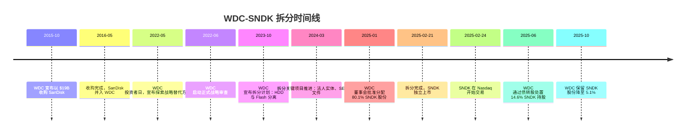
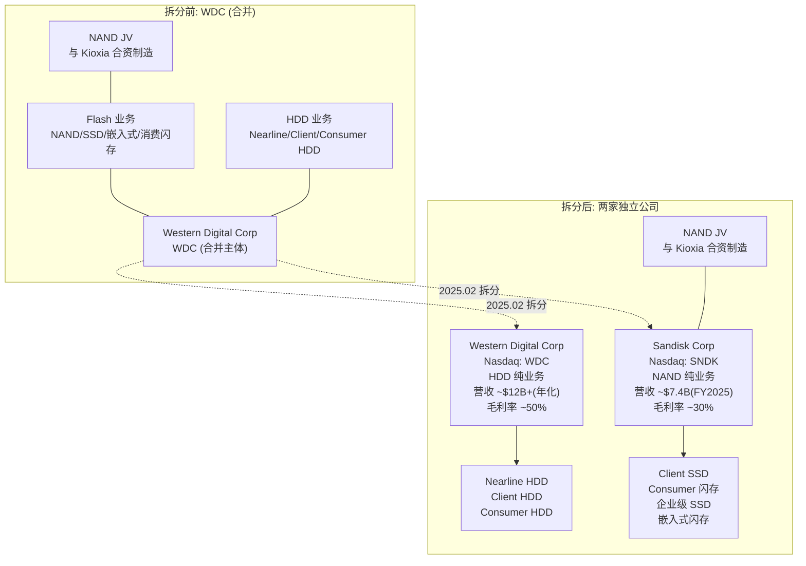
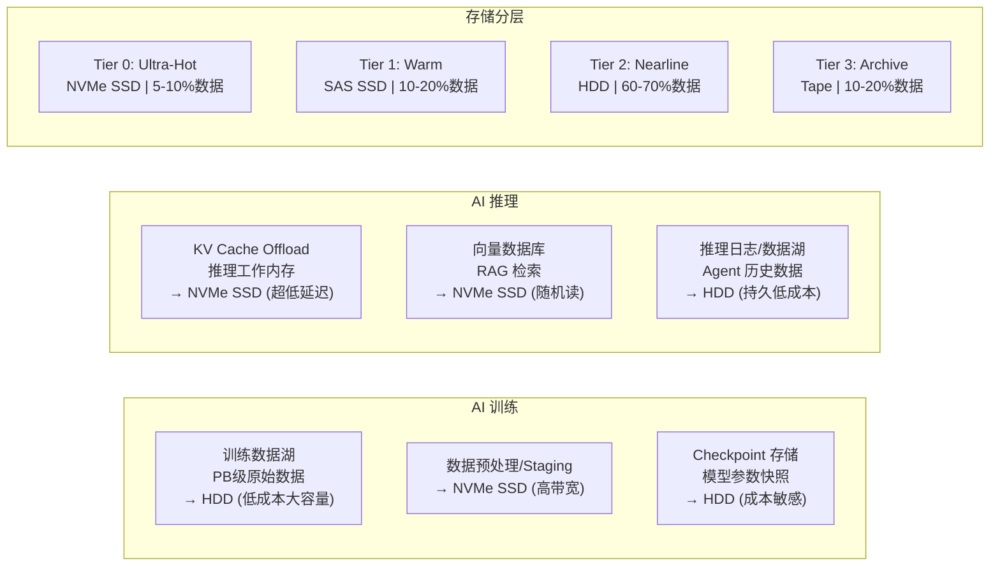

# 闪迪与西部数据——拆分深度对比

> 2025年2月21日，西部数据（WDC）正式完成闪迪（SNDK）的拆分。一家公司裂变为两家：WDC 专注 HDD 机械硬盘，SNDK 专注 NAND 闪存。本文从拆分背景、业务结构、财务数据、竞争格局、AI 机会五个维度深度对比。

---

## 1. 概览

| 维度 | WDC (Western Digital) | SNDK (Sandisk) |
|:---|:---|:---|
| **主业** | HDD 机械硬盘 | NAND 闪存 + SSD |
| **上市** | Nasdaq: WDC | Nasdaq: SNDK |
| **拆分完成** | 2025-02-21 | 2025-02-21 |
| **CEO** | Irving Tan | David Goeckeler |
| **FY2025 收入** | ~$9.2B (9个月, continuing ops) | $7.36B (全年) |
| **市值 (2026-05-08)** | ~$167B | ~$231B |
| **P/E (trailing)** | ~29x | ~53x |
| **员工** | ~50,000+ | ~25,000+ |

---

## 2. 时间线

---

## 3. 拆分背景详解

### 3.1 2016年 WDC 为什么收购闪迪？

**交易结构：**
- 总对价约 **$190亿**（$86.50/股）
- $67.50 现金 + 0.2387 股 WDC 股票 换 1 股 SNDK
- 融资：$174亿 新债务 + $68亿 账面现金
- 2016年5月12日完成交割

**战略逻辑（WDC 官方陈述）：**

| 驱动力 | 具体内容 |
|:---|:---|
| **媒体不可知战略** | WDC 从 2008 年起规划成为"存储解决方案公司"，而非仅 HDD 厂商 |
| **进入 SSD 市场** | 2015年 SSD 正在侵蚀 HDD 市场，WDC 在 SSD 领域几乎没有份额 |
| **垂直整合 NAND** | 通过 SanDisk-东芝 JV 获得稳定、低成本的 NAND 供应 |
| **TAM 翻倍** | 可寻址市场从 ~$300亿 扩展到 ~$600亿+ |
| **协同效应** | 18个月内实现 $5亿 年化协同，2020年达 $11亿 |
| **财务增厚** | 预计 12 个月内 non-GAAP EPS 增厚 |

**深层逻辑：** HDD 行业面临 SSD 替代威胁。WDC 如果不拥有 NAND 能力，长期看可能被边缘化。收购 SanDisk 本质上是"用 HDD 的现金流买一张 NAND 的船票"。

SanDisk 当时拥有：
- 与东芝 15 年的 NAND JV 合作关系（制造端）
- 强大的消费级品牌（闪存卡、U盘）
- 企业级 SSD 产品线
- 10,000+ 专利

### 3.2 为什么 2025年要拆出来？

**直接原因（WDC 官方陈述）：**

1. **战略审查结论。** 2022年5月投资者日，WDC 公开宣布探索战略替代方案；2022年6月启动正式战略审查；经过全面评估后，董事会认为分拆是"最佳可执行方案"。

2. **两个业务本质不同。** HDD 和 NAND 是两种截然不同的生意：
   - HDD：寡头格局、技术迭代慢、资本开支中等、现金流稳定
   - NAND：高度竞争、技术迭代快（层数竞赛）、资本开支巨大、强周期

3. **市场估值折价。** 合并状态下，市场给 WDC 的估值无法充分反映两个业务各自的价值——"部分之和大于整体"。

4. **资本配置冲突。** NAND 需要大量资本投入进行技术迁移和产能扩张，而 HDD 业务能产生充裕现金流。放在一起，资本配置互相掣肘。

**深层逻辑：**

2016年收购时，WDC 的逻辑是"垂直整合 + 媒体不可知"可以创造协同价值。但近十年的运营证明：
- HDD 和 NAND 的协同效应有限（买 NAND 不需要同时做 HDD）
- 两种业务的周期不同步，合并报表反而增加了盈利波动
- AI 时代到来后，两个业务都迎来爆发——分开各自讲自己的故事，估值更高

### 3.3 拆分交易结构

| 项目 | 内容 |
|:---|:---|
| **分配方式** | WDC 按 1:1/3 比例向股东分配 SNDK 股票（每持有1股 WDC 得 1/3 股 SNDK） |
| **分配比例** | 80.1%（1.16亿股）分配给 WDC 股东，19.9%（2883万股）由 WDC 保留 |
| **SNDK 现金支付** | SNDK 通过 $20亿 定期贷款向 WDC 支付 ~$15亿 现金 |
| **后续减持** | 2025年6月通过债转股减持 14.6%；2025年10月降至 5.1% |
| **税务处理** | 联邦所得税目的下的免税分配 |
| **关键协议** | 分离与分配协议、过渡服务协议(TSA)、税务事项协议、员工事项协议、IP 交叉许可协议、商标过渡许可协议 |

---

## 4. 两家公司对比

### 4.1 WDC——HDD 寡头

**业务本质：** 机械硬盘制造商，核心竞争力在磁头技术、盘片密度、规模化制造。

**产品线：**
- **Nearline HDD（近线存储）：** 数据中心大容量硬盘，营收占比 ~89%
- **Client HDD：** PC/笔记本用硬盘（~5%）
- **Consumer HDD：** 外置硬盘/DVR（~6%）

**技术路线：**
- 当前主力：ePMR（能量辅助垂直磁记录）
- 下一代：HAMR（热辅助磁记录）——可支撑 30TB+ 单盘容量
- UltraSMR（叠瓦式磁记录）进一步提升密度

**关键特征：**
- 极强规模效应，只有 3 家全球供应商
- 客户锁定效应强（认证周期长、更换成本高）
- 需求高度集中于云服务商（CSP），大客户议价能力极强
- 2026年 CY 产能已全部售罄，长期协议签到 2027-2028 年

### 4.2 SNDK——NAND 闪存专业户

**业务本质：** NAND Flash 芯片 + SSD 产品制造商，核心竞争力在 3D NAND 堆叠技术、控制器固件、消费品牌。

**产品线：**
- **Client SSD / 嵌入式闪存：** PC SSD、手机存储（~56% 营收）
- **Consumer 产品：** 闪存卡、U盘、外置 SSD（~31%）
- **Cloud / 企业级 SSD：** 数据中心 NVMe SSD（~13%，快速增长）

**技术路线：**
- BiCS（Bit Cost Scalable）3D NAND 技术（与 Kioxia 联合开发）
- UltraQLC 平台，计划推出 256TB NVMe SSD
- 下一代：更高层数 3D NAND（200+ 层）

**关键特征：**
- 与 Kioxia（原东芝存储）的制造 JV 是核心资产
- NAND 是强周期行业，历史上价格波动剧烈
- 消费品牌（SanDisk/WD_Black）有强认知度
- 企业级市场是薄弱环节，拆分后正在加速突破

### 4.3 拆分前后业务架构

### 4.4 竞争格局对比

#### HDD 市场（WDC vs 希捷 vs 东芝）

| 指标 | WDC | Seagate (STX) | Toshiba |
|:---|:---|:---|:---|
| **市场份额（按出货量）** | ~42% | ~40% | ~18% |
| **趋势** | 持续获得份额 | 2024年失去部分份额 | 份额下降 |
| **市值 (2026-05)** | ~$167B | ~$172B | 未上市 |
| **技术路线** | ePMR → HAMR | HAMR (先行者) | 跟随 |
| **Nearline 聚焦** | 极高 (89% 云) | 高 | 中等 |
| **最大客户** | 美国 CSP | 美国 CSP | — |

> 注：HDD 市场是典型的寡头格局——三家厂商控制几乎 100% 的市场，且扩张产能意愿有限（回报率考量），导致供给紧张持续时间可能超预期。

#### NAND 市场（SNDK vs 三星/SK海力士/Kioxia/美光）

| 排名 | 厂商 | Q4 2025 营收 | QoQ增长 | 市场份额 |
|:---|:---|:---|:---|:---|
| 1 | **Samsung** | $6.35-6.60B | +10-18% | 27-28% |
| 2 | **SK Group** (SK hynix + Solidigm) | $5.21B | +47.8% | 22.1% |
| 3 | **Kioxia** | $3.31-3.52B | +15.7-16.5% | 14-15% |
| 4 | **Micron** | $2.74-3.03B | +21.8-24.8% | 11.6-12.8% |
| 5 | **SanDisk** | $3.03B | +31.1% | 12.8% |
| — | **Top 5 合计** | **$21.17B** | **+23.8%** | **~90%** |

> Source: TrendForce Q4 2025; CFM MemoryMarket Q4 2025. 两家机构的数据略有差异，但排名和趋势一致。

**SNDK 在 NAND 竞争中的位置：**
- 市场份额第 4-5 位，与 Micron 极为接近
- 增长势头好（QoQ +31%），受益于供应短缺周期
- **核心优势：** 与 Kioxia 的制造 JV 提供稳定产能；消费品牌强劲
- **核心劣势：** 企业级/数据中心 SSD 历史上较弱，正在追赶；规模不及三星/SK

---

## 5. 营收结构拆解

### 5.1 WDC 拆分后营收（仅 HDD）

WDC FY2026 前三季度数据（拆分后，continuing operations only）：

| 季度 | 总营收 | Cloud | Client | Consumer | 毛利率 (Non-GAAP) | EPS (Non-GAAP) |
|:---|:---|:---|:---|:---|:---|:---|
| Q1 FY2026 (Sep 2025) | $2.82B | $2.51B (89%) | $0.15B (5%) | $0.16B (6%) | 43.9% | $1.78 |
| Q2 FY2026 (Dec 2025) | $3.02B | $2.67B (89%) | $0.18B (6%) | $0.17B (6%) | 46.1% | $2.13 |
| Q3 FY2026 (Mar 2026) | $3.34B | $2.97B (89%) | $0.18B (5%) | $0.19B (6%) | 50.5% | $2.72 |
| **9个月累计** | **$9.17B** | **$8.16B** | **$0.50B** | **$0.52B** | — | — |

**关键趋势：**
- Cloud 占营收 89%，且绝对金额同比增长 ~48%
- 毛利率从 43.9% 攀升至 50.5%，接近历史峰值
- 营收逐季度加速增长（+27% → +25% → +45% YoY）
- Q4 FY2026 指引：$3.65B（+36-44% YoY），毛利率 51-52%

**WDC 2026 创新日指引：**
- 未来 3-5 年营收 CAGR **>20%**
- Nearline 出货量（Exabyte）CAGR **mid-20%s**
- 定价预期保持稳定
- 前五大客户中三家已签订长期协议（至 CY2027-2028），正在洽谈 CY2029-2030

### 5.2 SNDK 营收结构

SNDK FY2025 全年数据（截至 2025年6月27日）：

| 终端市场 | FY2025 营收 | 占比 | YoY增长 | 特征 |
|:---|:---|:---|:---|:---|
| **Client** (PC/手机) | $4.13B | 56% | +1% | 成熟市场，增长平缓 |
| **Consumer** (零售) | $2.27B | 31% | 持平 | 品牌强势，周期波动大 |
| **Cloud** (数据中心) | $0.96B | 13% | **+195%** | 快速增长，基数低 |

**近季度趋势：**

| 季度 | 总营收 | Cloud | Client | Consumer | 毛利率 (Non-GAAP) |
|:---|:---|:---|:---|:---|:---|
| Q2 FY2025 (Dec 2024) | $1.88B | $0.25B | $1.03B | $0.60B | 32.5% |
| Q3 FY2025 (Mar 2025) | $1.70B | $0.20B | $0.93B | $0.57B | 22.7% |
| Q4 FY2025 (Jun 2025) | $1.90B | $0.21B | $1.10B | $0.59B | 26.4% |
| Q1 FY2026 指引 | $2.10-2.20B | — | — | — | 28.5-29.5% |

> 注：Q3 毛利率骤降至 22.7% 和 GAAP 巨亏受 $18.3亿 商誉减值影响；Q4 已恢复至 26.4%。

**SNDK 营收特征总结：**
- Consumer + Client 合计占 ~87%，是典型的"消费级为主"结构
- Cloud 虽然占比小（13%），但增速最快（+195% YoY），是未来核心增长引擎
- 拆分后企业级团队组建加速，TrendForce 指出 SNDK "aggressively expanded into server segment"
- 管理层预计 FY2026 全年供应偏紧，定价和利润率持续改善

### 5.3 WDC 拆分前 Flash 业务参考

WDC 拆分前，Flash 业务的历史表现（已重分类为 discontinued operations）：

| 期间 | Flash 收入趋势 |
|:---|:---|
| FY2024 全年 | ~$6.66B |
| FY2025 全年 | ~$7.36B（+10% YoY） |

拆分前两个业务的对比：
- HDD 收入规模更大（~$13B 年化 FY2026）、利润率更高（~50%）
- Flash 收入中等（~$7.4B FY2025）、利润率较低（~26-30%）但成长性更强

---

## 6. 财务数据

### 6.1 关键财务指标对比

| 指标 | WDC (TTM / 最新) | SNDK (FY2025) | 说明 |
|:---|:---|:---|:---|
| **营收** | ~$12.6B (年化, CY continuing ops) | $7.36B | WDC 为纯 HDD, SNDK 为纯 NAND |
| **毛利率 (GAAP)** | 50.2% (Q3 FY2026) | 30.1% (FY2025) | HDD 毛利率远高于 NAND |
| **毛利率 (Non-GAAP)** | 50.5% (Q3 FY2026) | 30.3% (FY2025) | — |
| **营业利润率** | 35.7% (Q3 FY2026) | ~9.4% (Non-GAAP FY2025) | — |
| **净利润** | $6.23B (9M FY2026 GAAP, 含 SNDK 持股收益) | -$1.64B (GAAP, 含商誉减值) | GAAP 数字受减值/非经常项目影响大 |
| **Non-GAAP 净利润** | ~$2.3B+ (9M 估算) | $440M (FY2025) | — |
| **经营现金流** | $1.12B (Q3 FY2026 单季) | — | WDC 现金流极强 |
| **自由现金流** | $978M (Q3 FY2026 单季) | $77M (Q4 FY2025) | — |
| **总债务** | ~$1.6B | ~$2.0B (Term Loan) | WDC 拆分后大幅去杠杆 |
| **现金** | ~$3.2B | ~$1.5B (Q4 FY2025) | — |

### 6.2 估值水平对比

| 指标 | WDC | SNDK | Seagate (STX) |
|:---|:---|:---|:---|
| **股价 (2026-05-08)** | $480 | $1,562 | — |
| **市值** | ~$167B | ~$231B | ~$172B |
| **Trailing P/E** | ~25-29x | ~44-53x | ~70x |
| **Forward P/E** | ~25x | ~10x | — |
| **P/S (TTM)** | ~14-15x | ~17-18x | — |
| **P/B** | ~17x | ~14-17x | ~157x |
| **PEG** | 0.43 | ~0.03-0.58 | — |
| **EV/EBITDA** | ~22x | — | — |

> 数据来源：WallStreetZen, StockAnalysis, Yahoo Finance, Trefis (2026-05-07/08)

**估值分析：**

1. **SNDK 市值 > WDC。** SNDK ~$231B vs WDC ~$167B。市场给了 NAND 纯业务比 HDD 寡头更高的估值，尽管目前 NAND 利润率和现金流都低于 HDD。原因：
   - NAND 的 TAM 更大、增长更快（AI 推理驱动）
   - HDD "被替代"的叙事长期存在（虽然实际并非如此）
   - SNDK 的 forward P/E 仅 ~10x，暗示市场预期盈利将爆发（NAND 涨价周期）

2. **WDC 是典型的"低估值高现金流"标的。** P/E ~25x，毛利率 50%+，且需求可见度极高（售罄至 2027-2028）。与 Seagate 的 P/E ~70x 相比，WDC 似乎更"便宜"——但需注意 Seagate 去年盈利基数低导致 P/E 虚高。

3. **拆分创造了巨大价值。** 2024年 WDC 市值仅 ~$200亿，拆分后两家合计 ~$398B，不到两年价值增长 ~20x。

### 6.3 拆分后股价走势

| 时间节点 | WDC 股价 | WDC 市值 | SNDK 股价 | SNDK 市值 |
|:---|:---|:---|:---|:---|
| 2024 年底 (拆分前) | ~$60 | ~$21B | — | — |
| 2025-02-24 (拆分首日) | — | ~$22B | ~$36 | — |
| 2025-06 (FY2025) | ~$41B | — | — | — |
| 2025-09 | ~$41B | — | — | — |
| 2025-12 | ~$59B | — | — | — |
| 2026-03 | ~$92B | — | — | — |
| 2026-05-08 | $480 | **~$167B** | $1,562 | **~$231B** |

> SNDK 52周区间：$35.79 - $1,439.70。从拆分的 ~$36 涨至 ~$1,562，涨幅 **~4,200%**。

---

## 7. AI 时代的机会

### 7.1 AI 数据中心存储需求全景

AI 工作负载对存储的需求分层：

### 7.2 AI 对 HDD 的需求（WDC 受益）

**核心论点：AI 的每个环节都在产生需要存储的持久化数据。**

- **训练数据湖：** LLM 训练需要 PB 级文本、图像、视频数据。这些数据必须持久存储，且不需要微秒级访问——HDD 的 $/TB 优势（比 SSD 便宜 5-10x）使其成为唯一经济的选择。
- **模型 Checkpoint：** 训练过程中定期保存的模型状态，占用海量空间。
- **推理产生的数据：** Agentic AI 系统需要持久访问大量历史数据来支持规划、推理和自主决策。这些数据量级远超训练数据。
- **HDD 供应紧张正在推高价格：** $/GB 从 $0.012-0.013 升至 $0.015-0.016（+25-33%），但相比 SSD 仍有压倒性成本优势。

**WDC CEO Irving Tan 原话：** "Virtually every AI workload, from training, inference, agentic AI to physical AI, creates data that is stored persistently and cost-efficiently on HDDs."

**关键数据点：**
- WDC 预计 Nearline 出货量（Exabyte）CAGR mid-20%s 至 2028
- 2026年 CY 产能已售罄，订单排到 2027-2028
- 全球数据量预计从 2024年 173.4ZB 增长到 2029年 527.5ZB（3x+）

### 7.3 AI 对 NAND 的需求（SNDK 受益）

**核心论点：AI 推理需要极致性能，NAND/SSD 是不可替代的高速层。**

- **KV Cache 卸载：** GPT/Claude 等模型推理时，KV Cache（工作记忆）占用大量昂贵的 GPU HBM。将这些数据卸载到 NVMe SSD 可以释放 GPU 内存，降低成本——这是目前 NAND 在 AI 中最令人兴奋的新用例。
- **向量数据库：** RAG（检索增强生成）依赖向量搜索，需要高 IOPS、低延迟的 SSD。
- **AI 推理服务器扩容：** 北美 CSP 大规模部署 AI 推理服务器，每台都需要 enterprise SSD 作为本地存储。
- **HDD 短缺的替代效应：** HDD 供给不足 + 价格上升，正在加速部分 Nearline 工作负载向 QLC SSD 迁移。TrendForce 指出 "HDD shortages drove rising substitution demand for QLC SSDs"。

**趋势数据：**
- NAND 市场 Q4 2025 增长 27.8% QoQ，达到 $23.55B
- Q1 2026 NAND 合约价预计暴涨 **85-90% QoQ**
- 企业级 SSD 需求"爆炸性增长"
- 122TB/245TB QLC SSD 正在量产，256TB 产品规划中
- NAND 供给紧张预计持续至 2027 年末（新 Fab 需要 2-3 年建设周期）

### 7.4 谁更受益？

| 维度 | WDC (HDD) | SNDK (NAND) |
|:---|:---|:---|
| **需求确定性** | 极高（已售罄至2028） | 极高（供给缺口持续） |
| **定价权** | 强，稳定涨价 | 极强，NAND 价格暴涨 |
| **利润弹性** | 温和（毛利率 ~50%，稳定增长） | 剧烈（毛利率 22%→29%，上升通道） |
| **竞争护城河** | 极宽（寡头，无法复制） | 中等（5家竞争，技术迭代快） |
| **长期叙事** | "被替代"风险（但短期内不成立） | "AI核心"叙事（市场更偏爱） |
| **资本开支压力** | 中等 | 高（NAND 层数竞赛，Fab 投资巨大） |
| **当前估值** | 较便宜（P/E ~25x） | 较贵（P/E ~53x，但 forward ~10x） |

**结论：**
- **两者都深度受益于 AI，但方式不同。** WDC 是"AI 数据湖的基础设施"，SNDK 是"AI 推理的高速通道"。
- **短期（1-2年）：** NAND 价格暴涨周期中，SNDK 的利润弹性更大。如果 NAND 价格如 TrendForce 预测涨 85-90%，SNDK 的毛利率可能从 ~30% 迅速攀升至 40%+。
- **长期（3-5年）：** WDC 的需求可见度更高（HDD 寡头格局 + 长期协议），而 NAND 的周期性风险始终存在（产能扩张后可能再次过剩）。
- **对投资者而言：** 这是一个经典的"高确定性现金牛 vs 高弹性成长股"选择题。

---

## 8. 投资视角总结

### 关键判断

1. **拆分是正确的决策。** 合并时 WDC 市值仅 ~$200亿，拆分后两家合计 ~$398B。市场用脚投票，证明了 HDD 和 NAND 分开估值的逻辑。

2. **AI 不是 HDD 的敌人，而是朋友。** 关于"SSD 取代 HDD"的叙事已经讲了十年，但 AI 带来的数据爆炸让 HDD 的需求不减反增。HDD 在 $/TB 上的结构性优势（便宜 5-10x）不会消失。

3. **SNDK 是典型的周期成长股。** NAND 目前处于"供给短缺 + 价格暴涨"的甜蜜期，但历史上 NAND 经历过多次暴涨暴跌。当前的超高股价隐含了"这次不一样"的预期——需要警惕。

4. **WDC 是 AI 基础设施中被低估的一环。** 当市场关注 GPU、HBM、网络时，存储——尤其是 HDD——同样是 AI 基础设施的关键瓶颈。WDC 售罄至 2028 年这一事实，是需求真实性的最强证据。

5. **Kioxia JV 是 SNDK 的战略资产也是风险。** 与 Kioxia 的制造合资企业提供了稳定产能，但也意味着 SNDK 不能完全独立控制制造成本和技术路线图。

### 风险因素

| WDC 风险 | SNDK 风险 |
|:---|:---|
| HAMR 技术转型的资本开支和执行风险 | NAND 周期下行时利润率可能暴跌 |
| CSP 大客户集中度极高 | 与 Kioxia JV 关系变化风险 |
| SSD 替代 HDD 的长期叙事压力 | 企业级 SSD 竞争力弱于三星/SK |
| 全球贸易政策/关税风险 | 新建 Fab 审批和投资周期长 |
| 需求集中于少数超大规模客户 | 消费级市场周期性更剧烈 |

### 监控指标

- **WDC:** Nearline Exabyte 出货量、ASP 趋势、HAMR 量产进度、大客户长期协议续签情况
- **SNDK:** NAND 合约价 QoQ 趋势、Cloud 营收占比提升速度、毛利率恢复进度、BiCS 层数进展

---

*撰写日期: 2026-05-10 · 数据截止: 2026-05-08 (股价), FY2025/Q3FY2026 (财报)*