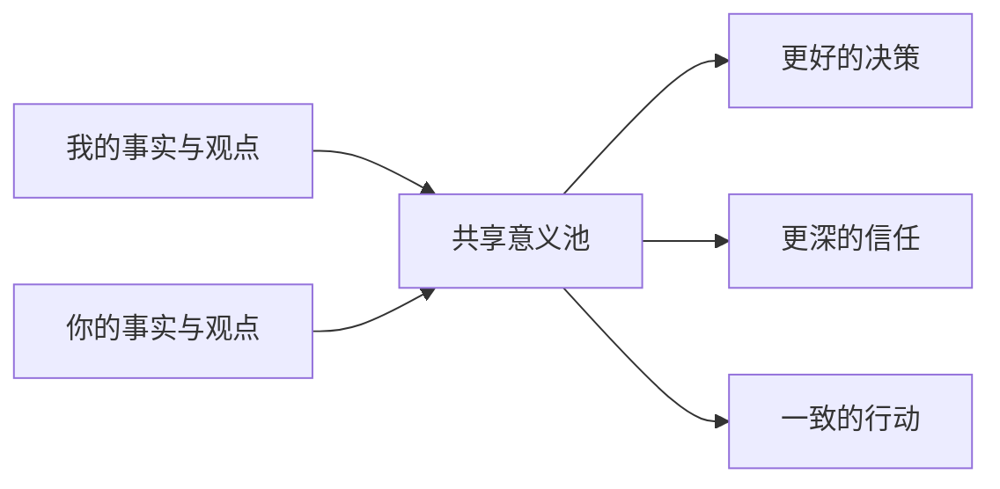
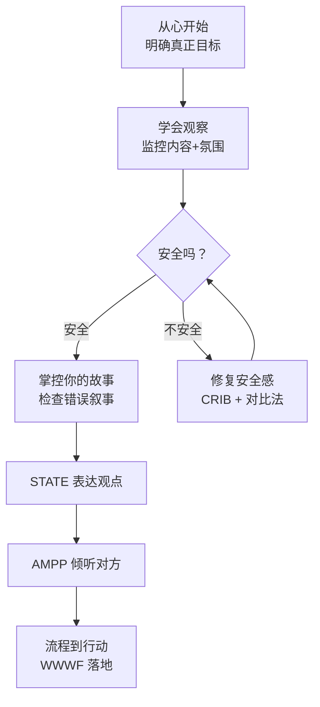

> 当 stakes 高、观点对立、情绪激烈时，普通对话升级为"关键对话"。大多数人面对关键对话只有两种反应：回避或搞砸。这本书提供第三种选择。

## 核心模型：共享意义池 (Shared Pool of Meaning)

关键对话的目标不是"赢"，而是让双方把所有信息放进共享池，共同找到最佳方案。双方各掌握着对方不知道的信息，只有拼在一起才能看到全貌——独白式的说服永远不如真正的对话，因为说话的人没法替代对方头脑里没有放到池子里的那部分事实。

## 三大核心原则

### 1. 从心开始 (Start with Heart)

对话前问自己三个问题，按优先级排列：

1. **我希望为自己达成什么？**
2. **我希望为对方达成什么？**
3. **我希望为这段关系达成什么？**

关键时刻问：**"我现在的行为，是在推动目标还是在破坏目标？"**

### 2. 学会观察 (Learn to Look)

同时监控两个层面：

| 层面 | 监控内容 | 工具 |
|------|---------|------|
| **内容** | 正在讨论什么 | 理性 |
| **氛围** | 对方是否感到安全 | 观察 |

<b>安全感受到威胁的两个信号：</b>

- **沉默 (Silence)**：掩饰、回避、退缩
- **暴力 (Violence)**：控制、贴标签、攻击

一旦检测到沉默或暴力，<b>暂停内容，先修复安全感</b>。 
### 3. 修复安全感

安全感来自两个条件：

- <b>共同目的 (Mutual Purpose)</b>："你关心我的利益吗？"
- <b>相互尊重 (Mutual Respect)</b>："你尊重我的价值吗？"

**CRIB 修复法：**

1. **C**ommit to seek Mutual Purpose — 承诺寻找共同目的
2. **R**ecognize the purpose behind the strategy — 识别策略背后的真实目的
3. **I**nvent a Mutual Purpose — 创造更高层次的共同目的
4. **B**rainstorm new strategies — 头脑风暴新策略

**CRIB 示例**：你和同事就产品方向争执——你要做 A 功能，他要做 B 功能。

1. **C**ommit："我们暂停争论 A 还是 B，先找到我们都认可的目标"
2. **R**ecognize："你坚持 B 是因为担心用户留存？我坚持 A 是因为担心新用户转化？"
3. **I**nvent："其实我们的共同目的是用户增长——留存和转化缺一不可"
4. **B**rainstorm："那有没有一个方案，能在一个迭代里同时验证留存和转化？"

**对比法 (Contrasting) — 修复误解的核心句式：**

> "我不希望……（消除误解），而是希望……（阐明真实意图）"

示例："我不希望你加班到崩溃，而是希望我们能找到可持续的节奏。"

## 掌控你的故事 (Master My Stories)

情绪不是别人"施加"给我们的，而是我们自己讲给自己的"故事"引发的。

**三种常见的错误故事：**

| 故事类型 | 特征 | 自问 |
|----------|------|------|
| **受害者故事** | "我没得选，我只能这样" | "我是否忽略了自己在其中的角色？" |
| **反派故事** | "他就是故意的，他就是蠢/坏" | "一个理性正派的人为什么会这样做？" |
| **无助者故事** | "没办法，改变不了什么" | "我真正想要的是什么？我能做什么？" |

**重讲故事的技巧：**

1. 回到事实 — "我看到的究竟是什么？哪些是我的推测？"
2. 问：**"一个理性正派的人为什么会这样做？"** 这是最有力的问题
3. 回到目标 — "我讲这个故事对我达成目标有帮助吗？"

## 两大核心方法

### STATE — 表达你的观点

| 步骤                       | 含义          | 示例                     |
| ------------------------ | ----------- | ---------------------- |
| **S**hare your facts     | 分享事实（非评价）   | "上周三次会议你都在我发言时打断了"     |
| **T**ell your story      | 说出你的判断（试探性） | "我开始觉得你不太重视我的意见"       |
| **A**sk for others' path | 询问对方看法      | "你怎么看？我可能误会了"          |
| **T**alk tentatively     | 试探性表达       | 用"我认为""也许""可能"而非"事实就是" |
| **E**ncourage testing    | 鼓励反驳        | "你觉得我的判断有问题吗？请直接说"     |

> **关键**：事实是最不具争议的起点。永远从事实开始，而不是从结论开始。

### AMPP — 倾听对方

| 步骤 | 含义 | 示例 |
|------|------|------|
| **A**sk | 邀请分享 | "能详细说说你的想法吗？" |
| **M**irror | 反馈观察到的情况 | "你声音提高了，这件事好像对你很重要" |
| **P**araphrase | 复述确认理解 | "所以你是担心方案超预算，对吗？" |
| **P**rime | 推测未说出的话 | "你是否觉得我没有考虑项目的风险？" |

> 当对方沉默时，AMPP 是打开共享池的工具。当你感到被攻击、想反击时，AMPP 是让自己冷静下来的工具。

## 常见困境

书中用一整章 (<b>"Yeah, But..."</b>) 覆盖了 17 种常见死局。以下是高频场景和应对：

| 困境                                                         | 应对                                                                                                                               |
| ---------------------------------------------------------- | -------------------------------------------------------------------------------------------------------------------------------- |
| <b>对方沉默不开口</b> | 用 AMPP 逐级升级：Ask → Mirror → Paraphrase → Prime。如果四次邀请仍不开腔，直接说"我注意到你不想谈这个，能告诉我为什么吗？" |
| **对方当场爆炸**                                                 | 不辩解、不对轰。先用对比法消解误解，再回到共同目的："我不是要否定你的方案，我是想确保我们讨论了风险"                                |
| **对方玩权力压制**    | 不直接对抗权力，把对话框回共享目的："我理解这是你的决定权，但在我执行之前，有一个风险我想确保你知道"                                |
| **屡次回到同一个争议**                                              | 说明之前决策时的 WWWF 没做到位。重新确认：谁、做什么、什么时候、怎么跟进                                                                                          |
| **对方就是不信任你**                                               | 信任是对话的结果，不是前提。从最小合作点开始，每次按 STATE 诚实表达、按 AMPP 真诚倾听，信任会逐渐累积                            |

> 所有困境的通用解：回到"从心开始"三个问题——我想为自己/对方/关系达成什么？当你想赢的时候，你已经输了。

## 流程到行动 (Move to Action)

对话结束后，必须转化为决策和行动。四种决策方式：

| 方式 | 适用场景 | 风险 |
|------|---------|------|
| **命令 (Command)** | 紧急/无余地 | 破坏参与感 |
| **咨询 (Consult)** | 需要输入但不共享决定权 | 若参与者感到被忽视则适得其反 |
| **投票 (Vote)** | 快速缩小选项 | 少数派可能不买账 |
| **共识 (Consensus)** | 高风险/需要全力以赴 | 耗时，可能变成妥协 |

**WWWF 行动确认表**（避免误解的根本方法）：

- **W**ho — 谁负责？
- **W**hat — 做什么？
- **W**hen — 截止时间？
- **F**ollow-up — 怎么跟进？

## 全书框架一览

## 关键洞察

- **"双核处理"** 是全书最核心的隐喻：大脑同时运行"内容核"和"氛围核"，氛围核的优先级永远更高
- <b>共同目的不是找到的，是创造的</b>：当双方目的看似冲突时，往上抽象一层（"我们都希望项目成功"），寻找更高层次的共同目的
- **安全感的建立是生理层面的**：当对方感到不安全时，肾上腺素已分泌，理性脑已下线，此时讲道理是无效的
- **事实 → 判断 → 询问 → 邀请反驳** 这个顺序是 STATE 的精髓，大多数人的错误是跳过事实直接丢结论

## 与相关概念的连接

- [[思考，快与慢（丹尼尔·卡尼曼）]] — 系统1/系统2 解释了为什么关键对话中情绪脑先于理性脑启动
- [[非暴力沟通]] — NVC 的观察/感受/需要/请求与 STATE 模型高度互补
- [[框架效应 - Framing Effect]] — "对比法"和故事重述本质上是在重构问题的框架