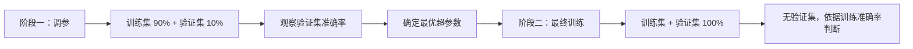

# Cifar10 数据集深度学习实战

> Kaggle 平台上的经典图片分类实战全流程

**难度**：⭐⭐⭐⭐（比 Fashion MNIST 复杂）  
**数据集来源**：加拿大研究机构，来自 Tiny Image 数据集

---

## 数据集介绍

| 属性 | 说明 |
| --- | --- |
| 类别数 | 10 类 |
| 图片尺寸 | 32×32 像素 |
| 训练集大小 | ~100 MB |
| 测试集大小 | ~700 MB（7Z 压缩） |
| 通道数 | 3（RGB 彩色） |

### 实战策略

- 🧪 **Demo 模式**：先用子集快速验证代码和参数
- 🚀 **完整模式**：参数调好后跑全量数据

---

## 数据预处理流程

### 1. 文件整理与划分

```
原始数据 → 按类别整理到子文件夹 → 适配 PyTorch ImageFolder
```

**数据集划分**：

| 数据集 | 比例 | 用途 |
| --- | --- | --- |
| 训练集 | 90% | 模型训练 |
| 验证集 | 10% | 超参数调试 |
| 测试集 | 单独存放 | 最终预测（标签 unknown） |

> ⚠️ 大文件场景不建议复制图片，可自定义 Data Iterator 读取

### 2. 批处理参数

| 模式 | Batch Size | 适用场景 |
| --- | --- | --- |
| Demo | 32 | 低 GPU 显存 |
| 完整 | 128-256 | 充足显存 |

---

## 图片增广（Data Augmentation）

### 训练集增广策略

针对 32×32 小图片的特殊处理：

```
原始 32×32 → 放大至 40×40 → 随机裁剪回 32×32
```

- 裁剪区域至少覆盖原图 **64%**
- 因图片方正、颜色正常，**未做**比例调整和颜色变换
- 基础操作：To Tensor + RGB 通道归一化

### 验证集/测试集

```python
# 无需增广，仅做基础转换
transform = ToTensor() + Normalize()
```

### 数据加载器配置

| 参数 | 训练集 | 验证集 | 测试集 |
| --- | --- | --- | --- |
| Shuffle | ✅ 开启 | ❌ 关闭 | ❌ 关闭 |
| Drop Last | ✅ 开启 | ❌ 关闭 | ❌ 关闭 |

> **Drop Last**：训练集开启保证固定 Batch Size，测试集关闭确保所有图片都被预测

---

## 模型搭建

### 模型选择

```python
model = ResNet18(
    input_channels=3,  # RGB 彩色图片
    num_classes=10     # Cifar10 类别数
)
```

### 损失函数

```python
criterion = CrossEntropyLoss(reduction='none')
# reduction 是否求和对训练影响较小
```

---

## 训练优化策略

### 学习率衰减（Learning Rate Decay）

**为什么需要衰减**：
> 迭代靠近最优解时，降低学习率可减少随机梯度的噪音影响，避免在最优解附近震荡

**Step LR 配置**：

| 参数 | 值 |
| --- | --- |
| 衰减间隔 | 每 4 个 epoch |
| 衰减系数 | 0.9 |
| 初始学习率 | 0.1 |

### 训练参数

| 参数 | Demo 模式 | 完整模式 |
| --- | --- | --- |
| Epochs | 20 | ~100 |
| 学习率 | 0.1 | 0.1 |
| 权重衰减 | 5e-4 | 5e-4 |
| GPU | 多卡并行 | 多卡并行 |

### 训练过程监控

- ✅ 训练集准确率随 epoch 持续上升
- ✅ Loss 持续下降
- ⚠️ Cifar10 因图片小、背景复杂，训练难度高于普通数据集

---

## 调参与最终训练

### 两阶段训练法



### 测试集预测与提交

```python
# 1. 前向传播获取预测值
predictions = model(test_data)

# 2. 取最大值索引作为类别标签
labels = argmax(predictions, dim=1)

# 3. 转换为 DataFrame 并保存 CSV
df = DataFrame({'id': ids, 'label': labels})
df.to_csv('submission.csv', index=False)
```

---

## 核心优化点（相比基础实战）

| 改进项 | 说明 | 效果 |
| --- | --- | --- |
| 🖼️ **图片增广** | 放大后随机裁剪 | 提升数据多样性 |
| 📉 **学习率衰减** | Step LR 策略 | 支持更长 epoch，更好收敛 |
| 🎯 **微调 Fine-tuning** | 可尝试预训练模型 | 大概率不降低效果，可能提升性能 |

---

## 高分实战技巧

### Cifar10 高准确率方案

```python
# 模型升级
model = ResNet50()  # 比 ResNet18 更深

# 学习率策略
# 前 150 epochs：大学习率，不衰减
# 后期：进行几次学习率衰减
```

> 💡 Cifar10 已被广泛研究，还有更多优化方法可尝试（如混合精度训练、标签平滑、CutMix 等）

---

## 关键代码片段

### 数据加载器

```python
train_loader = DataLoader(
    train_dataset,
    batch_size=32,
    shuffle=True,
    drop_last=True
)

test_loader = DataLoader(
    test_dataset,
    batch_size=32,
    shuffle=False,
    drop_last=False  # 确保所有图片都被预测
)
```

### 学习率调度器

```python
scheduler = StepLR(
    optimizer,
    step_size=4,    # 每 4 个 epoch
    gamma=0.9       # 衰减系数
)

# 每个 epoch 后调用
scheduler.step()
```

---

## 相关概念

- [[ResNet 残差网络]]
- [[数据增广 Data Augmentation]]
- [[学习率调度器 Learning Rate Scheduler]]
- [[交叉熵损失 Cross Entropy Loss]]
- [[微调技术 Fine-tuning]]
- [[Kaggle 竞赛平台]]

---

**Tags**: #深度学习 #Cifar10 #图片分类 #PyTorch #Kaggle #ResNet #实战教程
**Created**: 2026-03-12
**Source**: Kaggle 实战视频教程
