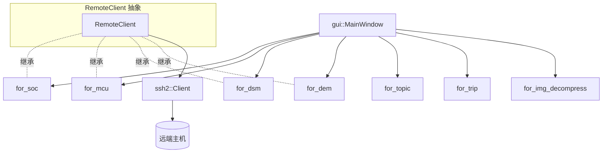

# for_remote 模块

#HIL #remote-control #SSH

> 统一封装对远端主机（Orin/MCU/DSM/摄像头网关等）的 SSH 连接、命令执行与服务控制。

## 架构

`RemoteClient` 抽象基类 → 7 个具体适配器

## 适配器列表

| 适配器 | 目标设备/服务 |
|---|---|
| `for_soc` | SOC 系统 |
| `for_mcu` | MCU 控制器 |
| `for_dem` | DEM 诊断事件管理 |
| `for_dsm` | DSM 驾驶员状态监控 |
| `for_topic` | Topic 管理 |
| `for_trip` | Trip 行程管理 |
| `for_img_decompress` | 图像解压缩 |
| `for_bag` | Bag 数据包管理 |

## RemoteClient 抽象基类

- `Connect/Disconnect`: SSH 连接管理，含 `AfterConnect`/`BeforeDisconnect` 钩子
- `BuildCommand`: 根据 `passwd_required_` 决定是否 `sudo -S` 包裹命令
- `Start/Stop/IsRunning`: 子类实现具体业务逻辑
- 依赖 `third_party/ssh2::Client` 完成底层 SSH 会话

## 认证模式

- 密码认证
- 免密（密钥）认证

## 组件关系图

