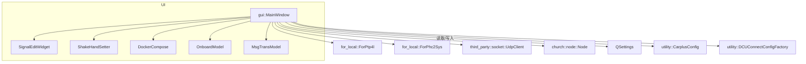

# gui 模块

#HIL #Qt #GUI

> Qt 桌面应用，提供一体化 HIL 操作界面。

## 入口与关键组件

- `gui.cc`：Qt 应用入口，解析命令行（`cxxopts`），初始化 ROS、配置（`QSettings`）、`CarplusConfig` 与 `DCUConnectConfigFactory`，创建 `MainWindow`
- `window.{h,cc}`：`MainWindow` 主窗体

## MainWindow 聚合的核心子模块

| 组件 | 职责 |
|---|---|
| `DockerCompose` | 场景容器编排与健康检查 |
| `OnboardModel` | 车载模块管理 |
| `MsgTransModel` | 消息转换模块 |
| `ShakeHandSetter` | 握手信号管理 |
| `SignalEditWidget` | 信号编辑与注入 |
| `OrinMonitor` | Orin 域控监控 |
| `TopicTable` | Topic 监控表 |
| `UdpClient` | 与 sim-chassis 等 UDP 交互 |
| `church::node::Node` | 内部消息/事件节点 |
| `ForPtp4l` / `ForPhc2Sys` | 本地时间同步控制 |

## 子目录

- `base/`：基础组件（Orin 管理、Docker 管理、菜单/场景编辑、CAN 信号编辑、监控视图等）
- `fault/`：故障注入面板
  - `lidar/`：LiDAR 故障设置（C01/P03/P177 车型适配）
  - `pbox/`：PBox/IMU 故障设置
  - `radar/`：Radar 故障设置
  - `hilcam_fault/`：HIL 相机故障设置
  - `general/`：D2D 配置、通用消息设置
  - `e2e_setter`：E2E 校验配置
  - `msg_publisher`：消息发布器

## 命令行参数

```
--host        sim chassis IP
--port        端口
--car-type    车型
--vir-cam     虚拟相机模式
```

## 关键交互流程

1. 启动 `roscore`
2. 写入 `QSettings` 并初始化配置工厂
3. 准备场景容器（`PrepareScenario`）
4. 运行时通过信号槽联动 UI 与业务逻辑

## 组件关系图


