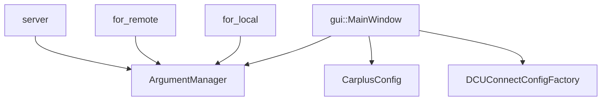

# utility 模块

#HIL #configuration

> 跨模块复用的基础能力与配置访问入口。

## 关键组件

| 组件                        | 职责                                          |
| ------------------------- | ------------------------------------------- |
| `ArgumentManager`         | 统一配置读取（JSON/INI），提供禁用模块、图像转换参数、密码需求、时间同步网卡等 |
| `CarplusConfig`           | 车型维度的 DBC/Topic/路径管理（单例模式）                  |
| `DCUConnectConfigFactory` | DCU 连接配置工厂                                  |
| `remote_invoke`           | 远程调用封装                                      |
| `item_viewer`             | UI 辅助查看器                                    |
| `utility`                 | 通用工具函数                                      |

## ArgumentManager 提供的配置

- `DisableSimModule(vir_cam)`: 需要禁用的仿真模块列表
- `ImgTransformerArgs/Enabled(vir_cam)`: 图像转换模块参数与开关
- `PasswdRequired()`: 远程 sudo 密码需求
- `TimeSyncEthName()`: 时间同步网卡名
- `ServiceName()`: 远程服务名

## 配置来源

- JSON/INI 文件（`config/` 目录）
- 运行期环境变量或 `QSettings`

## 依赖关系

