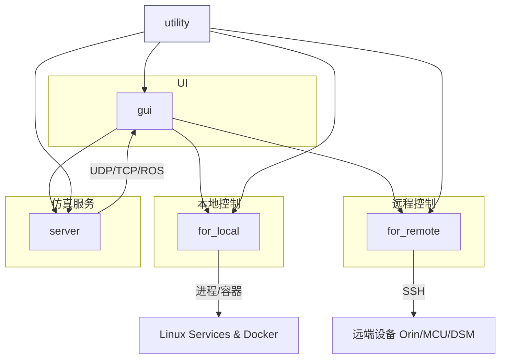

# software_in_loop 架构概览

#architecture #HIL #autonomous-driving #simulation

> **定位**: HIL（Hardware-In-the-Loop）仿真测试平台，用于自动驾驶车辆底盘、传感器和控制模块的软件在环测试。需搭配 `carplus` 一起实现 HIL 测试。

## 基本信息

| 维度 | 说明 |
|---|---|
| 构建系统 | Bazel（MonoRepo 结构） |
| 语言 | C++（主体）+ Python（工具链/初始化）+ Protobuf（通信协议） |
| UI 框架 | Qt (QMainWindow) |
| CI/CD | GitLab CI（build → release-deb → unit_test → integration_test） |
| 通信中间件 | ROS / SOME/IP / UDP / TCP / ZMQ / WebSocket |
| 安装路径 | `/opt/deeproute/software_in_loop/` |

## 顶层目录结构

```
software_in_loop/
├── src/                  # 核心源码（6 个子模块）
│   ├── gui/              # Qt 桌面界面
│   ├── for_local/        # 本机服务控制
│   ├── for_remote/       # 远端设备控制（SSH）
│   ├── server/           # 传感器仿真服务
│   ├── chassis/          # 底盘 CAN/FlexRay 仿真器
│   ├── utility/          # 配置与工具
│   └── diagrams/         # 架构图（Mermaid）
├── common/               # 仓库级公共库
├── proto/                # Protobuf 消息定义
├── pybind_so/            # PyBind11 Python 绑定
├── tools/                # Python 工具集
├── config/               # 配置文件
├── pipeline/             # 打包与部署
├── someip/               # SOME/IP 中间件集成
├── third_party/          # 第三方库
└── resources/            # GUI 图片资源
```

## 分层架构

```
┌──────────────────────────────────────────────┐
│                  gui (Qt 界面)                │  ← 用户交互层
│    MainWindow / 故障注入面板 / 信号编辑器      │
├──────────────────┬───────────────────────────┤
│   for_local      │      for_remote           │  ← 控制层
│  (本机进程/容器)  │   (SSH 远端设备管理)       │
├──────────────────┴───────────────────────────┤
│              server (仿真服务)                 │  ← 仿真层
│  sim-lidar / sim-radar / sim-pbox / sim-uss  │
│  sim-relayer / joystick                       │
├──────────────────────────────────────────────┤
│            chassis (底盘仿真器)                │  ← 底盘层
│  CAN/FlexRay 通信 / 多车型策略 / PCIe-ZLG    │
├──────────────────────────────────────────────┤
│              utility (配置/工具)               │  ← 基础设施层
│  ArgumentManager / CarplusConfig / DCU 配置   │
└──────────────────────────────────────────────┘
```

## 模块依赖关系



## Bazel 外部依赖

```
simulation_common  ← 仿真公共库
bazel_configs      ← 构建工具链
third_party        ← 第三方库
common             ← MonoRepo 公共库
platform           ← 平台层
onboard_application ← 车载应用
vsomeip            ← SOME/IP 协议栈（git_repository）
```

## 详细模块文档

- [[gui 模块]]
- [[for_local 模块]]
- [[for_remote 模块]]
- [[server 模块]]
- [[chassis 模块]]
- [[utility 模块]]
- [[pybind_so 模块]]
- [[tools 工具集]]
- [[proto 消息定义]]

## 关键技术特征

1. **多车型适配**: 工厂模式 + 策略模式，支持吉利(GL)、长城(GWM)、力帆(LP)、Smart 等多个 OEM
2. **双平台支持**: ORIN（Linux）和 QNX 域控平台
3. **CAN/FlexRay 硬件交互**: PCIe-ZLG CAN 卡与真实底盘 ECU 通信
4. **全传感器模拟**: LiDAR、Radar、PBox（IMU）、USS、Camera 全覆盖
5. **SOME/IP 中间件**: PBox 等模块的车载以太网通信
6. **Docker 容器化**: 仿真场景通过 docker-compose 编排
7. **远程设备管理**: SSH 隧道管理 Orin/MCU 等车端设备
8. **Python 自动化**: PyBind11 导出 C++ 能力，支持自动化测试
