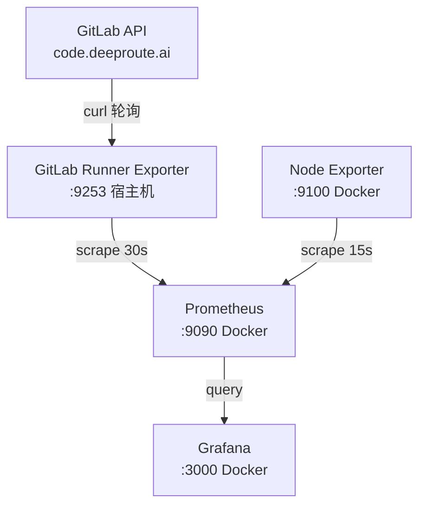

# Prometheus-Grafana GitLab Runner 监控系统

> 项目路径: `~/code/prometheus_grafana`
> 远程部署: `dr@10.24.99.65:~/code/prometheus_grafana`
> 最后更新: 2026-03-18

## 概述

基于 Prometheus + Grafana 的 GitLab Runner 监控系统，实时采集 Runner 状态与 Job 执行信息，提供可视化 Dashboard。

## 目录结构

```
prometheus_grafana/
├── docker-compose.yml            # Docker 编排（Prometheus + Grafana + Node Exporter）
├── prometheus.yml                # Prometheus 抓取配置
├── .env.example                  # 环境变量模板
├── start_exporter.sh             # Exporter 启动脚本
├── README.md
│
├── gitlab_exporter/              # 自定义 GitLab Runner Exporter
│   ├── exporter.py               #   主程序：轮询 GitLab API → Prometheus 指标
│   ├── backfill.py               #   历史数据回填（生成 OpenMetrics 文件）
│   ├── backfill_gap.py           #   补填缺失时段的 job_info 指标
│   ├── pyproject.toml            #   uv 项目配置（Python ≥3.12）
│   ├── requirements.txt          #   依赖：prometheus-client, requests
│   └── Dockerfile                #   容器镜像（当前未使用）
│
├── grafana/                      # Grafana 预配置
│   └── provisioning/
│       ├── datasources/
│       │   └── prometheus.yml    #   数据源：http://prometheus:9090
│       └── dashboards/
│           ├── dashboard.yml     #   Dashboard 加载配置
│           └── gitlab-runner.json#   GitLab Runner Dashboard
│
├── scripts/                      # 运维脚本
│   ├── check_block_permissions.sh#   TSDB 块权限检查与修复
│   └── backup_recent_blocks.sh   #   TSDB 块定期备份
│
└── prometheus_data/              # Prometheus TSDB 数据目录
```

## 服务架构



### 服务端口

| 服务 | 端口 | 运行方式 |
|------|------|----------|
| Prometheus | 9090 | Docker |
| Grafana | 3000 | Docker（匿名可访问） |
| Node Exporter | 9100 | Docker |
| GitLab Runner Exporter | 9253 | 宿主机 `uv run` |

## 技术栈

| 类别 | 技术 |
|------|------|
| 监控存储 | Prometheus TSDB |
| 可视化 | Grafana + clock/piechart/echarts 插件 |
| 数据采集 | 自定义 Python Exporter（prometheus-client） |
| API 调用 | curl 子进程（规避企业 TLS 兼容问题） |
| 包管理 | uv（pyproject.toml） |
| 编排 | Docker Compose v3.8 |
| 数据格式 | OpenMetrics |

## 核心指标

Exporter 暴露的 Prometheus 指标：

| 指标 | 类型 | 说明 |
|------|------|------|
| `gitlab_runner_state` | Gauge | Runner 当前状态 |
| `gitlab_runner_online` | Gauge | Runner 是否在线 |
| `gitlab_runner_active` | Gauge | Runner 是否激活 |
| `gitlab_runner_running_job_count` | Gauge | 正在运行的 Job 数 |
| `gitlab_runner_job_info` | Gauge | Job 详细信息（标签维度） |
| `gitlab_runner_job_duration_seconds` | Gauge | Job 持续时间 |
| `gitlab_runner_job_timeline` | Gauge | Job 时间线 |
| `gitlab_runner_job_hash` | Gauge | Job 哈希标识 |

## Runner ID 对照表

| Runner ID | 描述 |
|-----------|------|
| 9730 | gl_oriny_2 |
| 9731 | gwm_oriny_1 |
| 9732 | gwm_orinx_2 |
| 9733 | gwm_oriny_2 |
| 9735 | gwm_thor_2 |
| 9897 | gwm_thor_1 |
| 10418 | gwm_oriny_3 |
| 10419 | gwm_thor_3 |
| 11499 | gwm_orinx_1 |
| 11500 | gl_oriny_3 |

## 环境变量

| 变量 | 说明 |
|------|------|
| `GITLAB_URL` | GitLab 实例地址（如 `https://code.deeproute.ai`） |
| `GITLAB_TOKEN` | Personal Access Token（需 `read_api` 权限） |
| `RUNNER_IDS` | 逗号分隔的 Runner ID 列表（优先使用） |
| `GITLAB_PROJECT_ID` | 项目 ID，用于获取项目下 Runner |
| `POLL_INTERVAL` | API 轮询间隔（秒） |
| `EXPORTER_PORT` | Exporter 监听端口（默认 9253） |

## Exporter 核心设计

### 模块组成（exporter.py）

- **Config**: 从环境变量读取并验证配置
- **GitLabClient**: 封装 curl 调用 GitLab API（规避 Python OpenSSL 与企业 TLS 兼容性问题）
- **DataStore**: 线程安全的数据缓存层
- **Poller**: 后台线程定期轮询 Runner 和 Job 数据
- **GitLabRunnerCollector**: Prometheus Collector 接口，从 DataStore 生成指标

### Runner 发现顺序

1. `RUNNER_IDS` 环境变量（优先）
2. `GITLAB_PROJECT_ID` 获取项目下的 Runner
3. 全局 `/runners` API 端点

## 历史数据回填

Prometheus TSDB 是不可变存储，修改历史数据需要：

```
停 Prometheus → 删旧块 → 生成新 OpenMetrics → promtool 导入 → 启 Prometheus
```

### 关键约束

- **不可重叠**: 回填数据的时间范围不能与已有块重叠
- **PAUSE_SCHEDULE**: 手动指定 Runner 暂停时段，避免依赖实时 API 状态
- **块权限**: TSDB 块需为 `nobody:nogroup`，否则压缩时可能丢数据

### 回填工具

| 脚本 | 用途 | 输出 |
|------|------|------|
| `backfill.py` | 完整历史回填 | `backfill.om`（约 146MB/7天/10 runners） |
| `backfill_gap.py` | 补填 job_info 缺失时段 | `backfill_gap.om` |

## 运维脚本

| 脚本 | 用途 |
|------|------|
| `check_block_permissions.sh` | 检查 TSDB 块权限，`--fix` 自动修复为 `nobody:nogroup` |
| `backup_recent_blocks.sh` | 备份最近 N 小时 TSDB 块到 `_backup/`，自动清理 7 天前备份 |
| `start_exporter.sh` | 启动 Exporter 的便捷脚本 |

## 常用命令

```bash
# 启动所有服务
docker compose up -d

# 启动 Exporter（宿主机）
cd gitlab_exporter && source ../.env && uv run python exporter.py

# 查看 TSDB 块时间范围
sudo python3 -c "
import json, os
from datetime import datetime, timezone, timedelta
cst = timezone(timedelta(hours=8))
base = '/var/lib/docker/volumes/prometheus_grafana_prometheus_data/_data'
for d in sorted(os.listdir(base)):
    meta = os.path.join(base, d, 'meta.json')
    if not os.path.isfile(meta): continue
    m = json.load(open(meta))
    mint = datetime.fromtimestamp(m['minTime']/1000, tz=cst).strftime('%m-%d %H:%M')
    maxt = datetime.fromtimestamp(m['maxTime']/1000, tz=cst).strftime('%m-%d %H:%M')
    print(f'{d[:12]} {mint} ~ {maxt}')
"

# 验证数据
curl -s 'http://localhost:9090/api/v1/query?query=count(gitlab_runner_state)' | jq .
```

## 踩坑记录

| 问题 | 原因 | 解决 |
|------|------|------|
| Runner 状态交替闪烁 | backfill 运行两次，数据重叠 | 删除所有旧回填块，一次性重新生成 |
| promtool 导入后查不到数据 | 挂载了本地目录而非 Docker named volume | 改为 `-v prometheus_grafana_prometheus_data:/prometheus` |
| 新导入块被压缩删除 | Prometheus 运行中导入重叠块 | 先停 Prometheus，再导入 |
| 历史数据缺 job_info | 初版 backfill 未生成该指标 | 增加 job_info 生成逻辑 |
| Python 3.8 语法报错 | 远端 Python 版本低 | 加 `from __future__ import annotations` |
| Prometheus 无法抓取 Exporter | `host.docker.internal` 在 Linux 不可用 | compose 添加 `extra_hosts` |

## 相关链接

- Grafana Dashboard: `http://10.24.99.65:3000`
- Prometheus UI: `http://10.24.99.65:9090`
- GitLab API: `https://code.deeproute.ai`
