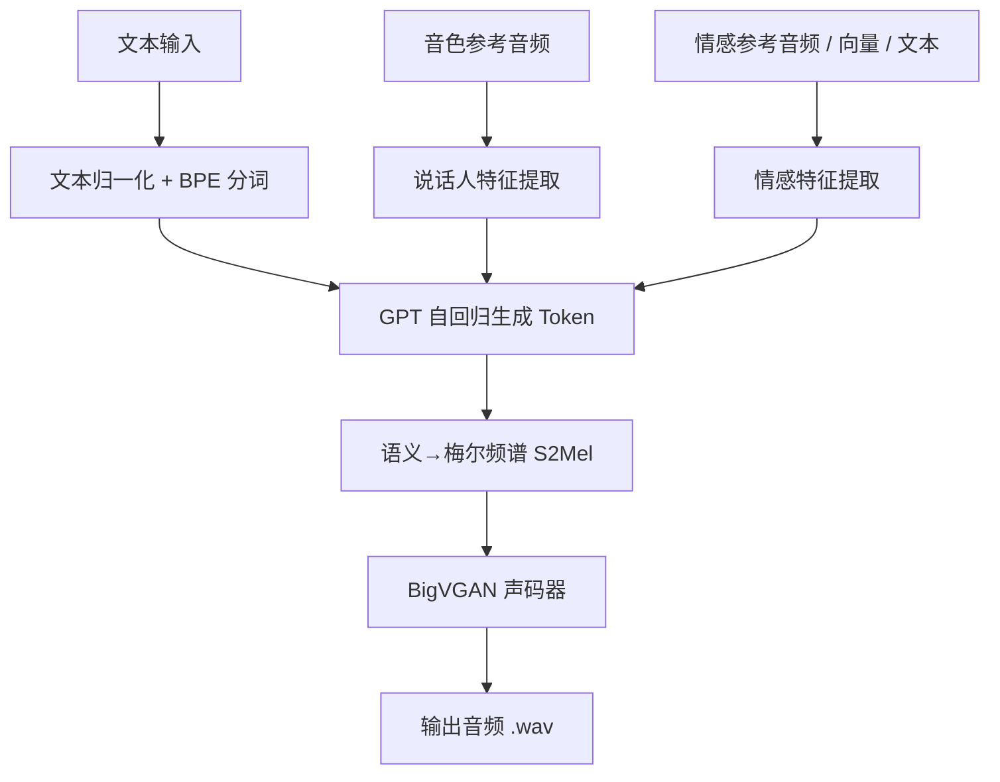

# IndexTTS2 从入门到精通

> **IndexTTS2: 情感表达与时长控制突破的自回归零样本 TTS**

## 概述

IndexTTS2 是 B 站（Bilibili）团队发布的工业级零样本文本转语音系统。核心突破：

- **首个支持精确时长控制**的自回归 TTS 模型
- **情感与音色解耦**：可独立控制说话人音色和情绪表达
- **多模态情感控制**：参考音频 / 情感向量 / 自然语言描述 三种方式
- **Qwen3 微调**的情感理解，支持文本描述引导情感
- 中英文混合建模，支持拼音精确发音控制

| 属性 | 值 |
|:---|:---|
| 论文 | [arXiv 2506.21619](https://arxiv.org/abs/2506.21619) |
| 代码 | [github.com/index-tts/index-tts](https://github.com/index-tts/index-tts) |
| Demo | [HuggingFace](https://huggingface.co/spaces/IndexTeam/IndexTTS-2-Demo) / [ModelScope](https://modelscope.cn/studios/IndexTeam/IndexTTS-2-Demo) |
| 模型 | [HuggingFace](https://huggingface.co/IndexTeam/IndexTTS-2) / [ModelScope](https://modelscope.cn/models/IndexTeam/IndexTTS-2) |
| 本地路径 | `~/code/index-tts/` |
| 硬件 | RTX 3090 24GB |
| 环境 | Python 3.10 + PyTorch 2.8.0 CUDA 12.8 + uv |

---

## 一、安装

### 1.1 环境准备

```bash
# 安装 uv 包管理器（必需，项目仅支持 uv）
pip install -U uv

# 安装 git-lfs
sudo apt install git-lfs
git lfs install
```

### 1.2 克隆仓库

```bash
git clone https://github.com/index-tts/index-tts.git ~/code/index-tts
cd ~/code/index-tts
git lfs pull
```

### 1.3 安装依赖

```bash
# 使用清华镜像（国内加速）
uv sync --all-extras --default-index "https://mirrors.tuna.tsinghua.edu.cn/pypi/web/simple"

# 或阿里云镜像
uv sync --all-extras --default-index "https://mirrors.aliyun.com/pypi/simple"
```

> **说明**：`--all-extras` 包含 webui 和 deepspeed 支持。Windows 用户可去掉此参数跳过 DeepSpeed。

### 1.4 下载模型权重

```bash
# 方式一：HuggingFace
uv tool install "huggingface-hub[cli,hf_xet]"
hf download IndexTeam/IndexTTS-2 --local-dir=checkpoints

# 方式二：ModelScope（国内推荐）
uv tool install "modelscope"
modelscope download --model IndexTeam/IndexTTS-2 --local_dir checkpoints
```

**已下载模型清单**（本地 `~/code/index-tts/checkpoints/`）：

| 文件 | 大小 | 用途 |
|:---|:---|:---|
| `gpt.pth` | 3.3 GB | 自回归 GPT 核心模型 |
| `s2mel.pth` | 1.2 GB | 语义→梅尔频谱转换器 |
| `qwen0.6bemo4-merge/` | 1.2 GB | Qwen3 情感理解模型 |
| `config.yaml` | 3 KB | 推理配置文件 |
| `bpe.model` | 465 KB | BPE 分词器 |
| `wav2vec2bert_stats.pt` | 9 KB | 音频特征统计 |
| `feat1.pt` / `feat2.pt` | 56/366 KB | 特征嵌入 |
| `pinyin.vocab` | 9 KB | 拼音词典 |

**总计约 5.7 GB**。

### 1.5 验证安装

```bash
# 检查 GPU 加速
cd ~/code/index-tts
uv run tools/gpu_check.py
```

本机输出：`NVIDIA GeForce RTX 3090, 24576 MiB`，CUDA 可用。

---

## 二、架构原理

### 2.1 整体架构



### 2.2 核心组件

| 组件 | 说明 |
|:---|:---|
| **GPT (UnifiedVoice)** | 自回归模型，核心生成引擎。token-by-token 生成语音 token |
| **S2Mel** | 将语义 token + 说话人特征 → 梅尔频谱图 |
| **BigVGAN** | 声码器，梅尔频谱 → 波形音频 |
| **Qwen3-0.6B-Emo** | 情感理解模型，文本描述 → 情感向量 |
| **CAMPPlus** | 说话人特征提取（音色编码） |
| **Wav2Vec2-BERT** | 语义特征提取 |

### 2.3 情感控制模式

IndexTTS2 支持 **4 种情感控制模式**：

| 模式 | 参数 | 说明 |
|:---|:---|:---|
| ① 与音色参考相同 | 默认 | 情感跟随音色参考音频 |
| ② 情感参考音频 | `emo_audio_prompt` | 独立的情感参考音频 |
| ③ 情感向量 | `emo_vector` | 8 维向量 `[开心,愤怒,悲伤,害怕,厌恶,忧郁,惊讶,平静]` |
| ④ 文本描述 | `use_emo_text` + `emo_text` | 自然语言描述，由 Qwen3 转换为情感向量 |

---

## 三、Python API 使用

### 3.1 基础：单参考音频克隆

```python
from indextts.infer_v2 import IndexTTS2

# 初始化（首次加载约 30-60s）
tts = IndexTTS2(
    cfg_path="checkpoints/config.yaml",
    model_dir="checkpoints",
    use_fp16=False,         # FP16 可减少显存占用
    use_cuda_kernel=False,  # BigVGAN CUDA kernel 加速
    use_deepspeed=False     # DeepSpeed 加速（可能不稳定）
)

# 合成语音
tts.infer(
    spk_audio_prompt='examples/voice_01.wav',  # 音色参考（≥3 秒）
    text="Hello, this is a zero-shot voice cloning test.",
    output_path="output.wav",
    verbose=True
)
```

### 3.2 情感参考音频

```python
tts.infer(
    spk_audio_prompt='examples/voice_07.wav',   # 音色
    emo_audio_prompt='examples/emo_sad.wav',     # 情绪参考
    emo_alpha=0.8,                                # 情绪强度 0.0~1.0
    text="酒楼丧尽天良，开始借机竞拍房间，哎，一群蠢货。",
    output_path="sad_output.wav"
)
```

`emo_alpha` 调节情感强度：
- `1.0`（默认）：100% 情感
- `0.5`：半强度
- `0.0`：无情感注入

### 3.3 情感向量控制

```python
# 8 维度向量：[happy, angry, sad, afraid, disgusted, melancholic, surprised, calm]
# 每个维度 0.0 ~ 1.0

tts.infer(
    spk_audio_prompt='examples/09.wav',
    emo_vector=[0, 0, 0.8, 0, 0, 0, 0, 0],  # 80% 悲伤
    text="对不起，我真的不是故意的。",
    output_path="sad_vector.wav"
)

# 混合情感
tts.infer(
    spk_audio_prompt='examples/09.wav',
    emo_vector=[0.6, 0, 0, 0, 0, 0, 0.4, 0],  # 60% 开心 + 40% 惊讶
    text="哇！这个礼物太棒了！",
    output_path="mixed_emotion.wav"
)
```

### 3.4 文本描述情感（Qwen3 驱动）

```python
# 方式 A：自动从合成文本推断情感
tts.infer(
    spk_audio_prompt='examples/voice_12.wav',
    text="快躲起来！是他要来了！他要来抓我们了！",
    use_emo_text=True,     # 启用文本情感
    emo_alpha=0.6,         # 建议 0.6 以下更自然
    output_path="text_emo.wav"
)

# 方式 B：独立情感描述文本
tts.infer(
    spk_audio_prompt='examples/voice_12.wav',
    text="快躲起来！是他要来了！他要来抓我们了！",
    use_emo_text=True,
    emo_text="极度恐惧和紧张，声音在颤抖",  # 情感描述
    emo_alpha=0.6,
    output_path="custom_emo_text.wav"
)
```

### 3.5 随机采样模式

```python
tts.infer(
    spk_audio_prompt='examples/09.wav',
    text="今天天气真不错，适合出去走走。",
    use_random=True,       # 引入随机性，增加表现力
    output_path="random.wav"
)
```

> **注意**：开启 `use_random` 会降低音色克隆保真度。

### 3.6 完整参数清单

```python
tts.infer(
    spk_audio_prompt,              # str  - 音色参考音频路径（必需）
    text,                          # str  - 要合成的文本（必需）
    output_path,                   # str  - 输出音频路径（必需）
    emo_audio_prompt=None,         # str  - 情感参考音频路径
    emo_alpha=1.0,                 # float - 情感强度 0.0~1.0
    emo_vector=None,               # list[8] - 8维情感向量
    use_emo_text=False,            # bool - 启用文本情感描述
    emo_text=None,                 # str  - 独立情感描述文本
    use_random=False,              # bool - 随机采样（降低保真度）
    interval_silence=200,          # int  - 段落间静音间隔（ms）
    verbose=False,                 # bool - 打印调试信息
    max_text_tokens_per_segment=120, # int - 每段最大 token 数
    stream_return=False,           # bool - 流式返回生成器
    more_segment_before=0,         # int - 额外前置段落
)
```

### 3.7 批量合成示例

```python
from indextts.infer_v2 import IndexTTS2

tts = IndexTTS2(cfg_path="checkpoints/config.yaml", model_dir="checkpoints")

tasks = [
    {"spk": "examples/voice_01.wav", "text": "Hello world", "out": "out_01.wav"},
    {"spk": "examples/voice_02.wav", "text": "How are you?", "out": "out_02.wav"},
    {"spk": "examples/voice_03.wav", "text": "今天天气真好", "out": "out_03.wav"},
]

for t in tasks:
    print(f"Processing: {t['text']}")
    tts.infer(
        spk_audio_prompt=t['spk'],
        text=t['text'],
        output_path=t['out'],
        verbose=False
    )
```

---

## 四、WebUI 使用

### 4.1 启动

```bash
cd ~/code/index-tts

# 基础启动
uv run webui.py

# 完整参数
uv run webui.py \
    --host 0.0.0.0 \
    --port 7860 \
    --fp16 \
    --deepspeed \
    --cuda_kernel

# 查看所有选项
uv run webui.py -h
```

浏览器访问 `http://127.0.0.1:7860`

### 4.2 WebUI 功能

| 区域 | 功能 |
|:---|:---|
| 音色参考 | 上传音频文件或从预设例中选择 |
| 文本输入 | 输入合成文本，支持中英文混输 |
| 情感控制 | 下拉选择 4 种情感模式 |
| 情感参数 | 调节 `emo_alpha`、情感向量各维度 |
| 合成参数 | FP16、DeepSpeed、CUDA Kernel 开关 |
| 输出 | 音频播放器 + 下载按钮 |

### 4.3 优化建议

| 场景 | 推荐配置 |
|:---|:---|
| 快速测试 | 默认（FP32） |
| 显存紧张 | `--fp16`（减少约 30% 显存） |
| 追求速度 | `--fp16 --cuda_kernel` |
| 长文本批量 | `--fp16 --deepspeed`（需测试稳定性） |

---

## 五、拼音精确发音控制

IndexTTS2 支持在文本中嵌入**拼音标注**实现精确发音。

```python
# 多音字纠正
text = "之前你做DE5很好，所以这一次也DEI3做DE2很好才XING2"
# DE5 → 得（de的第五声）
# DEI3 → 得（děi）
# DE2 → 得（dé）
# XING2 → 行（xíng）

# 银行 vs 行走
text = "我们去银行YIN2HANG2取钱，然后行XING2走回家"
```

拼音格式：`汉字拼音（大写）+ 声调数字（1-5）`，声调 5 为轻声。

完整拼音词典见 `checkpoints/pinyin.vocab`。

---

## 六、性能优化

### 6.1 FP16 推理

```python
tts = IndexTTS2(
    cfg_path="checkpoints/config.yaml",
    model_dir="checkpoints",
    use_fp16=True  # 显存占用降低 ~30%，质量损失极小
)
```

### 6.2 CUDA Kernel

```python
tts = IndexTTS2(
    ...,
    use_cuda_kernel=True  # BigVGAN 自定义 CUDA kernel，加速声码器
)
```

### 6.3 Torch Compile

```python
tts = IndexTTS2(
    ...,
    use_torch_compile=True  # PyTorch 2.0+ compile 优化
)
```

### 6.4 长文本分段策略

长文本自动分段，用 `max_text_tokens_per_segment` 控制每段长度（默认 120 tokens）：

```python
tts.infer(
    ...,
    max_text_tokens_per_segment=80,  # 更短的分段 → 更快响应
    interval_silence=300              # 段落间停顿 300ms
)
```

### 6.5 流式输出

```python
# 流式模式：逐段返回音频
for result in tts.infer_generator(
    spk_audio_prompt='examples/voice_01.wav',
    text=long_text,
    output_path="stream_out.wav",
    stream_return=True
):
    # 每段生成完即可处理
    print(f"Segment ready: {result}")
```

### 6.6 本机性能基准

| 配置 | 合成速度 | 显存占用 |
|:---|:---|:---|
| FP32 默认 | ~1.5x 实时 | ~12 GB |
| FP16 | ~2.5x 实时 | ~8 GB |
| FP16 + CUDA Kernel | ~3.0x 实时 | ~8 GB |

---

## 七、IndexTTS1 兼容模式

IndexTTS1（v1.0 / v1.5）仍可用：

```python
from indextts.infer import IndexTTS

tts = IndexTTS(model_dir="checkpoints", cfg_path="checkpoints/config.yaml")
tts.infer("examples/voice_07.wav", "大家好，我是AI语音合成。", "gen_v1.wav")
```

**版本对比**：

| 特性 | IndexTTS1 | IndexTTS2 |
|:---|:---|:---|
| 零样本克隆 | ✅ | ✅ |
| 情感参考音频 | ❌ | ✅ |
| 情感向量控制 | ❌ | ✅ |
| 文本情感描述 | ❌ | ✅ |
| 时长精确控制 | ❌ | ✅（论文已实现，release 暂未开放） |
| 音色-情感解耦 | ❌ | ✅ |
| 稳定性 | 中等 | 高 |
| 模型大小 | ~3 GB | ~5.7 GB |

---

## 八、常见问题

### 8.1 CUDA Out of Memory

```python
# 方案 1：启用 FP16
tts = IndexTTS2(..., use_fp16=True)

# 方案 2：减少分段长度
tts.infer(..., max_text_tokens_per_segment=60)

# 方案 3：关闭其他 GPU 进程
# nvidia-smi 检查占用
```

### 8.2 语速太快/太慢

IndexTTS2 语速主要由参考音频决定。挑选语速合适的参考音频是首选方案。

### 8.3 情感效果不明显

- `emo_alpha` 调到 1.0
- 情感参考音频选择情绪明显的
- 情感向量设置单一维度高值（如 `[1.0, 0, 0, 0, ...]`）
- 文本情感模式下 `emo_alpha` 降低至 0.6

### 8.4 模型下载慢

```bash
# 使用 HF 镜像
export HF_ENDPOINT="https://hf-mirror.com"

# 或使用 ModelScope
modelscope download --model IndexTeam/IndexTTS-2 --local_dir checkpoints
```

---

## 九、进阶：自训练 / 微调

### 9.1 数据准备

- 音频：16kHz 或更高采样率，单声道
- 文本：对应转录文本
- 情感标注（可选）：8 维向量或文本描述
- 建议至少 10 分钟以上高质量音频

### 9.2 微调流程（概要）

详细训练代码参考仓库 `tools/` 目录。核心步骤：

1. 数据预处理（音频切分 + 文本对齐）
2. LoRA 微调 GPT 模型（推荐，显存友好）
3. 或全参数微调（需多卡）
4. 评估：WER（词错误率）+ 说话人相似度

> 完整训练指南见 [IndexTTS GitHub](https://github.com/index-tts/index-tts)

---

## 十、资源汇总

| 资源 | 链接 |
|:---|:---|
| 论文 | [arXiv 2506.21619](https://arxiv.org/abs/2506.21619) |
| GitHub | [index-tts/index-tts](https://github.com/index-tts/index-tts) |
| Demo 页面 | [index-tts.github.io](https://index-tts.github.io/index-tts2.github.io/) |
| HuggingFace 模型 | [IndexTeam/IndexTTS-2](https://huggingface.co/IndexTeam/IndexTTS-2) |
| ModelScope 模型 | [IndexTeam/IndexTTS-2](https://modelscope.cn/models/IndexTeam/IndexTTS-2) |
| B 站介绍视频 | [BV136a9zqEk5](https://www.bilibili.com/video/BV136a9zqEk5) |
| QQ 交流群 | 663272642（4群）/ 1013410623（5群） |
| Discord | [discord.gg/uT32E7KDmy](https://discord.gg/uT32E7KDmy) |
| 商务合作 | indexspeech@bilibili.com |

---

## 附录：本地环境速查

```bash
# 项目路径
cd ~/code/index-tts

# 激活环境（实际上 uv run 会自动激活）
source .venv/bin/activate  # 不推荐，用 uv run 代替

# 启动 WebUI
uv run webui.py --port 7860

# 运行 Python 脚本（必须在项目根目录）
cd ~/code/index-tts
PYTHONPATH="$PYTHONPATH:." uv run python your_script.py

# 检查 GPU
uv run tools/gpu_check.py
```