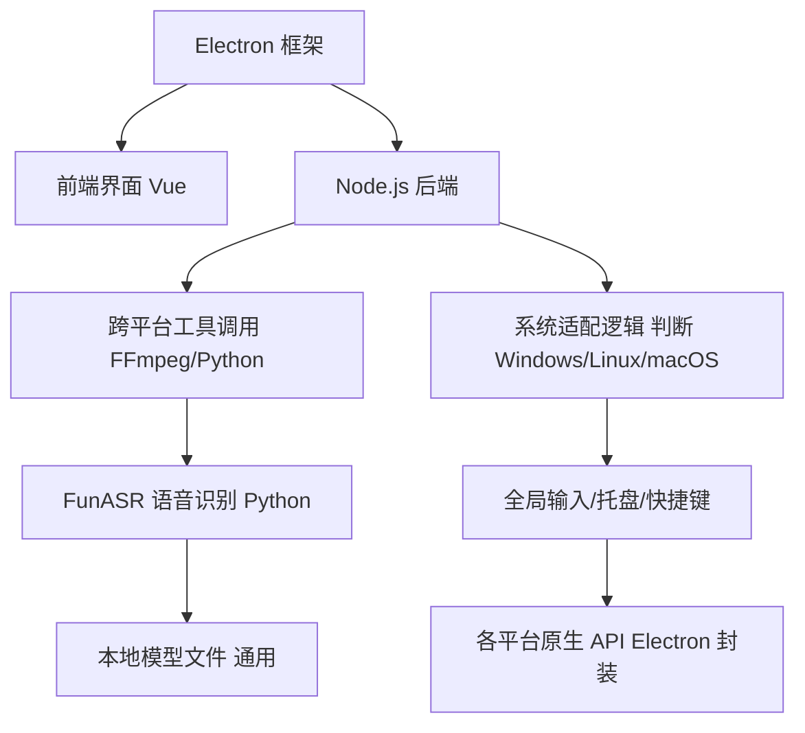

# QuQu 跨平台实现原理详解

> 创建日期:: 2026-03-09
> 标签:: #Electron #Node.js #跨平台 #桌面应用 #架构设计
> 分类:: 技术文档/架构设计

---

## 📌 核心问题

**QuQu 如何实现 Windows/macOS/Linux 三大桌面平台跨平台支持？**

> **答案**：核心依赖 **Node.js 生态的 Electron 框架** + 跨平台底层工具链

---

## 🏗️ 整体架构

```
┌─────────────────────────────────────────────────────────────┐
│                    QuQu 跨平台架构                           │
├─────────────────────────────────────────────────────────────┤
│                                                             │
│  ┌─────────────────────────────────────────────────────┐   │
│  │              Electron 框架 (核心骨架)                │   │
│  │  ┌─────────────────┐  ┌─────────────────┐          │   │
│  │  │   Vue + Element  │  │   Node.js       │          │   │
│  │  │   (前端界面)     │  │   (后端能力)    │          │   │
│  │  └─────────────────┘  └─────────────────┘          │   │
│  └─────────────────────────────────────────────────────┘   │
│                          ↓                                  │
│         ┌────────────────┴────────────────┐                │
│         ↓                                 ↓                │
│  ┌─────────────────┐            ┌─────────────────┐       │
│  │   Python 层      │            │   系统适配层     │       │
│  │   FunASR + FFmpeg│            │   (平台差异处理) │       │
│  └─────────────────┘            └─────────────────┘       │
│         ↓                                 ↓                │
│  ┌─────────────────┐            ┌─────────────────┐       │
│  │   语音识别模型   │            │   原生 API 调用   │       │
│  │   (通用文件)     │            │   (Electron 封装) │       │
│  └─────────────────┘            └─────────────────┘       │
│                                                             │
└─────────────────────────────────────────────────────────────┘
```

---

## 🔧 核心技术栈

### 技术组合拳

| 层级 | 技术 | 作用 | 跨平台原理 |
|------|------|------|-----------|
| **前端/桌面层** | Electron (Node.js + Chromium) | 图形界面、系统托盘、全局快捷键 | Electron 封装各平台底层调用 |
| **语音识别层** | Python + FunASR + FFmpeg | 音频采集、语音转文字 | Python/FFmpeg 本身跨平台 |
| **系统交互层** | 平台适配逻辑 | 全局输入、路径处理 | 判断系统类型，调用对应工具 |

---

## 📦 各层详解

### 1. 前端/桌面层：Electron

#### Electron 本质

```
┌─────────────────────────────────────────────────────────────┐
│                    Electron 架构                            │
├─────────────────────────────────────────────────────────────┤
│                                                             │
│  Electron = Node.js (后端能力) + Chromium (前端界面)        │
│                                                             │
│  ┌─────────────────┐  ┌─────────────────┐                  │
│  │   Chromium      │  │   Node.js       │                  │
│  │   (渲染进程)    │  │   (主进程)      │                  │
│  │                 │  │                 │                  │
│  │  HTML/CSS/JS    │  │  文件系统       │                  │
│  │  Vue + Element  │  │  网络请求       │                  │
│  │  跨平台 UI      │  │  系统 API       │                  │
│  └─────────────────┘  └─────────────────┘                  │
│                                                             │
└─────────────────────────────────────────────────────────────┘
```

#### QuQu 的应用

| 功能 | 实现方式 | 跨平台原理 |
|------|----------|-----------|
| **图形界面** | Vue + Element Plus | 纯前端技术，浏览器渲染无差异 |
| **系统托盘** | Electron `Tray` API | Electron 封装各平台托盘 API |
| **全局快捷键** | Electron `globalShortcut` | 封装 Windows/macOS/Linux 快捷键 API |
| **窗口管理** | Electron `BrowserWindow` | 封装各平台窗口系统 |
| **底层调用** | Node.js `child_process` | 调用 FFmpeg/Python 脚本 |

#### Electron 跨平台原理

```
┌─────────────────────────────────────────────────────────────┐
│              Electron 跨平台封装                            │
├─────────────────────────────────────────────────────────────┤
│                                                             │
│  开发者代码 (JavaScript)                                    │
│         ↓                                                   │
│  Electron API (统一接口)                                    │
│         ↓                                                   │
│  ┌─────────────┬─────────────┬─────────────┐               │
│  │  Windows    │   macOS     │    Linux    │               │
│  │  Win32 API  │  Cocoa API  │   GTK/X11   │               │
│  └─────────────┴─────────────┴─────────────┘               │
│                                                             │
│  开发者只需写一次代码，Electron 自动调用对应平台 API！        │
│                                                             │
└─────────────────────────────────────────────────────────────┘
```

---

### 2. 语音识别层：Python + FunASR

#### 技术栈

```
┌─────────────────────────────────────────────────────────────┐
│                  语音识别架构                               │
├─────────────────────────────────────────────────────────────┤
│                                                             │
│  音频采集 → FFmpeg (跨平台音视频工具)                       │
│       ↓                                                     │
│  音频处理 → Python + NumPy (跨平台科学计算)                 │
│       ↓                                                     │
│  语音识别 → FunASR (飞桨开源框架，Python 实现)               │
│       ↓                                                     │
│  模型文件 → 通用格式 (各平台可直接加载)                     │
│                                                             │
└─────────────────────────────────────────────────────────────┘
```

#### 跨平台原理

| 组件 | 跨平台原理 |
|------|-----------|
| **Python** | 解释器跨 Windows/macOS/Linux，代码无需修改 |
| **FunASR** | 纯 Python 实现，依赖 PaddlePaddle (跨平台) |
| **FFmpeg** | 各平台有预编译二进制包，接口一致 |
| **模型文件** | 二进制格式通用，无平台差异 |

#### Node.js 调用 Python 脚本

```javascript
// Node.js 层调用 Python 语音识别
const { spawn } = require('child_process');

function runSpeechRecognition(audioPath) {
  return new Promise((resolve, reject) => {
    const python = spawn('python3', ['speech_recognize.py', audioPath]);
    
    python.stdout.on('data', (data) => {
      resolve(data.toString());
    });
    
    python.stderr.on('data', (data) => {
      reject(data.toString());
    });
  });
}
```

---

### 3. 系统交互层：平台适配逻辑

#### 全局输入适配

```
┌─────────────────────────────────────────────────────────────┐
│                  全局输入适配                               │
├─────────────────────────────────────────────────────────────┤
│                                                             │
│  QuQu 代码                                                  │
│       ↓                                                     │
│  判断当前操作系统                                           │
│       ↓                                                     │
│  ┌─────────────┬─────────────┬─────────────┐               │
│  │   Linux     │   Windows   │    macOS    │               │
│  │   xdotool   │  pyautogui  │  osascript  │               │
│  │   wtype     │             │             │               │
│  └─────────────┴─────────────┴─────────────┘               │
│                                                             │
└─────────────────────────────────────────────────────────────┘
```

#### 代码示例

```javascript
// 判断操作系统
const os = require('os');
const platform = os.platform();

// 根据平台选择输入工具
function getGlobalInputTool() {
  switch (platform) {
    case 'linux':
      return 'xdotool';  // 或 wtype
    case 'win32':
      return 'pyautogui';
    case 'darwin':
      return 'osascript';
    default:
      throw new Error(`Unsupported platform: ${platform}`);
  }
}

// 模拟键盘输入
function typeText(text) {
  const tool = getGlobalInputTool();
  // 调用对应工具...
}
```

#### 路径处理适配

```javascript
// Node.js 自动处理路径差异
const path = require('path');

// Windows: C:\Users\QuQu\model
// macOS: /Users/QuQu/model
// Linux: /home/ququ/model
const modelPath = path.join(__dirname, 'models', 'funasr');

// Node.js 的 path 模块会自动使用正确的路径分隔符！
```

---

## 📊 跨平台实现逻辑图



---

## ✅ 平台差异处理总结

| 功能 | Windows | macOS | Linux | QuQu 处理方式 |
|------|---------|-------|-------|--------------|
| **全局输入** | `pyautogui` | `osascript` | `xdotool/wtype` | 判断系统，调用对应工具 |
| **系统托盘** | Win32 API | Cocoa API | GTK/X11 | Electron 统一封装 |
| **全局快捷键** | Win32 RegisterHotKey | macOS Carbon | X11 GrabKey | Electron 统一封装 |
| **路径分隔符** | `\` | `/` | `/` | Node.js `path` 模块自动处理 |
| **Python 命令** | `python.exe` | `python3` | `python3` | 判断系统选择命令 |
| **文件权限** | ACL | chmod | chmod | 统一用 Node.js `fs.chmod` |

---

## 🎯 跨平台优势

| 优势 | 说明 |
|------|------|
| **一套代码** | 前端/后端逻辑无需修改，跑遍三大平台 |
| **开发效率高** | 用 Web 技术栈 (HTML/CSS/JS/Python)，开发者众多 |
| **维护成本低** | 核心逻辑统一，只需少量平台适配代码 |
| **生态丰富** | Node.js + Python 生态，大量现成库可用 |
| **用户无感知** | 各平台原生体验一致，无需学习成本 |

---

## ⚠️ 跨平台挑战

| 挑战 | 解决方案 |
|------|----------|
| **系统 API 差异** | Electron 封装 + 平台判断逻辑 |
| **路径格式差异** | Node.js `path` 模块自动处理 |
| **权限管理差异** | 各平台单独适配（macOS 权限弹窗、Linux sudo 等） |
| **打包体积大** | Electron 应用通常 100MB+（含 Chromium） |
| **性能开销** | 比原生应用高，但语音识别场景可接受 |

---

## 📈 技术选型对比

| 方案 | 跨平台 | 开发效率 | 性能 | 体积 | QuQu 选择 |
|------|--------|----------|------|------|----------|
| **Electron** | ✅ 三大平台 | ⭐⭐⭐⭐⭐ | ⭐⭐⭐ | 大 | ✅ |
| **原生开发** | ❌ 各写各的 | ⭐⭐ | ⭐⭐⭐⭐⭐ | 小 | ❌ |
| **Flutter** | ✅ 三大平台 | ⭐⭐⭐⭐ | ⭐⭐⭐⭐ | 中 | ⚠️ |
| **Tauri** | ✅ 三大平台 | ⭐⭐⭐⭐ | ⭐⭐⭐⭐ | 小 | ⚠️ |
| **Qt** | ✅ 三大平台 | ⭐⭐⭐ | ⭐⭐⭐⭐ | 中 | ⚠️ |

**QuQu 选择 Electron 的原因**：
1. 团队熟悉 Web 技术栈
2. 开发效率优先
3. 语音识别性能瓶颈不在 UI
4. 体积问题可接受

---

## 🔗 相关资源

### 官方文档

- [Electron 官方文档](https://www.electronjs.org/docs)
- [Node.js 官方文档](https://nodejs.org/docs)
- [FunASR 官方文档](https://github.com/alibaba-damo-academy/FunASR)
- [FFmpeg 官方文档](https://ffmpeg.org/documentation.html)

### 相关笔记

- [[Prometheus & Grafana 监控体系指南]]
- [[Docker 容器管理]]
- [[Python 自动化脚本]]

---

## 📝 总结

> **QuQu 跨平台的核心骨架是 Electron（基于 Node.js），让前端代码能跑在所有桌面系统；核心功能（语音识别）依赖 Python/FunASR/FFmpeg 这些跨平台工具，避免重复造轮子；针对不同系统的"细节差异"通过代码判断系统类型，调用对应适配逻辑。**

### 一句话总结

```
Node.js/Electron 解决"界面和基础能力跨平台"
    +
Python/FunASR 解决"核心语音功能跨平台"
    +
平台适配逻辑解决"系统细节差异"
    =
QuQu 全桌面平台支持！🎉
```

---

*最后更新:: 2026-03-09*
