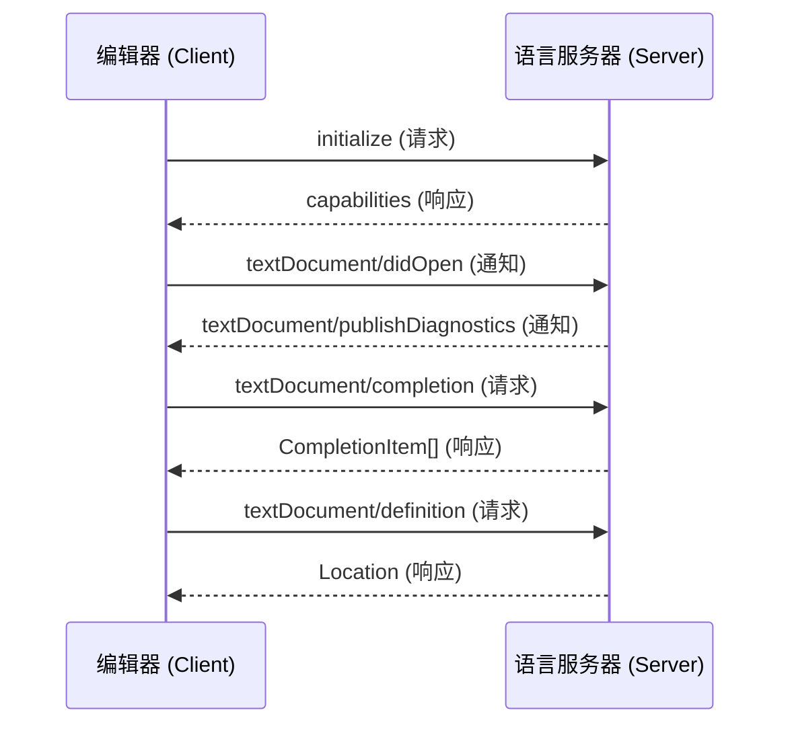

# LSP (Language Server Protocol)

> 语言服务器协议 —— 编辑器与语言工具之间的通用桥梁

---

## 一句话概括

LSP 是**标准化协议**，让「语言智能功能」（补全、跳转、诊断等）与「编辑器」解耦，实现一次开发，到处运行。

---

## 为什么需要 LSP？

### 没有 LSP 的时代

```
编辑器 × 语言 = 爆炸的组合

VS Code 需要：Python 插件、Go 插件、Rust 插件...
Vim 需要：    Python 插件、Go 插件、Rust 插件...
Emacs 需要：  Python 插件、Go 插件、Rust 插件...

每种语言要为 N 个编辑器写 N 遍同样的逻辑
```

**问题**：
- 重复开发严重
- 功能不一致（VS Code 的 Python 支持 vs Vim 的 Python 支持）
- 维护成本高

### LSP 带来的改变

```
统一架构：

┌─────────────────────────────────────────┐
│           编辑器 (Client)                │
│  ┌─────────┐ ┌─────────┐ ┌─────────┐   │
│  │ VS Code │ │  Vim    │ │  Emacs  │   │
│  └────┬────┘ └────┬────┘ └────┬────┘   │
│       └───────────┼───────────┘         │
│                   │ LSP Protocol        │
│                   │ (JSON-RPC)          │
│       ┌───────────┼───────────┐         │
│       ▼           ▼           ▼         │
│  ┌─────────┐ ┌─────────┐ ┌─────────┐   │
│  │ Python  │ │   Go    │ │  Rust   │   │
│  │ Server  │ │ Server  │ │ Server  │   │
│  └─────────┘ └─────────┘ └─────────┘   │
└─────────────────────────────────────────┘
```

**结果**：
- 语言开发者只需写 **1 个 Server**
- 编辑器开发者只需写 **1 个 Client**
- 用户获得**一致的体验**

---

## 核心架构

### 两个角色

| 角色 | 职责 | 示例 |
|------|------|------|
| **LSP Client** | 集成在编辑器中，负责 UI 交互、发起请求、展示结果 | VS Code 内置 LSP 客户端、vim-lsp、lsp-mode |
| **LSP Server** | 独立进程，提供语言分析能力 | pylsp、gopls、rust-analyzer |

### 通信方式

```
JSON-RPC 2.0 over:
- stdin/stdout (最常见)
- TCP socket
- WebSocket
- Node.js IPC
```

### 消息类型



---

## 完整功能清单

### 文本同步

| 方法 | 说明 |
|------|------|
| `textDocument/didOpen` | 文件打开通知 |
| `textDocument/didChange` | 内容变更通知（增量或全量） |
| `textDocument/didSave` | 文件保存通知 |
| `textDocument/didClose` | 文件关闭通知 |

### 智能功能

| 功能 | 方法 | 典型应用 |
|------|------|----------|
| **代码补全** | `textDocument/completion` | 输入时自动提示 |
| **悬停提示** | `textDocument/hover` | 鼠标悬停显示文档 |
| **跳转到定义** | `textDocument/definition` | Ctrl+Click 跳转 |
| **查找引用** | `textDocument/references` | 查找所有引用处 |
| **代码诊断** | `textDocument/publishDiagnostics` | 红色波浪线报错 |
| **代码格式化** | `textDocument/formatting` | 自动排版代码 |
| **重命名** | `textDocument/rename` | 安全重命名变量 |
| **代码片段** | `completionItem/insertText` | 快速插入模板 |
| **代码大纲** | `textDocument/documentSymbol` | 文件结构导航 |
| **工作区符号** | `workspace/symbol` | 全局符号搜索 |
| **代码动作** | `textDocument/codeAction` | 快速修复建议 |
| **内联提示** | `textDocument/inlayHint` | 类型提示、参数名 |
| **语义高亮** | `textDocument/semanticTokens` | 更精确的语法着色 |

### 工作区功能

| 方法 | 说明 |
|------|------|
| `workspace/didChangeConfiguration` | 配置变更通知 |
| `workspace/didChangeWatchedFiles` | 文件监视通知 |
| `workspace/executeCommand` | 执行自定义命令 |
| `workspace/applyEdit` | Server 请求修改文件 |

---

## 实际工作流程详解

### 场景：用户在 VS Code 中编辑 Python 文件

```
┌─────────────────────────────────────────────────────────────┐
│ Step 1: 初始化                                               │
├─────────────────────────────────────────────────────────────┤
│ VS Code: "用户打开了 main.py，启动 pylsp"                     │
│ pylsp: 启动进程，监听 stdin                                   │
│ VS Code → pylsp: { "method": "initialize", ... }             │
│ pylsp → VS Code: { "capabilities": { "completionProvider":   │
│                    { "triggerCharacters": ["."] }, ... } }   │
└─────────────────────────────────────────────────────────────┘

┌─────────────────────────────────────────────────────────────┐
│ Step 2: 文件同步                                             │
├─────────────────────────────────────────────────────────────┤
│ VS Code → pylsp: { "method": "textDocument/didOpen",         │
│                    "params": { "textDocument": {             │
│                      "uri": "file:///project/main.py",       │
│                      "languageId": "python",                 │
│                      "text": "import os\n..." } } }           │
│                                                               │
│ pylsp: 解析代码，发现 import os 未使用                        │
│ pylsp → VS Code: { "method": "textDocument/publishDiagnostics"│
│                    "params": { "uri": "...", "diagnostics": [ │
│                      { "message": "'os' imported but unused",│
│                        "severity": 2,                        │
│                        "range": { ... } } ] } }              │
│ VS Code: 显示黄色波浪线警告                                   │
└─────────────────────────────────────────────────────────────┘

┌─────────────────────────────────────────────────────────────┐
│ Step 3: 代码补全                                             │
├─────────────────────────────────────────────────────────────┤
│ 用户输入: "os."                                              │
│                                                               │
│ VS Code → pylsp: { "method": "textDocument/completion",      │
│                    "params": { "textDocument": { "uri": ... },│
│                               "position": { "line": 0,        │
│                                             "character": 3 } } }│
│                                                               │
│ pylsp: 查询 os 模块的属性列表                                 │
│ pylsp → VS Code: { "id": 1, "result": { "items": [           │
│                      { "label": "path",                      │
│                        "kind": 9,  // Module                 │
│                        "detail": "os.path",                  │
│                        "documentation": "..." },             │
│                      { "label": "system",                    │
│                        "kind": 3,  // Function               │
│                        "detail": "os.system(cmd)", ... },    │
│                      ... ] } }                               │
│                                                               │
│ VS Code: 显示补全列表，用户选择 "path"                        │
└─────────────────────────────────────────────────────────────┘

┌─────────────────────────────────────────────────────────────┐
│ Step 4: 跳转到定义                                           │
├─────────────────────────────────────────────────────────────┤
│ 用户 Ctrl+Click 在 "os.path.join" 上                         │
│                                                               │
│ VS Code → pylsp: { "method": "textDocument/definition",      │
│                    "params": { ... "position": ... } }       │
│                                                               │
│ pylsp: 查找 os.path.join 的定义位置                           │
│ pylsp → VS Code: { "id": 2, "result": {                      │
│                      "uri": "file:///usr/lib/python3.11/...",│
│                      "range": { "start": {...}, "end": {...} }│
│                    } }                                       │
│                                                               │
│ VS Code: 打开标准库文件，跳转到 join 函数定义                  │
└─────────────────────────────────────────────────────────────┘
```

---

## 主流 LSP Server 一览

### Python

| Server | 特点 | 推荐度 |
|--------|------|--------|
| **Pyright** | 微软官方，类型检查强，速度快 | ⭐⭐⭐ |
| **Pylsp** | 社区驱动，插件丰富 | ⭐⭐⭐ |
| **Ruff LSP** | 基于 Rust 重写，极速 | ⭐⭐⭐ |
| Jedi | 老牌，功能稳定 | ⭐⭐ |

### Go

| Server | 特点 |
|--------|------|
| **gopls** | Google 官方，功能完整 |

### Rust

| Server | 特点 |
|--------|------|
| **rust-analyzer** | 官方出品，功能极其强大 |

### TypeScript/JavaScript

| Server | 特点 |
|--------|------|
| **typescript-language-server** | 基于 tsserver，功能完整 |
| **vtsls** | 性能优化版 |

### C/C++

| Server | 特点 |
|--------|------|
| **clangd** | LLVM 官方，基于 Clang |
| ccls | 社区版，功能丰富 |

### Java

| Server | 特点 |
|--------|------|
| **jdtls** | Eclipse 官方，功能最全 |

### 其他语言

| 语言 | Server |
|------|--------|
| Lua | lua-language-server |
| Bash | bash-language-server |
| YAML | yaml-language-server |
| JSON | json-language-server |
| Markdown | marksman, markdown-oxide |
| SQL | sqls, sql-language-server |

---

## LSP 与 AI 编程工具的关系

### 对比

| 维度 | LSP | AI 工具 (Copilot/Cursor) |
|------|-----|-------------------------|
| **基础** | 静态分析、类型系统 | 大语言模型 |
| **响应** | 确定性的、精确的 | 概率性的、创造性的 |
| **速度** | 毫秒级 | 秒级（需要网络） |
| **准确性** | 100% 准确（基于代码） | 可能幻觉 |
| **功能** | 跳转、诊断、重构 | 代码生成、解释、问答 |

### 协作关系

```
┌─────────────────────────────────────────┐
│           编辑器 (VS Code/Cursor)        │
├─────────────────────────────────────────┤
│  AI 层: Copilot / Cursor Composer       │  ← 生成代码、解释逻辑
│       ↕                                 │
│  LSP 层: 语言服务器                      │  ← 验证代码、提供跳转/诊断
│       ↕                                 │
│  代码编辑器                             │  ← 用户编辑
└─────────────────────────────────────────┘
```

**实际场景**：
1. 用户用 Cursor 生成一段代码
2. LSP 立即检查语法错误、类型不匹配
3. 用户通过 LSP 跳转到定义理解代码
4. 用户用 LSP 重命名变量，AI 工具保持上下文

---

## 配置实战

### VS Code 配置自定义 LSP

```json
// settings.json
{
  "python.languageServer": "Pylance",  // 或 "Pylsp", "Jedi"
  "python.analysis.typeCheckingMode": "strict",
  
  "gopls": {
    "ui.diagnostic.annotations": {
      "bounds": true,
      "escape": true
    }
  }
}
```

### Neovim 配置 (Lua)

```lua
-- 使用 nvim-lspconfig
local lspconfig = require('lspconfig')

-- Python
lspconfig.pylsp.setup{
  settings = {
    pylsp = {
      plugins = {
        pycodestyle = { enabled = false },
        pyflakes = { enabled = false },
        ruff = { enabled = true },
      }
    }
  }
}

-- Go
lspconfig.gopls.setup{}

-- Rust
lspconfig.rust_analyzer.setup{
  settings = {
    ["rust-analyzer"] = {
      cargo = { allFeatures = true },
      checkOnSave = { command = "clippy" }
    }
  }
}
```

### Emacs 配置

```elisp
(use-package lsp-mode
  :hook ((python-mode . lsp)
         (go-mode . lsp)
         (rust-mode . lsp))
  :commands lsp)

(use-package lsp-ui
  :commands lsp-ui-mode)
```

---

## 进阶话题

### LSP 扩展机制

```
标准 LSP 协议不够用时，可以扩展：

1. 自定义方法
   - workspace/executeCommand
   - 例如: "editor.action.organizeImports"

2. 自定义通知
   - 例如: "$/progress" 进度通知
   - "$/logTrace" 调试日志

3. 实验性协议
   - inline completions (GitHub Copilot 使用)
   - 类型层次结构
   - 调用继承链
```

### 性能优化

| 技术 | 说明 |
|------|------|
| **增量同步** | 只传输变更部分，而非整个文件 |
| **Debouncing** | 延迟处理快速连续输入 |
| **Lazy Loading** | 按需分析符号，而非全盘扫描 |
| **Caching** | 缓存编译结果、类型信息 |

### 调试 LSP

```bash
# 查看 LSP 通信日志
# VS Code: 设置 "python.trace.server": "verbose"

# 手动启动 LSP Server 查看输出
pylsp -v --log-file /tmp/pylsp.log

# 使用 tcpdump 或 Wireshark 抓包分析
```

---

## 相关资源

| 资源 | 链接 |
|------|------|
| 官方规范 | https://microsoft.github.io/language-server-protocol/ |
| LSP 实现列表 | https://langserver.org/ |
| VS Code LSP 指南 | https://code.visualstudio.com/api/language-extensions/language-server-extension-guide |
| nvim-lspconfig | https://github.com/neovim/nvim-lspconfig |

---

## 一句话总结

> **LSP 是现代编辑器的「语言智能底座」，让编辑器专注于 UI，让语言工具专注于分析，两者通过标准化协议协作，最终让用户获得一致、强大的编程体验。**

---

## 关联笔记

- [[MCP (Model Context Protocol)]] - AI 工具的 LSP 等价物
- [[Tree-sitter]] - 语法解析器，常与 LSP 配合使用
- [[DAP (Debug Adapter Protocol)]] - 调试领域的 LSP