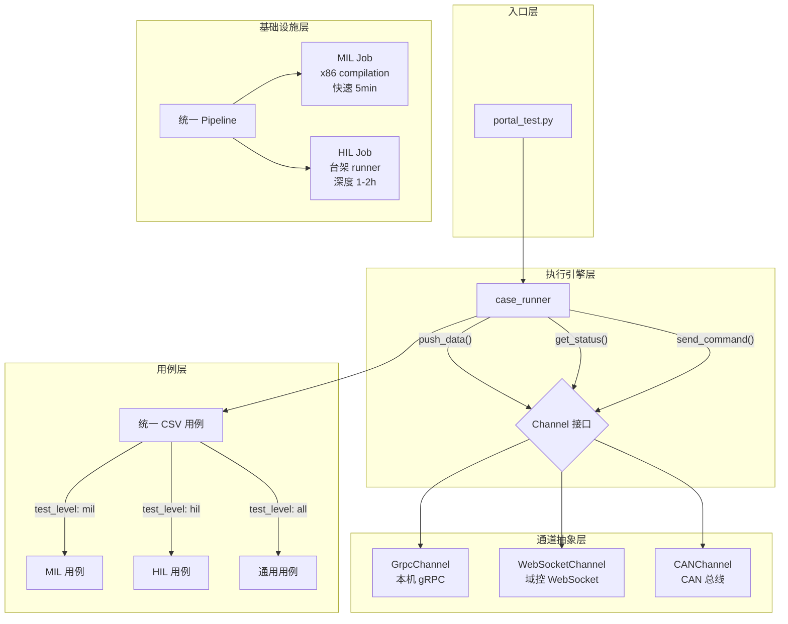
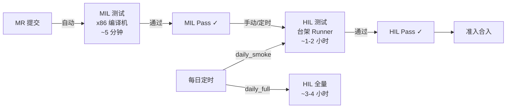

# 统一测试框架：分阶段迁移与架构演进方案

---

# 排查发现的设计问题（完整清单）

深入排查两个项目后发现以下需要大改的设计点，按阻断级别排序：

## P0 阻断级（不修则无法运行）

### 1. conftest 冲突 — 两套 pytest hook 互相干扰


| 冲突点                                           | 位置                             | 问题                                                                  |
| --------------------------------------------- | ------------------------------ | ------------------------------------------------------------------- |
| hil_auto_test `pytest_sessionfinish`          | `tests/conftest.py:9-19`       | 调用 `TContext().stop_navigation_by_hut()`，BLC 模式下没有 HUT 环境，直接异常      |
| hil_auto_test `case_entrance.py` 模块级初始化       | `tests/case_entrance.py:28-39` | import 阶段即 `ctx = TContext()`，连 HIL 服务端拿 car_type/project，BLC 环境下必崩 |
| BLC `pytest_configure` 动态注册 ~47 markers       | `conftest.py:106-136`          | 与 hil_auto_test 的 markers 可能重名冲突                                    |
| BLC `pytest_plugins` 自动扫描 fixtures/           | `conftest.py:49-59`            | 加载所有 `fixture_*.py`，可能与 HIL fixture 命名冲突                            |
| BLC `user_account` fixture 依赖 xdist worker_id | `conftest.py:339-368`          | autouse=True，单进程跑会报错                                                |


**结论**：`--mode blc` 不能只在 portal_test.py 加 if/else，必须**彻底隔离 pytest 的 conftest 加载链**。

### 2. root_path 硬编码目录名 `blc-interface-test`

3 处核心文件用 `Path(__file__).parents` 遍历查找名为 `blc-interface-test` 的父目录：

- `conftest.py:13-14`
- `grpc_page/blc_request.py:9-10`
- `commom/common_method/timestamp_manager.py:6-7`

迁移后目录名变为 `blc_interface`，全部静默失败（root_path 为空或未定义）。

### 3. `os.getcwd()` 路径依赖

`find_file_path()` 用 `os.getcwd()` 拼接相对路径查找 CSV/JSON 配置文件：

- `utils/file_handle.py:36-39`
- `utils/tools/env_setup.py:21,26,69,72`
- `conftest.py:34`

在 hil_auto_test 中运行时 cwd 是 hil_auto_test 根目录，找不到 BLC 的数据文件。

## P1 高优先级（影响 CI 执行）

### 4. deal_proto_file.py 路径硬编码

- 第 83 行硬编码 Mac 路径 `/Users/easonhe/blc-interface-test/proto/`
- 第 141、145 行路径截取依赖 `/blc-interface-test/proto/`
- 固定用 `python3.8 -m grpc_tools.protoc`，hil_auto_test 不一定有 grpcio-tools

### 5. sudo pytest — Runner 权限

三个车型 CI YAML 全部 `sudo pytest` 执行（BLC 安装到 `/opt/deeproute/blc/` 需 root）。若 hil_auto_test Runner 无 sudo 权限或非 privileged 模式则无法执行。

### 6. protobuf 版本兼容

hil_auto_test 锁定 `protobuf==3.20.3`。BLC 未声明版本，若之前用 protobuf 4.x 编译的 pb2 文件，在 3.20.3 下无法正常反序列化。需用 3.20.x 重新编译所有 proto。

## P2 中优先级（影响稳定性）

### 7. BLC 进程生命周期无管理

`unit_start_the_process.py` 启动 BLC 进程后无清理逻辑，靠 CI 脚本 `kill -12` 手动杀。

- 测试失败时进程不回收
- 端口占用导致后续测试失败
- 多 xdist worker 端口从 10000 递增，无冲突检测

### 8. Python 版本不确定

BLC 脚本到处写死 `python3.8`（CI YAML、deal_proto_file.py）。hil_auto_test `pyproject.toml` 标记 `target-version = "py38"` 但实际 CI 镜像 Python 版本未在仓库写明。

### 9. sys.path 污染（15+ 处）

分布在 conftest.py、blc_request.py、timestamp_manager.py、deal_proto_file.py、testcase/*.py、fixtures/*.py 等 15+ 处的 `sys.path.insert/append`，使用了 `os.path.realpath('')`（依赖 cwd）或按目录名查找。

### 10. Pipeline 侧改动量超预期

实际需要改 6+ 个文件：


| 文件                                              | 改动                                  |
| ----------------------------------------------- | ----------------------------------- |
| `pipeline/config/function_cases.py`             | 新增 `blc_unit` 配置                    |
| `pipeline/config/grouping.py`                   | 新增分组逻辑                              |
| `pipeline/core/services/pipeline.py`            | 设置优先级（FUNCTION_CASE_PRIORITY_ORDER） |
| `pipeline/config/tags/`                         | 新增 `blc_unit_default.txt`           |
| `pipeline/core/domain/cases.py`                 | 用例目录映射（`test_cases/blc_unit/`）      |
| `pipeline/integrations/feishu/write_metrics.py` | FUNCTION_CASE_MAP 补充 blc_unit       |


## P3 低优先级

### 11. pytest-xdist + pytest-parallel 重复

BLC 的 requirements.txt 同时装了两个并行插件，功能重叠，可能互相干扰。

### 12. 第三方依赖版本冲突


| 包                      | BLC | hil_auto_test | 风险     |
| ---------------------- | --- | ------------- | ------ |
| allure-pytest          | 无版本 | 2.13.5        | 版本不一致  |
| openpyxl               | 无版本 | 3.1.5         | 版本不一致  |
| pytest-rerunfailures   | 无版本 | 13.0          | 版本不一致  |
| matplotlib/scipy/sympy | 有   | 无             | 增加依赖体积 |


---

# 阶段 0：最小可用迁移（先跑起来）

**目标**：用最小改动量让 BLC 测试在 hil_auto_test 仓库中可运行，**不改 hil_auto_test 的任何现有代码**。

**核心思路**：blc_interface 作为**完全独立的子目录**运行，与 hil_auto_test 的 tests/ 零交集。不走 portal_test.py，不走 pipeline 生成系统，BLC 有自己的入口和 CI 配置。

## 0.1 代码拷贝

```bash
cd /home/dr/code/hil_auto_test
rsync -av --exclude='.git' --exclude='proto/' --exclude='__pycache__' \
    /home/dr/codetree/repo/blc-interface-test/ blc_interface/
```

目录结构：

```
hil_auto_test/
├── blc_interface/           # BLC 独立子目录
│   ├── conftest.py          # BLC 自己的 conftest（修 root_path）
│   ├── pytest.ini           # BLC 自己的 pytest 配置
│   ├── testcase/
│   ├── grpc_page/
│   ├── fixtures/
│   ├── case_data/
│   ├── commom/
│   ├── utils/
│   ├── configs/
│   ├── gitlab-ci/           # BLC 独立的 CI 配置（调整路径）
│   └── requirements-blc.txt # BLC 独立依赖清单
├── tests/                   # HIL 测试不动
├── portal_test.py           # 不改
├── pipeline/                # 不改
└── requirements.txt         # 仅追加 grpcio 等
```

## 0.2 三个 P0 修复

### 修复 1：root_path 检测

`conftest.py`、`grpc_page/blc_request.py`、`commom/common_method/timestamp_manager.py` 三个文件，将：

```python
for parent in Path(__file__).parents:
    if parent.name == "blc-interface-test":
        root_path = str(parent)
        break
```

改为：

```python
for parent in Path(__file__).parents:
    if (parent / "pytest.ini").exists() and (parent / "conftest.py").exists():
        root_path = str(parent)
        break
```

用"存在 pytest.ini + conftest.py"作为项目根标志，不再依赖目录名。

然后批量替换 `__init__.py` 中的引用：

```bash
cd blc_interface
find . -name "*.py" -exec grep -l "blc-interface-test" {} \; | \
    xargs sed -i 's/blc-interface-test/blc_interface/g'
```

### 修复 2：cwd 依赖

`utils/file_handle.py` 的 `find_file_path()` 改为基于 `__file__` 定位项目根：

```python
_BLC_ROOT = os.path.dirname(os.path.dirname(os.path.abspath(__file__)))

def find_file_path(file_name, data_path="configs"):
    target_dir = os.path.join(_BLC_ROOT, data_path)
    # ... 在 target_dir 下递归查找 file_name
```

### 修复 3：conftest 隔离

关键：**从 blc_interface/ 子目录运行 pytest，不从 hil_auto_test 根目录运行**。

CI 中的执行方式：

```bash
cd $CI_PROJECT_DIR/blc_interface
sudo pytest -v -m "${TEST_TAGS}" -n ${PROCESS_NUM} testcase/lp_a10 \
    --alluredir=${REPORT_PATH} --rootdir=.
```

`--rootdir=.` 确保 pytest 只在 `blc_interface/` 目录下搜索 conftest.py，完全不碰上层 hil_auto_test 的 `tests/conftest.py`。

## 0.3 CI YAML 路径调整

保留 BLC 原有的分层 CI 结构，仅调整路径前缀：

**原来**：

```yaml
script:
    - cd $CI_PROJECT_DIR
    - python3.8 utils/deal_proto_file.py
    - sudo pytest -v ... testcase/lp_a10
```

**迁移后**：

```yaml
script:
    - cd $CI_PROJECT_DIR/blc_interface
    - python3.8 utils/deal_proto_file.py
    - sudo pytest -v ... testcase/lp_a10 --rootdir=.
```

proto clone 目标也改为 `$CI_PROJECT_DIR/blc_interface/proto/`。

在 hil_auto_test 根目录的 `.gitlab-ci.yml` 中用 `include:` 引入 BLC 的 CI：

```yaml
include:
  - local: 'blc_interface/gitlab-ci/lp-a10-acept-unit.gitlab-ci.yml'
    rules:
      - if: '$BLC_TEST == "true"'
  - local: 'blc_interface/gitlab-ci/gl-p177-acept-unit.gitlab-ci.yml'
    rules:
      - if: '$BLC_TEST == "true"'
  - local: 'blc_interface/gitlab-ci/gwm-c01-acept-unit.gitlab-ci.yml'
    rules:
      - if: '$BLC_TEST == "true"'
```

## 0.4 依赖处理

在根 `requirements.txt` 追加 BLC 必需依赖（带版本锁定）：

```
# BLC interface test
grpcio>=1.48.2
grpcio-tools>=1.48.2
pytest-xdist>=3.0
loguru
```

其余 BLC 专属依赖（matplotlib/scipy/sympy 等）放 `blc_interface/requirements-blc.txt`，CI 中单独安装。

## 0.5 验证清单

```bash
# 1. 用例发现
cd /home/dr/code/hil_auto_test/blc_interface
pytest --collect-only testcase/lp_a10 --rootdir=. 2>&1 | tail -5

# 2. import 链完整性
python -c "from grpc_page.blc_request import Drdtu1; print('OK')"
python -c "from utils.file_handle import find_file_path; print('OK')"

# 3. 配置文件可读
python -c "
from utils.file_handle import find_file_path
print(find_file_path('account_data.json'))
"
```

## 阶段 0 改动量估算


| 改动项                     | 文件数     | 工作量       |
| ----------------------- | ------- | --------- |
| root_path 修复（3 处核心）     | 3       | 0.5h      |
| `__init__.py` 批量 sed    | ~80     | 0.5h      |
| find_file_path cwd 修复   | 1       | 0.5h      |
| CI YAML 路径调整（3 个车型文件）   | 3       | 1h        |
| deal_proto_file.py 路径修复 | 1       | 0.5h      |
| 依赖合并                    | 1       | 0.5h      |
| 验证 + 调试                 | -       | 2h        |
| **合计**                  | **~90** | **~5-6h** |


## 阶段 0 不做的事（留给阶段 1）

- 不改 portal_test.py
- 不改 hil_auto_test 的 pipeline 生成系统
- 不改 tests/ 下任何 HIL 代码
- 不统一 Allure 报告/飞书通知
- 不做 Channel 抽象
- 不改 CSV 用例格式

---

## 目标架构（最终态）




---

## 两个项目的接口对照

深入分析后，两个项目与 BLC 的交互可以归纳为 **3 个核心操作**：


| 操作       | blc-interface-test (MIL)                                     | hil_auto_test (HIL)                                                      |
| -------- | ------------------------------------------------------------ | ------------------------------------------------------------------------ |
| **推送数据** | `Drdtu1.push_data(msgs, runtime)` → gRPC `ProcGrpc`          | `TContext.ws_cli.publish(topic, bytes)` → WebSocket                      |
| **读取状态** | `Drdtu1.get_op_status_request()` → gRPC `GetOperationStatus` | `TContext.get_operation_status(key)` → WebSocket `/blc/operation_status` |
| **发送指令** | `Drdtu1.proc_send_api_command_request()` → gRPC `ProcGrpc`   | `TContext.pub_user_config()` → WebSocket `/blc/command`                  |


这 3 个操作就是 Channel 抽象的核心。

---

# 阶段 1：框架集成（统一入口 + Pipeline 生成）

**前置条件**：阶段 0 完成，BLC 测试已能在 `blc_interface/` 子目录独立运行。

**目标**：将 BLC 测试纳入 hil_auto_test 的框架体系（portal_test.py 入口、pipeline 生成系统、报告/通知体系），不再维护独立的 CI YAML。

## 1.1 入口统一 + conftest 隔离

扩展 [portal_test.py](/home/dr/code/hil_auto_test/portal_test.py)：

```python
parser.add_argument("--mode", choices=["hil", "blc"], default="hil")
parser.add_argument("--blc-target", help="BLC testcase dir, e.g. testcase/lp_a10")
parser.add_argument("--blc-marks", help="pytest marks, e.g. 'lp and function'")
parser.add_argument("--blc-workers", type=int, default=10, help="xdist worker count")

if options.mode == "blc":
    pytest_args = [
        f"blc_interface/{options.blc_target}",
        "-m", options.blc_marks,
        "-n", str(options.blc_workers),
        f"--alluredir={options.alluredir}",
        "--rootdir=blc_interface",
        "-c", "blc_interface/pytest.ini",
    ]
else:
    # 现有 HIL 逻辑不变
    ...
```

conftest 隔离方案：

- `--rootdir=blc_interface` 确保 pytest 只在 blc_interface/ 下搜索 conftest
- `-c blc_interface/pytest.ini` 使用 BLC 专属 pytest 配置
- hil_auto_test 的 `tests/conftest.py`、`case_entrance.py` 不会被加载
- BLC 的 autouse fixture（user_account 等）不影响 HIL 测试

## 1.2 Pipeline 集成（6 个文件改动）


| 文件                                              | 改动                                          |
| ----------------------------------------------- | ------------------------------------------- |
| `pipeline/config/function_cases.py`             | 新增 `blc_unit` FunctionCaseConfig            |
| `pipeline/config/grouping.py`                   | 新增 blc_unit 分组逻辑                            |
| `pipeline/core/services/pipeline.py`            | FUNCTION_CASE_PRIORITY_ORDER 加 blc_unit     |
| `pipeline/config/tags/blc_unit_default.txt`     | 新增默认标签文件                                    |
| `pipeline/core/domain/cases.py`                 | 用例目录映射（blc_unit → blc_interface/case_data/） |
| `pipeline/integrations/feishu/write_metrics.py` | FUNCTION_CASE_MAP 加 blc_unit                |


创建 `pipeline/templates/blc_pipeline.yml.j2`（BLC 专用 pipeline 模板），核心步骤：

1. prepare：下载 BLC deb → 安装 → 启动多实例 → clone proto_msg
2. test：三个并行 job（LP/GL/GWM），每个 job 内两组并行（function + signal/trigger/safety/scene）
3. report：allure 生成 → S3 上传 → 飞书通知

此时可删除阶段 0 的独立 CI YAML（`blc_interface/gitlab-ci/`）。

## 1.3 报告/通知统一

BLC 测试复用 hil_auto_test 的基础设施：

- **Allure**：`--alluredir` 统一输出路径
- **S3 上传**：复用 `s3_upload_results`
- **飞书通知**：`FUNCTION_CASE_MAP["blc_unit"] = "BLC 接口测试"`

## 1.4 依赖完全合并

将 `blc_interface/requirements-blc.txt` 的内容合入根 `requirements.txt`，版本统一：

```
# BLC interface test
grpcio>=1.48.2
grpcio-tools>=1.48.2
pytest-xdist>=3.0
allpairspy
loguru
deepdiff
jmespath
colorama
scipy
matplotlib
tabulate
sympy
rsa
```

---

# 阶段 2：分层测试金字塔架构

## 原则

- **用例写一次，跑多层**：同一个 ACC 状态机用例在 MIL 和 HIL 都能执行
- **通道可替换**：测试逻辑不感知底层通信方式
- **渐进迁移**：逐模块迁移，老用例继续跑

## 2.1 通道抽象层

创建 `hil_auto_test/channels/` 包：

```python
# channels/base.py
from abc import ABC, abstractmethod
from typing import Any, Dict, Optional


class Channel(ABC):
    """与被测模块通信的抽象通道"""

    @abstractmethod
    def push(self, topic: str, data: Dict, timestamp_ns: int) -> Any:
        """向被测模块推送一帧数据"""

    @abstractmethod
    def query(self, path: str = "") -> Dict:
        """查询模块当前状态，path 为空返回全部，支持点号路径如 'acc_status.status'"""

    @abstractmethod
    def command(self, cmd: Dict) -> Any:
        """向模块发送指令"""

    @abstractmethod
    def wait_status(self, path: str, expected: str, timeout: float = 10.0) -> bool:
        """等待状态达到预期值"""
```

```python
# channels/grpc_channel.py — MIL 实现
class GrpcChannel(Channel):
    """gRPC 通道：本机直连 BLC 进程"""

    def __init__(self, host: str = "127.0.0.1", port: int = 10010):
        self.stub = DtuServiceStub(grpc.insecure_channel(f"{host}:{port}"))

    def push(self, topic, data, timestamp_ns):
        # 复用 Drdtu1.push_data 的 protobuf 序列化逻辑
        ...

    def query(self, path=""):
        resp = self.stub.GetOperationStatus(GetOperationStatusRequest())
        status = MessageToDict(resp)
        return _resolve_path(status, path) if path else status

    def command(self, cmd):
        # 复用 proc_send_api_command_request 逻辑
        ...

    def wait_status(self, path, expected, timeout=10.0):
        deadline = time.time() + timeout
        while time.time() < deadline:
            if self.query(path) == expected:
                return True
            time.sleep(0.1)
        return False
```

```python
# channels/websocket_channel.py — HIL 实现
class WebSocketChannel(Channel):
    """WebSocket 通道：连接域控 ORIN"""

    def __init__(self, ws_client: DrWebsocketClient):
        self.ws = ws_client

    def push(self, topic, data, timestamp_ns):
        self.ws.publish(topic, DrMsgTranslator.json_to_bytes(topic, data))

    def query(self, path=""):
        return self.ws.get("/blc/operation_status", path)

    def command(self, cmd):
        self.ws.publish("/blc/command", DrMsgTranslator.json_to_bytes("/blc/command", cmd))

    def wait_status(self, path, expected, timeout=10.0):
        return self.ws.wait_for("/blc/operation_status", path, expected, timeout)
```

### 对照原有代码的映射关系

```
┌────────────────────────────┬──────────────────────────────┐
│   BLC 项目 (MIL)            │   Channel 接口                │
├────────────────────────────┼──────────────────────────────┤
│ Drdtu1.push_data()         │ channel.push(topic, data, t) │
│ Drdtu1.get_op_status()     │ channel.query(path)          │
│ Drdtu1.proc_send_api_cmd() │ channel.command(cmd)         │
│ DrivingRqApi.get_status()  │ channel.query("acc_status")  │
├────────────────────────────┼──────────────────────────────┤
│   HIL 项目                  │   Channel 接口                │
├────────────────────────────┼──────────────────────────────┤
│ ws_cli.publish(topic,data) │ channel.push(topic, data, t) │
│ ctx.get_operation_status() │ channel.query(path)          │
│ ctx.pub_user_config()      │ channel.command(cmd)         │
│ ws_cli.wait_for()          │ channel.wait_status()        │
└────────────────────────────┴──────────────────────────────┘
```

## 2.2 用例格式统一

统一 CSV schema，在 HIL 现有格式基础上扩展 `test_level` 字段：


| 字段              | 说明           | 示例                          |
| --------------- | ------------ | --------------------------- |
| `case_id`       | 唯一标识         | `ACC_STANDBY_TO_ACTIVE_001` |
| `用例名称`          | 中文名          | `ACC 从 Standby 切到 Active`   |
| `state_machine` | 状态机          | `ACC_Standby`               |
| `test_level`    | 适用测试层级       | `mil`, `hil`, `mil,hil`     |
| `自动化输入输出`       | JSON 测试步骤    | `{"steps": [...]}`          |
| `自动化标签`         | pytest marks | `acc                        |


统一的 step 格式（兼容 HIL 现有格式）：

```json
{
  "steps": [
    {
      "operation": {
        "type": "push_data",
        "topic": "car_info",
        "data": {"shift_report": {"actual_gear": "DRIVE"}},
        "duration": 1.0
      }
    },
    {
      "expectation": {
        "type": "status_expect",
        "path": "acc_status.status",
        "expected": "ACC_ACTIVE",
        "timeout": 5.0
      }
    }
  ]
}
```

### 迁移策略

不需要一次性转换所有用例。渐进式迁移：

1. 新增用例用统一格式
2. 老用例逐模块/逐车型转换
3. `case_runner` 同时支持新旧格式（检测 `steps` 字段是否存在）

## 2.3 执行引擎统一

扩展现有 `tests/case_runner/runner.py`，增加 Channel 感知：

```python
def run_case(context, case_info):
    channel = context.channel  # Channel 实例（Grpc 或 WebSocket）

    for step in case_info["steps"]:
        if "operation" in step:
            op = step["operation"]
            if op["type"] == "push_data":
                channel.push(op["topic"], op["data"], op.get("timestamp_ns", 0))
            elif op["type"] == "command":
                channel.command(op["data"])
            elif op["type"] == "sleep":
                time.sleep(op["duration"])
            # HIL 特有操作（MIL 跳过）
            elif op["type"] in ("信号注入", "ego_control", "导航下单"):
                if not isinstance(channel, GrpcChannel):
                    execute_hil_operation(context, op)
                else:
                    logger.info(f"MIL 模式跳过 HIL 操作: {op['type']}")

        if "expectation" in step:
            exp = step["expectation"]
            if exp["type"] == "status_expect":
                assert channel.wait_status(exp["path"], exp["expected"], exp.get("timeout", 10))
            elif exp["type"] in ("can_expect", "topic_expect"):
                execute_hil_expect(context, exp)
```

## 2.4 Pipeline 分级触发




在 `.gitlab-ci.yml` 中增加规则：

```yaml
# MR 自动触发 MIL
generate-blc-mil-tests:
  stage: generate-hil-tests
  rules:
    - if: '$CI_MERGE_REQUEST_IID'
      changes:
        - blc_interface/**/*
  script:
    - ./pipeline/scripts/generate_pipeline.sh --mode blc

# HIL 定时/手动触发
generate-hil-tests:
  stage: generate-hil-tests
  rules:
    - if: '$PIPELINE_TYPE == "hil"'
    - if: '$PIPELINE_TYPE == "daily_smoke"'
```

---

# 三阶段对比


| 维度                  | 阶段 0（最小可用）                   | 阶段 1（框架集成）                     | 阶段 2（架构演进）             |
| ------------------- | ---------------------------- | ------------------------------ | ---------------------- |
| 工作量                 | 5-6 小时                       | 1-2 周                          | 4-8 周                  |
| 对 hil_auto_test 的改动 | **零改动**                      | portal_test.py + pipeline 6 文件 | Channel + case_runner  |
| 测试逻辑                | 完全不改                         | 完全不改                           | 渐进迁移到统一 runner         |
| 入口                  | `cd blc_interface && pytest` | `portal_test.py --mode blc`    | 同阶段 1                  |
| CI 配置               | BLC 独立 YAML（include）         | pipeline 生成系统自动生成              | MR→MIL + 定时→HIL        |
| 通信方式                | gRPC 独立                      | gRPC 独立                        | Channel 抽象统一           |
| 用例格式                | BLC 原 CSV 不动                 | BLC 原 CSV 不动                   | 统一 schema + test_level |
| 报告/通知               | BLC 原逻辑                      | 复用 Allure/S3/飞书                | 全复用                    |
| 复用度                 | 仅共享 git 仓库                   | 共享仓库 + 基础设施                    | 用例/断言/报告全复用            |
| 回退难度                | 删 blc_interface/ 即可          | 需回退 portal + pipeline 改动       | 架构级回退困难                |


---

# 风险清单（按阶段）

## 阶段 0 风险


| #   | 风险                                             | 级别  | 缓解措施                                |
| --- | ---------------------------------------------- | --- | ----------------------------------- |
| 1   | `root_path` 按目录名查找（3处核心 + ~80处 `__init__`）     | 阻断  | 改为特征文件检测 + sed 批量替换                 |
| 2   | `os.getcwd()` 路径依赖（find_file_path 等）           | 阻断  | 改为 `__file__` 相对路径                  |
| 3   | deal_proto_file.py Mac 路径 + 项目名硬编码             | 阻断  | 修复 3 处硬编码路径                         |
| 4   | grpcio / grpcio-tools 依赖缺失                     | 阻断  | 追加到 requirements.txt                |
| 5   | CI YAML 绝对路径 `/builds/.../blc-interface-test/` | 高   | 改为 `$CI_PROJECT_DIR/blc_interface/` |
| 6   | protobuf 版本兼容（HIL 锁 3.20.3）                    | 高   | 用 3.20.x grpc_tools 重新编译 proto      |
| 7   | sudo pytest — Runner 权限                        | 高   | 确认 Runner 有 sudo，或改为非 root 方式       |


## 阶段 1 风险


| #   | 风险                                | 级别  | 缓解措施                                                     |
| --- | --------------------------------- | --- | -------------------------------------------------------- |
| 1   | conftest 冲突（TContext 初始化、hook 互扰） | 高   | `--rootdir=blc_interface -c blc_interface/pytest.ini` 隔离 |
| 2   | Pipeline 生成系统 6 文件改动的回归风险         | 中   | 充分测试 pipeline generate，对比生成的 YAML                        |
| 3   | BLC 进程生命周期无管理（无 teardown）         | 中   | 后续改为 fixture 管理启停                                        |
| 4   | Python 版本不一致（BLC 写死 python3.8）    | 中   | 确认 CI 镜像 Python 版本，统一命令                                  |


## 阶段 2 风险


| #   | 风险                 | 级别  | 缓解措施                          |
| --- | ------------------ | --- | ----------------------------- |
| 1   | Channel 抽象不完整，遗漏操作 | 中   | 先覆盖 3 个核心操作，边用边扩展             |
| 2   | 用例格式迁移中断老用例        | 中   | runner 同时支持新旧格式，渐进迁移          |
| 3   | HIL 特有操作无法在 MIL 跑  | 低   | `test_level` 标注 + MIL 自动 skip |
| 4   | 状态机初始化逻辑不同         | 中   | fixture 层按 Channel 类型分支       |


