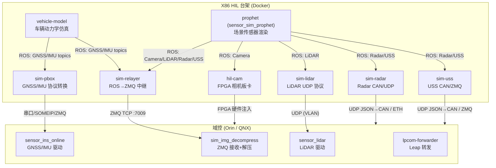

# HIL 传感器仿真详细文档

> 本文档描述 `software_in_loop` 项目中所有传感器的仿真方式、数据来源、传输路径及关键代码位置。

---

## 目录

1. [系统架构概览](#1-系统架构概览)
2. [相机 (Camera)](#2-相机-camera)
3. [LiDAR（激光雷达）](#3-lidar激光雷达)
4. [GNSS（全球导航卫星系统）](#4-gnss全球导航卫星系统)
5. [IMU（惯性测量单元）](#5-imu惯性测量单元)
6. [毫米波雷达 (Radar)](#6-毫米波雷达-radar)
7. [超声波传感器 (USS)](#7-超声波传感器-uss)
8. [传感器开关与故障注入](#8-传感器开关与故障注入)
9. [车型与模式对照表](#9-车型与模式对照表)
10. [关键文件索引](#10-关键文件索引)

---

## 1. 系统架构概览



### 核心数据源

| 进程 | 来源 | 生成内容 |
|------|------|----------|
| `vehicle-model` | 场景文件 + 车辆动力学 | GNSS 位置/速度、IMU 加速度/角速度、定位 Pose |
| `prophet` (sensor_sim_prophet) | 场景文件 + 渲染引擎 | 相机图像(H.264)、LiDAR 点云、Radar 目标、USS 回波 |

两者均为 **实时仿真**，不是录制回放。数据通过 Church/ROS 发布到 X86 内部总线。

### 两种注入模式

| 模式 | 适用 | 原理 |
|------|------|------|
| **硬件 HIL** | 有板卡/串口/VLAN 硬件 | `sim-*` 将 ROS 数据转为**厂商原生协议**（串口/UDP/SOMEIP），域控 DEM 认为在读真实硬件 |
| **虚拟 (`--vir-*`)** | 无对应硬件 | `sim-relayer` 通过 **ZMQ** 直发域控 `sim_img_decompress`，替代真实 DEM |

通过 `hil_gui --vir-cam --vir-gnss --vir-lidar` 切换。

---

## 2. 相机 (Camera)

### 2.1 数据来源

Prophet 渲染引擎（`sensor_sim_prophet`）根据场景实时渲染 **11 路相机** 画面：

| 名称 | 类型 | 说明 |
|------|------|------|
| `camera_1` | 前视主相机 | 华为 sensor |
| `camera_2` ~ `camera_6` | 周视/侧视 | 海康 sensor |
| `traffic_2` | 交通灯前视 | 华为 sensor |
| `panoramic_1` ~ `panoramic_4` | 环视鱼眼 | 全景 |

- 编码格式：H.264 压缩（`CompressedImage` protobuf）
- 分辨率：由 `cam.cfg`（从域控 vehicle-config 拷贝）决定
- ROS Topic：`/sensors/camera/<name>_raw_data/compressed_proto`

### 2.2 传输路径

#### 路径 A：硬件 HIL（默认，有 FPGA 相机板卡）

```
Prophet → ROS compressed_proto_simulation → hil-cam (hilcam_node)
→ FPGA 板卡硬件注入 → 域控相机链路（模拟 GMSL）
```

- 加载内核驱动：`/opt/deeproute/hilcam/load_driver.sh`
- 需要 `privileged` + NVIDIA runtime
- 支持硬件级故障注入（FPGA 寄存器操作）

#### 路径 B：虚拟相机（`--vir-cam`，无板卡）

```
Prophet → ROS compressed_proto → sim-relayer (--enable-camera)
→ ZMQ TCP :7009 → 域控 sim_img_decompress (--mode=zmq --camera)
→ 解压 H.264 → 注入感知栈
```

- 禁用 `hil-cam` 容器
- 禁用域控 `sensor_camera.jsonnet` / `sensor_camera_panoramic.jsonnet`

### 2.3 关键文件

| 文件 | 作用 |
|------|------|
| `config/docker-compose_bak.yml` (prophet段) | Prophet 启动命令 |
| `src/server/sim-relayer/zmq_relayer.cc` | 相机 ZMQ 中继 |
| `config/dem_templates/sim_img_decompress.jsonnet` | 域控接收模板 |
| `src/gui/fault/hilcam_fault/` | FPGA 故障注入 GUI |
| `src/gui/fault/camera_falut_setter.cc` | 软件故障注入（帧率/模糊/过曝/遮挡）|

### 2.4 故障注入能力

| 类型 | 机制 | 故障项 |
|------|------|--------|
| 软件 | Prophet topic `/simulation/falut/camera` | 帧率降低、模糊、过曝、区域遮挡 |
| 硬件 | `/hilcam/cmd` FPGA 寄存器 | 温度异常、标定异常、启动错误、传感器诊断位 |

---

## 3. LiDAR（激光雷达）

### 3.1 数据来源

Prophet 实时生成全帧点云：
- ROS Topic：`/sensors/lidar/combined_point_cloud_proto`
- 数据类型：`deeproute::drivers::PointCloud2`（protobuf）
- 频率：~10 Hz

### 3.2 支持型号

| 代码模块 | 厂商/型号 | 通道数 | 每帧点数 | UDP 包/帧 |
|---------|----------|--------|---------|-----------|
| `at128/` | Hesai AT128 | 128 | 153,600 | 600 |
| `atx/` | Hesai ATX (PandarATX) | 100 | 120,000 | 600 |
| `mx/` | RoboSense MX | - | 63,000 | 630 |
| `emx192/` | RoboSense EMX192 | 192 | 288,000 | 1500 |

### 3.3 车型 → 型号映射

| 车型 | LiDAR 型号 | 目标地址 |
|------|-----------|----------|
| C01, M81 | AT128 | `172.16.5.14:2202` (单播) |
| P03, DE09 系 | ATX | `172.16.5.14:2202` + TCP 3000 |
| P177 | MX | `224.0.0.167:31000` (组播) |
| P789, P171 | ATX | `224.0.0.167:31000` + TCP 9347 |
| LPA10 系 | ATX | `224.224.224.200:10200` |
| P01T, EC24W1 | EMX192 | `172.16.5.14:2202` |

### 3.4 传输路径

#### 路径 A：硬件 HIL（默认）— 以太网 UDP/TCP

```
Prophet → ROS PointCloud2 → sim-lidar (TranslateLidarProto)
→ 厂商 MSOP UDP 包 (VLAN 以太网) → 域控 sensor_lidar DEM
```

协议转换流程：
1. `ProtoToPCL()`：protobuf → PCL 点云
2. 按厂商格式序列化 MSOP 帧
3. 填充时间戳/序列号/CRC/E2E
4. UDP 逐包发送（子包间模拟真实 pcap 时序）

附加通道：
- **DIFOP 诊断 UDP**：遮挡状态、内部故障、E2E CRC
- **TCP 角度校正**：域控请求时下发 `at128_202.dat` / `atx_202.dat`

#### 路径 B：虚拟 LiDAR（`--vir-lidar`）

```
Prophet → ROS → sim-relayer (--enable-lidar)
→ ZMQ TCP :7009 → 域控 sim_img_decompress (--lidar)
```

### 3.5 关键文件

| 文件 | 作用 |
|------|------|
| `src/server/sim-lidar/main.cc` | 入口，按 `--car-type` 选实现 |
| `src/server/sim-lidar/sim_lidar_server.{h,cc}` | 抽象基类 |
| `src/server/sim-lidar/at128/` | Hesai AT128 |
| `src/server/sim-lidar/atx/` | Hesai ATX |
| `src/server/sim-lidar/mx/` | RoboSense MX |
| `src/server/sim-lidar/emx192/` | RoboSense EMX192 |
| `config/vehicle_integration.jsonnet` | LIDAR_VLAN_CONFIG |

### 3.6 故障注入

- Topic：`/simulation/fault/lidar`
- 类型：UDP 遮挡/内部故障/E2E、TCP 通信丢失、帧率异常、CRC 破坏

---

## 4. GNSS（全球导航卫星系统）

### 4.1 数据来源

`vehicle-model`（`--enable-loc-sensors`）根据车辆动力学实时计算：
- **完全本地仿真**，不依赖外部网络服务
- 场景文件驱动，支持 RTK_FIXED / RTK_FLOAT / PSRDIFF / SINGLE 等状态模拟

ROS Topics：

| Topic                                  | 类型             | 频率    |
| -------------------------------------- | -------------- | ----- |
| `/sensors/gnss/original_gnss_position` | `GnssPosition` | ~1 Hz |
| `/sensors/gnss/wgs84_gnss_position`    | `GnssPosition` | ~1 Hz |
| `/sensors/gnss/raw_gnss_velocity`      | `GnssVelocity` | ~1 Hz |

### 4.2 传输路径

#### 路径 A：P03/DE09 系 — 串口 NovAtel

```
vehicle-model → ROS → sim-pbox (p03::SimPboxServer)
→ NovAtel 二进制帧 → 串口 /dev/gnss (460800 8N1)
→ 域控 sensor_ins_online 读取
```

关键字段：latitude, longitude, altitude, solution_status, position_type, differential_age, num_satellites

#### 路径 B：C01/M81 — SOME/IP

```
vehicle-model → ROS → sim-pbox (c01::SimPboxServer)
→ NMEA (GPGGA/GPRMC/GPGST) → SOME/IP fireINMU_GPSDataEvent
→ 域控 INS 模块
```

#### 路径 C：Leap (LPA10) — ZMQ

```
vehicle-model → ROS → sim-pbox (SimPboxPub)
→ leap::insdata::GnssData → ZMQ /leap/gnss/gnss_data (:7004)
→ lpcom-forwarder → 域控
```

#### 路径 D：虚拟 GNSS（`--vir-gnss`）— ZMQ 直注

```
vehicle-model → ROS → sim-relayer (--enable-gnss)
→ ZMQ :7009 → 域控 sim_img_decompress (--gnss)
```

禁用 `sim-pbox` 和 `sensor_ins_online` DEM。

### 4.3 关键文件

| 文件 | 作用 |
|------|------|
| `src/server/sim-pbox/sim_pbox_server_base.cc` | ROS 订阅入口 |
| `src/server/sim-pbox/p03/sim_pbox_server.cc` | 串口 NovAtel |
| `src/server/sim-pbox/c01/sim_pbox_server.cc` | SOME/IP NMEA |
| `src/server/sim-pbox/lp/sim_pbox_pub.cc` | Leap ZMQ |
| `config/vehicle_integration.jsonnet` | GNSS_SERIAL_PORT / GNSS_VLAN |

### 4.4 注意事项

- **不涉及 NTRIP/CORS/千寻等 RTK 差分服务**
- `position_type` 状态码由 vehicle-model 场景直接生成
- 高德 API 仅用于 **NCA 导航路径规划**（见 `pybind_so/common/utils/http_points.h`），与 GNSS 定位无关

---

## 5. IMU（惯性测量单元）

### 5.1 数据来源

与 GNSS 同源，由 `vehicle-model` 生成：
- ROS Topic：`/sensors/gnss/raw_short_raw_imu`
- 数据类型：`ShortRawImu`（protobuf）
- 频率：~**100 Hz**

### 5.2 数据字段

| 字段 | 单位 | 说明 |
|------|------|------|
| `x/y/z_acce` | μg（微 g） | 三轴加速度 |
| `x/y/z_gyro` | μdeg/s | 三轴角速度 |
| `temperature` | °C | IMU 温度 |
| `imu_status` | enum | IMU 工作状态 |
| `gps_week` / `gps_seconds` | - | GPS 时间 |

### 5.3 传输路径

#### P03/DE09 系 — 串口

```
ROS ShortRawImu → OrientationAntiRotate(imu_orientation)
→ 打包 gnss_imu_frame_t (msg_id=1462, 0xAA44 头)
→ LSB 换算 → CRC32 → 串口 /dev/gnss
```

- 频率：事件驱动，跟随 ROS 到达（~100Hz）
- LSB 换算：`acce / 0.7777160582`，`gyro / 15.2587890625`

#### C01/M81 — SOME/IP

```
ROS ShortRawImu → 除以 1e6 转 float
→ INMU_IMURawDataStruct → SOME/IP 事件 (0x8004)
```

- 固定 **100 Hz**（`interval_ = 10ms`）

#### Leap — ZMQ

```
ROS ShortRawImu → OrientationInverseRotate()
→ 加速度 ×9.81e-6 → m/s²
→ 角速度 ×1e-6 → deg/s
→ leap::insdata::ImuData → ZMQ /leap/imu/imu_data_adas (:7004)
```

#### 虚拟 GNSS 模式

IMU 作为 GNSS 组的一部分，通过 `sim-relayer --enable-gnss` 中继（SensorSwitch ID: `GNSS_IMU`）。

### 5.4 坐标系矫正

`OrientationAntiRotate()` 支持 orientation 1–17（GWM）/ 1–32（LP），由：
- `--orient` CLI 参数
- 域控 `gnss_adapter_node.cfg` 的 `imu_orientation` 字段

### 5.5 关键文件

| 文件 | 作用 |
|------|------|
| `src/server/sim-pbox/p03/sim_pbox_server.cc` | P03 串口 IMU |
| `src/server/sim-pbox/c01/sim_pbox_server.cc` | C01 SOMEIP IMU |
| `src/server/sim-pbox/lp/sim_pbox_pub.cc` | LP ZMQ IMU |
| `src/server/sim-pbox/lp/ins_utils.h` | 坐标系旋转矩阵 |
| `proto/imu_fault.proto` | GWM 故障注入 |
| `proto/leap_pbox_fault.proto` | LP 故障注入 |

### 5.6 故障注入

| 平台 | Topic | 能力 |
|------|-------|------|
| GWM | `/simulation/falut/imu` | 帧率异常、诊断信号、E2E CRC、串口丢失、零帧、时间差 |
| LP | `/sensors/leap/pbox_faults` | imu_status / alignment / time_sync / temperature 注入 |

---

## 6. 毫米波雷达 (Radar)

### 6.1 数据来源

Prophet（`--enable_radar=true`）实时生成雷达目标：
- ROS Topic：`/sensors/radar/combined_objects`
- 数据类型：`deeproute::drivers::radar::Radar`
- 包含字段：id, frame_id(mrr/srr), longitude_dist, lateral_dist, confidence, dynprop, obstacle_class

### 6.2 传输路径

#### GWM/吉利 — CAN 总线

```
Prophet → ROS Radar → sim-radar (TranslateRadar)
→ JSON 批次 (每批 3 目标) → UDP :6676
→ chassis HilSocketBridge → DBC 编码 → PCIe ZLG CAN → 域控
```

按 `frame_id` 分流：
- `mrr` / `mrr_1` → 前雷达（SUB 通道）
- `srr_1` → 左角雷达（ADAS2 通道）
- `srr_2` → 右角雷达（ADAS2 通道）

槽位限制：

| 平台 | 前雷达槽位 | 角雷达槽位 |
|------|-----------|-----------|
| GWM (C01/P03/DE09) | 32 | 16 |
| GWM 25U2 (P01T) | 48 | 32 |
| 吉利 (P177) | 30 | 15 |

#### DE09 前向 4D 雷达 — 以太网 UDP

```
Prophet → sim-radar → STA77 二进制 UDP
→ 172.16.5.14:50100 (VLAN 直连) → 域控
```

- 分 4 类包：通用信息(0x0000) / 车身数据(0x0003) / 点云(0x0004) / 航迹目标(0x0005)
- 默认禁用前雷达 CAN 通道（SUB），改走 UDP

#### Leap — ZMQ

```
Prophet → sim-radar (SimRadarPub) → ZMQ :7002
→ /leap/radar/{front, corner_rl, corner_rr}
→ lpcom-forwarder → 域控
```

每路最多 10 目标。

### 6.3 关键文件

| 文件 | 作用 |
|------|------|
| `src/server/sim-radar/main.cc` | 入口，车型选择 |
| `src/server/sim-radar/sim_radar_server.{h,cc}` | GWM/吉利 CAN 实现 |
| `src/server/sim-radar/de09/sim_radar_4d_udp.{h,cc}` | DE09 4D UDP |
| `src/server/sim-radar/lp/sim_radar_pub.{h,cc}` | LP ZMQ |
| `proto/radar_fault.proto` | DE09 故障注入 |

---

## 7. 超声波传感器 (USS)

### 7.1 数据来源

Prophet（`--enable_uss=true`）实时生成超声波回波：
- ROS Topic：`/sensors/ultrasonic/combined_ultrasonic`
- 包含：12 探头原始回波 + 融合障碍物（最多 20 个）+ 系统状态

### 7.2 探头布局（12 路）

```
前：FLS - FLC - FLM - FRM - FRC - FRS
后：RRS - RRC - RRM - RLM - RLC - RLS
```

### 7.3 传输路径

#### GWM — CAN 总线

```
Prophet → ROS Ultrasonic → sim-uss (TranslateUss)
→ JSON (PDC DBC 信号) → UDP :6676
→ chassis → PCIe CAN (PDC 通道) → 域控
```

信号类型：
- 检测区域：`RPAS_Obj*` / `FPAS_Obj*` / `APS_Obj*`
- 原始回波：12 探头 CE/DE（Legacy 或 MultiEcho）
- 障碍物坐标：`PDC_Obj_XX_*`（×100 为 cm）
- 系统状态：`APASys_WorkStatus`

#### Leap — ZMQ

```
Prophet → sim-uss (SimUssPub) → ZMQ :7003
→ /leap/uss/{obstacle, detector}
→ lpcom-forwarder → 域控
```

### 7.4 关键文件

| 文件 | 作用 |
|------|------|
| `src/server/sim-uss/main.cc` | 入口 |
| `src/server/sim-uss/sim_uss_server.{h,cc}` | GWM CAN |
| `src/server/sim-uss/lp/sim_uss_pub.{h,cc}` | LP ZMQ |
| `proto/leap_uss_fault.proto` | LP 故障注入 |

### 7.5 注意

- P177 系当前 **不支持 USS 仿真**（`DISABLE_SIM_MODULE` 含 `sim-uss`）

---

## 8. 传感器开关与故障注入

### 8.1 传感器开关（数据链路切断）

- Topic：`/simulation/control/sensor_switch`
- 通过 `sim-relayer` 控制，按 `SensorId` 决定是否转发
- 覆盖：11 路相机 + LiDAR + GNSS + GNSS_IMU
- **不覆盖** Radar/USS（走 CAN 的不经 sim-relayer）

### 8.2 故障注入汇总

| 传感器 | GWM Topic | LP Topic | 能力 |
|--------|-----------|----------|------|
| Camera | `/simulation/falut/camera` | - | 帧率/模糊/过曝/遮挡 |
| Camera(HW) | `/hilcam/cmd` | - | FPGA 温度/标定/启动 |
| LiDAR | `/simulation/fault/lidar` | - | UDP 遮挡/E2E/帧率/CRC |
| GNSS/IMU | `/simulation/falut/imu` | `/sensors/leap/pbox_faults` | 帧率/信号/E2E/串口丢失 |
| Radar(4D) | `/simulation/fault/radar` | - | 4D UDP 故障 |
| USS | - | `/sensors/leap/uss_faults` | LP USS 状态 |

---

## 9. 车型与模式对照表

### 9.1 车型平台分类

| 平台 | 车型 | 特点 |
|------|------|------|
| GWM Orin-X | C01, M81 | SOMEIP PBox，AT128 LiDAR |
| GWM Orin-Y | P03, P03A, DE09, EC15, P01T, B07... | 串口 PBox，ATX LiDAR |
| GWM Thor-U | DE09, D03A, C01T... | 串口 PBox + 4D Radar UDP |
| 吉利 | P177, P789, P171 | MX LiDAR，真实 PBox |
| SMART | HY11, HY11P | 全虚拟传感器 |
| Leap QNX | LPA10, LPD19A, LPD21A... | ZMQ + lpcom |

### 9.2 默认传感器模式

| 车型 | Camera | LiDAR | GNSS/IMU | Radar | USS |
|------|--------|-------|----------|-------|-----|
| C01/M81 | hil-cam | sim-lidar (AT128) | sim-pbox (SOMEIP) | sim-radar (CAN) | sim-uss (CAN) |
| P03/DE09 | hil-cam | sim-lidar (ATX) | sim-pbox (串口) | sim-radar (CAN+4D UDP) | sim-uss (CAN) |
| HY11 | **虚拟** (无 hil-cam) | **虚拟** | **虚拟** | **虚拟** | **虚拟** |
| P177 | hil-cam | sim-lidar (MX) | **真实 PBox** | sim-radar (CAN) | **禁用** |
| LPA10 | hil-cam | sim-lidar (ATX) | sim-pbox (ZMQ) | sim-radar (ZMQ) | sim-uss (ZMQ) |

### 9.3 `--vir-*` 切换效果

| 参数 | 禁用容器 | 禁用 DEM | 启用 |
|------|----------|----------|------|
| `--vir-cam` | `hil-cam` | `sensor_camera*.jsonnet` | sim-relayer `--enable-camera` |
| `--vir-gnss` | `sim-pbox` | `sensor_ins_online.jsonnet` | sim-relayer `--enable-gnss` |
| `--vir-lidar` | `sim-lidar` | `sensor_lidar.jsonnet` | sim-relayer `--enable-lidar` |

---

## 10. 关键文件索引

### 配置

| 文件 | 说明 |
|------|------|
| `config/vehicle_integration.jsonnet` | 车型传感器总配置 |
| `config/docker-compose_bak.yml` | Docker 编排模板 |
| `config/dem_templates/sim_img_decompress.jsonnet` | 域控 ZMQ 接收配置 |
| `config/packages.json` | 外部包版本管理 |
| `pipeline/scripts/hil_gui` | 启动入口 + 模式切换 |

### 仿真服务

| 模块 | 路径 |
|------|------|
| sim-pbox (GNSS/IMU) | `src/server/sim-pbox/` |
| sim-lidar | `src/server/sim-lidar/` |
| sim-radar | `src/server/sim-radar/` |
| sim-uss | `src/server/sim-uss/` |
| sim-relayer | `src/server/sim-relayer/` |
| lpcom-forwarder | `src/server/lpcom-forwarder/` |
| Leap 结构体 | `src/server/lpcom-struct/` |

### 底盘 CAN

| 文件 | 说明 |
|------|------|
| `src/chassis/simulator/` | CAN 仿真主逻辑 |
| `src/chassis/vehicle/{de09,c01,p177}/` | 车型 DBC |
| `src/chassis/devices/pcie_zlg/` | PCIe CAN 硬件驱动 |

### Proto 定义

| 文件 | 说明 |
|------|------|
| `proto/imu_fault.proto` | GNSS/IMU 故障 |
| `proto/lidar_fault.proto` | LiDAR 故障 |
| `proto/radar_fault.proto` | Radar 故障 |
| `proto/leap_pbox_fault.proto` | LP PBox 故障 |
| `proto/leap_uss_fault.proto` | LP USS 故障 |
| `proto/sensor_switch.proto` | 传感器开关 |

### GUI 故障注入

| 路径 | 说明 |
|------|------|
| `src/gui/fault/pbox/` | GNSS/IMU 故障面板 |
| `src/gui/fault/lidar/` | LiDAR 故障面板 |
| `src/gui/fault/radar/` | Radar 故障面板 |
| `src/gui/fault/uss/` | USS 故障面板 |
| `src/gui/fault/hilcam_fault/` | 相机硬件故障面板 |
| `src/gui/fault/camera_falut_setter.cc` | 相机软件故障面板 |
| `src/gui/fault/sensor_switch/` | 传感器开关面板 |

---

## 附录：数据频率汇总

| 传感器 | 生成频率 | 到域控频率 | 备注 |
|--------|---------|-----------|------|
| Camera | 30 fps | 30 fps | H.264 压缩流 |
| LiDAR | 10 Hz | 10 Hz | 每帧 600-1500 UDP 包 |
| GNSS Position | ~1 Hz | 1 Hz | P03 串口 / C01 SOMEIP / LP ZMQ |
| GNSS Velocity | ~1 Hz | 1 Hz | 同上 |
| IMU | ~100 Hz | 100 Hz | 跟随 vehicle-model 输出 |
| Radar | ~20 Hz | CAN 周期发送 | 按目标数批次发送 |
| USS | ~50 Hz | CAN 周期发送 | 12 探头 + 障碍物 |
