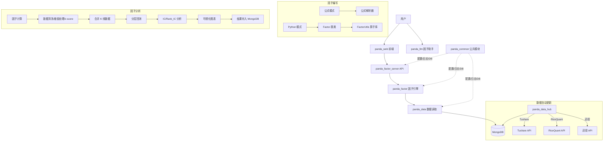

# PandaFactor 项目调研报告

## 1. 项目概述

**PandaFactor** 是一个 A 股量化因子开发与分析平台，由 PandaAI 团队（"量化李不白"）开发。核心定位是让用户快速**编写、计算、检验、可视化**量化因子，降低因子研发门槛。

- **仓库**: [PandaAI-Tech/panda_factor](https://github.com/PandaAI-Tech/panda_factor)
- **许可**: GPL v3
- **总 commit 数**: 55
- **最近提交**: Docker 支持、README 更新
- **数据源**: Tushare (已上线)、RiceQuant (已上线)、迅投 (已上线)、Tqsdk (测试中)、Wind/Choice/QMT (对接中)
- **数据库**: MongoDB（内置 5 年基础数据，每晚 8 点自动清洗更新）
- **网站**: https://www.pandaai.online（含 FactorHub 因子大赛）

## 2. 核心定位与价值主张

PandaFactor 解决的核心痛点：量化因子从想法到验证的**全流程自动化**。

| 传统方式 | PandaFactor 方式 |
|---------|---------------|
| 自行清洗数据、建数据库 | 内置 MongoDB + 自动更新 |
| 手写因子计算代码 | Python/公式双模式，继承 `Factor` 基类即可 |
| 手动做 IC 分析、分层回测 | 一键自动完成全流程 |
| 手动画图 | 自动生成 IC/收益/衰减等 10+ 图表 |
| LLM 辅助因子开发 | 内置 DeepSeek/OpenAI 兼容的因子助手 |

**目标用户**: 个人交易者、量化爱好者、初学因子开发的人群

**口号风格**: "没有一个alpha，一开始就是alpha" — 侧重鼓励和社区氛围

## 3. 项目架构



### 3.1 六大子模块

| 模块 | 路径 | 功能 | 关键文件 |
|------|------|------|---------|
| **panda_common** | 公共模块 | 配置、日志、MongoDB handler、模型定义 | `config.py`, `database_handler.py`, `config.yaml` |
| **panda_data** | 数据读取 | 从 MongoDB 提取行情/因子数据 | `market_data_reader.py`, `factor_reader.py` |
| **panda_data_hub** | 数据更新 | 自动清洗入库（Tushare/RiceQuant/迅投） | `data_scheduler.py`, `*_cleaner.py` |
| **panda_factor** | 因子引擎 | 因子编写、计算、分析、回测、可视化 | `factor_base.py`, `factor_utils.py`, `factor_analysis.py`, `factor.py` |
| **panda_factor_server** | 服务端 API | FastAPI 接口，管理因子提交与分析 | `server.py`, `user_factor_service.py` |
| **panda_llm** | LLM 因子助手 | OpenAI 协议兼容，因子开发专属 system prompt | `llm_service.py`, `chat_service.py` |
| **panda_web** | 前端 | Web 界面 | `main.py` |

### 3.2 核心代码量

- Python 文件: 130 个（含 setup.py、__init__）
- `panda_factor` 模块核心代码: ~5,781 行
- `factor_utils.py` 单文件: ~900 行（算子库是核心）

## 4. 因子开发体系

### 4.1 双模式编写

**Python 模式** — 继承 `Factor` 基类：

```python
class MomentumFactor(Factor):
    def calculate(self, factors):
        close = factors['close']
        returns = (close / DELAY(close, 20)) - 1
        return RANK(returns)
```

- `factors` 是 `FactorDataWrapper`，包裹基础量价数据字典
- 返回值必须是 Series，索引为 `(date, symbol)` 多级索引
- 自动继承 `FactorUtils` 的所有静态方法作为实例方法

**公式模式** — 表达式字符串：

```python
RANK((CLOSE / DELAY(CLOSE, 20)) - 1) * STDDEV((CLOSE / DELAY(CLOSE, 1)) - 1, 20)
```

- 支持中间变量，最后一行作为因子值
- 无编程基础也可使用

### 4.2 FactorDataWrapper 包装层

`factor_wrapper.py` 定义了 `FactorSeries` 和 `FactorDataWrapper`：

- `FactorDataWrapper`: 将量价数据字典包装为可索引对象，支持大小写不敏感访问
- `FactorSeries`: 包装 pd.Series，重载算术/比较运算符，支持 `series[-N]` 做延迟访问

### 4.3 算子库 (FactorUtils) — 项目最核心的资产

`factor_utils.py` 提供三层算子体系：

**Level 0: 核心工具函数**

| 函数 | 说明 |
|------|------|
| `RD(S, D)` | 保留 D 位小数 |
| `REF(S, N)` | 序列整体平移 N 期 |
| `DIFF(S, N)` | 序列差分 |
| `CONST(S)` | 常量序列 |
| `HHV/LLV(S, N)` | N 期最高/最低 |
| `HHVBARS/LLVBARS` | 最高/最低距今周期数 |
| `MA/EMA/SMA/DMA/WMA` | 各类均线 |
| `AVEDEV(S, N)` | 平均绝对偏差 |
| `SLOPE/FORCAST(S, N)` | 线性回归斜率/预测 |
| `LAST(S, A, B)` | 条件在 A~B 期前持续满足 |
| `DECAYLINEAR(S, d)` | 线性衰减加权 |

**Level 1: 应用函数**（基于 Level 0 组合）

`COUNT`, `EVERY`, `EXIST`, `FILTER`, `SUMIF`, `BARSLAST`, `BARSLASTCOUNT`, `BARSSINCEN`, `CROSS`, `LONGCROSS`, `VALUEWHEN`

**Level 2: 技术指标**（基于 Level 0+1 组合）

`MACD`, `KDJ`, `RSI`, `BOLL`, `CCI`, `ATR`, `DMI`, `BBI`, `TAQ`, `KTN`, `TRIX`, `VR`, `EMV`, `DPO`, `BRAR`, `MTM`, `MASS`, `ROC`, `EXPMA`, `OBV`, `MFI`, `ASI`, `PSY`, `BIAS`, `WR`

**截面/时间序列算子**

`RANK`, `RETURNS`, `STDDEV`, `CORRELATION`, `IF`, `DELAY`, `SUM`, `TS_ARGMAX/TS_ARGMIN`, `TS_MEAN/TS_MIN/TS_MAX`, `TS_RANK`, `DECAY_LINEAR`, `VWAP`, `CAP`, `SCALE`, `INDUSTRY_NEUTRALIZE`, `PRODUCT`, `LOG`, `POWER`, `COVARIANCE`, `SIGN`, `SIGNEDPOWER`, `MIN/MAX`, `ABS`, `DELTA`, `ADV`

### 4.4 安全机制 (factor_constants.py + factor_error_handler.py)

- **白名单模式**: 只允许 `numpy`, `pandas`, `math`, `scipy`, `sklearn`, `statsmodels`, `talib`, `datetime` 等模块
- **黑名单**: 禁止 `os`, `subprocess`, `sys`, `eval`, `exec`, `open`, `shutil` 等危险操作
- `FactorConstants.ALLOWED_BUILTINS`: 限定可用的内置函数名
- `FactorConstants.ALLOWED_ATTRIBUTES`: 限定 `np.` / `pd.` 可用的属性

这是用户提交因子代码的沙箱安全策略。

## 5. 因子分析全流程

`factor_analysis.py` 是分析流水线的核心入口：

```mermaid
graph LR
    A[获取 K 线数据] --> B[清洗 K 线]
    B --> C[后复权 + 未来收益计算]
    C --> D[清洗因子数据]
    D -->|极值处理 MAD/3σ| E[z-score 标准化]
    E --> F[合并 K 线 + 因子]
    F --> G[计算滞后收益]
    G --> H[分层分组]
    H --> I[回测计算]
    I --> J[IC/Rank_IC 统计]
    J --> K[图表生成]
    K --> L[结果存入 MongoDB]
```



每个步骤更新 MongoDB 中 task 的 `process_status` (1-9)，支持进度追踪。

### 5.1 因子类 (`factor.py`) 的分析能力

| 方法 | 功能 |
|------|------|
| `cal_df_stock` | 计算各组持仓股票 |
| `cal_turnover_rate` | 计算组间换手率 |
| `start_backtest` | 核心回测：分层收益 + IC + 滞后 IC |
| `cal_df_info1` | 多空分组统计：年化、夏普、回撤、换手率、胜率、IR |
| `cal_df_info2` | IC 统计：IC_mean、Rank_IC、IC_std、IC_IR、t 检验、p-value、单调性 |
| `draw_pct` | 分层累计收益图 + 超额收益图 |
| `draw_ic` | IC 时序图 + IC 密度图 |
| `draw_ic_dacay` | IC 衰减图 + IC 自相关图 |
| `*_to_chart_data` | 所有图表转为 ChartData 对象供前端渲染 |

### 5.2 关键分析指标

**分层收益统计** (df_info):

- 年化收益率 / 超额年化
- 最大回撤 / 超额最大回撤
- 年化波动 / 超额年化波动
- 换手率 / 月度胜率 / 超额月度胜率
- 夏普比率 / 信息比率 / 跟踪误差

**IC 统计** (df_info2):

- IC_mean / Rank_IC / IC_std / IC_IR / IR
- P(IC>0.02) / P(IC<-0.02)
- t 统计量 / p-value
- 单调性（各层年化收益率与排序的相关系数）

**图表类型** (10 种):

1. 分层累计收益图
2. 超额累计收益图
3. IC 时序图
4. Rank IC 时序图
5. IC 密度分布图
6. Rank IC 密度分布图
7. IC 衰减图
8. Rank IC 衰减图
9. IC 自相关图
10. Rank IC 自相关图

## 6. LLM 因子助手 (panda_llm)

`llm_service.py` 实现了一个专用的因子开发助手：

- **协议**: OpenAI API（兼容 DeepSeek、OpenAI 等）
- **配置**: 从 `config.yaml` 读取 `LLM_API_KEY`, `LLM_MODEL`, `LLM_BASE_URL`
- **System Prompt**: 限定只回答因子开发相关问题，强制中文回复
- **知识**: 包含所有内置算子的说明和示例
- **功能**: 代码编写、调试、优化建议
- **接口**: 支持流式和非流式两种模式

关键约束声明："I will not reference functions that don't exist in the system. I will avoid using future data."

## 7. 服务端 API (panda_factor_server)

- **框架**: FastAPI + uvicorn (端口 8001)
- **路由**: `/api/v1/` prefix，`user_factor_pro.py` 提供因子提交/分析接口
- **CORS**: 全开 (`allow_origins=["*"]`)
- **日志**: 文件 + 流式双写 (`panda.log`)
- **异常**: 全局异常处理器
- **请求日志**: 中间件记录每个请求耗时

## 8. 数据体系

### 8.1 数据存储 (MongoDB)

- 数据库名: `panda`
- 主要 collection:
  - `stocks`: 股票基本信息
  - `tasks`: 分析任务状态
  - `user_factors`: 用户因子定义
  - `factor_analysis_results`: 分析结果
  - 行情数据 collection

### 8.2 数据清洗 (panda_data_hub)

各数据源有对应的 cleaner：

| 数据源 | Stock Cleaner | Market Cleaner | Factor Cleaner |
|-------|-------------|---------------|---------------|
| Tushare | `tushare_stocks_cleaner` | `tushare_stock_market_cleaner` | `ts_factor_clean_pro` |
| RiceQuant | `ricequant_stocks_cleaner` | `ricequant_stock_market_cleaner` | `rq_factor_clean_pro` |
| 迅投 | `xtquant_stocks_cleaner` | `xtquant_stock_market_cleaner` | `xt_factor_clean_pro` |

自动更新通过 APScheduler 定时执行（每晚 8 点）。

### 8.3 数据读取 (panda_data)

- `market_data_reader.py`: 通用行情读取
- `partitioned_market_data_reader.py`: 分区优化读取
- `factor_reader.py`: 因子数据读取
- 支持 `panda_data.init()` + `panda_data.get_market_data()` / `panda_data.get_factor_by_name()`

## 9. 依赖生态

| 依赖 | 作用 |
|------|------|
| fastapi + uvicorn | API 服务 |
| flask | 辅助 Web |
| pymongo | MongoDB 驱动 |
| redis | 缓存/队列 |
| pandas + numpy + scipy + statsmodels | 数据处理与统计 |
| matplotlib + seaborn | 图表 |
| rqdatac / tushare / tqsdk | 数据源 SDK |
| apscheduler | 定时任务 |
| openai | LLM 接入 |
| loguru | 日志 |
| pyyaml | 配置文件 |
| chinese_calendar | 中国交易日历 |
| pydantic | 数据校验 |

## 10. Docker 支持

项目提供了 `Dockerfile` 和 `Dockerfile.server`，支持容器化部署。

## 11. 优势与局限

### 11.1 优势

| 优势 | 说明 |
|------|------|
| **全流程闭环** | 从数据 → 因子编写 → 计算 → 分析 → 可视化 → 存储，一站式 |
| **低门槛** | Python/公式双模式，公式模式无需编程 |
| **算子丰富** | 80+ 算子覆盖截面/时序/技术指标三层 |
| **LLM 助手** | 因子开发专用 AI，懂算子库，能写代码 |
| **自动更新** | 多数据源自动清洗入库 |
| **可视化完善** | 10 种标准因子分析图表 |
| **因子持久化** | 计算好的因子自动保存、极速提取 |
| **安全沙箱** | 白名单机制防止恶意代码执行 |
| **社区运营** | 因子大赛、微信群、B 站等社区活跃 |

### 11.2 局限与风险

| 层面 | 问题 | 影响 |
|------|------|------|
| **代码质量** | `factor.py` 1000+ 行单文件；`factor_analysis.py` 状态更新用硬编码数字 | 可维护性差 |
| **架构** | 无统一依赖管理，6 个子模块各自 setup.py，版本不一致 | 安装复杂 |
| **数据依赖** | 必须 MongoDB + 5 年数据预装 | 启动门槛不低 |
| **测试** | requirements 中有 pytest 但未见测试文件 | 无自动化测试保障 |
| **Python 版本** | 未声明限制，但 scipy==1.10.1 暗示 Python 3.8-3.11 | |
| **CORS 全开** | `allow_origins=["*"]` | 安全风险 |
| **日志泄露** | `print()` 与 `logger` 混用，多处 `print(df.tail(5))` | 生产环境不适 |
| **factor_constants bug** | MAD 和 std 极值处理分支都用了 `ext_out_3std_list` | MAD 方法实际执行的是 3σ |
| **commit 活动少** | 仅 55 commits，核心维护似乎集中 | 开源协作不活跃 |
| **GPL v3** | 传染性许可，企业使用需谨慎 | 限制了商业集成 |

### 11.3 代码细节问题

1. **极值处理 bug** (`factor_analysis.py:129-136`): MAD 和 std 分支都调用了 `ext_out_3std_list`，MAD 方法名暗示应调用 `ext_out_mad`，但实际用的也是 3std
2. **FactorSeries.index 假设**: 多处代码假设 Series 是 `(date, symbol)` MultiIndex，但未强制校验
3. **CORRELATION 实现不一致**: `factor_base.py` 用循环逐 symbol 计算，`factor_utils.py` 用 `rolling.corr`，两种路径行为不同
4. **硬编码 task status**: `process_status` 用 1-9 数字，无 enum/常量定义
5. **FactorDataWrapper.print**: `__getitem__` 和 `__setitem__` 里有 `print()` 调试语句，不应保留

## 12. 竞品对比

| 项目 | 定位 | 特点 |
|------|------|------|
| **PandaFactor** | A 股因子一站式平台 | 全流程 + LLM 助手 + 低门槛 |
| **Alphalens** (Quantopian) | 纯因子分析库 | 只做 IC/分层分析，不做因子编写 |
| **gplearn** |遗传编程因子挖掘 | 自动化因子生成，无人工编写 |
| **WorldQuant Alpha101** |因子公式集 | 只有公式定义，无计算/分析框架 |
| **聚宽/米筐 Research** | 云端量化研究 | 商业平台，功能更全但不可离线 |
| **自建因子框架** |团队内部 | 定制化强但开发成本高 |

PandaFactor 的差异化在于：**全流程 + 低门槛 + LLM 辅助 + 社区运营**。它本质是把因子研发从"团队基建"降级到"个人可上手"。

## 13. 适用场景评估

### 推荐使用

- A 股个人量化爱好者入门因子开发
- 快速验证一个因子想法（IC、分层、回测一站完成）
- 因子大赛/教学场景
- 需要离线、自托管数据环境的场景

### 不推荐使用

- 企业级量化团队（代码质量、GPL 许可、无测试）
- 需要高频/实时因子计算（MongoDB 不适合高频查询）
- 多市场（港股/美股/期货）— 仅支持 A 股
- 需要严格回测框架（无滑点模型精细化、无组合优化）

## 14. 与你的知识库的关联

PandaFactor 的核心知识点可拆解为多个 concept 页：

- 因子分析流程（IC、分层、衰减、自相关）→ `5.Finance` 或 `7.AI Summary`
- 量化算子体系（截面/时序/技术指标三层架构）→ `8.Coding` 或 `3.Agent`
- LLM 辅助因子开发（system prompt 设计）→ `3.Agent`
- MongoDB + APScheduler 数据自动更新架构 → `8.Coding`

## 15. 总结评估

| 维度 | 评分 (1-5) | 说明 |
|------|-----------|------|
| 功能完整度 | 4 | 全流程闭环，从编写到分析到存储 |
| 易用性 | 3.5 | 公式模式降低门槛，但 MongoDB 预装仍是门槛 |
| 代码质量 | 2 | 单文件过长、print/log混用、极值处理有 bug |
| 算子丰富度 | 4.5 | 80+ 算子三层体系，覆盖面广 |
| 可维护性 | 2 | 无测试、硬编码状态值、子模块版本不一致 |
| 安全性 | 2.5 | 有白名单沙箱但 CORS 全开、print 泄露数据 |
| 社区活跃度 | 3 | 有大赛和微信群，但 GitHub 协作少 |
| 企业适用 | 1.5 | GPL v3 + 代码质量 + 无测试 |

**总体判断**: PandaFactor 是一个**面向个人量化入门的全流程因子平台**，算子库是其最有价值的部分。代码质量和工程规范有明显短板（无测试、单文件过长、bug），但它解决了"因子从想法到验证"的完整链路问题，对初学者非常有用。如果你是个人量化爱好者想做 A 股因子研究，这是一个不错的起点；如果是企业级使用，需谨慎评估（GPL + 代码质量）。

---

## 参考资料

- [GitHub 仓库](https://github.com/PandaAI-Tech/panda_factor)
- [PandaAI 官网](https://www.pandaai.online)
- [因子大赛报名](https://www.pandaai.online/factorhub/factorcompetition)
- [算子支持文档](https://www.pandaai.online/community/article/72)
- 本地源码: `/home/dr/code/panda_factor/`