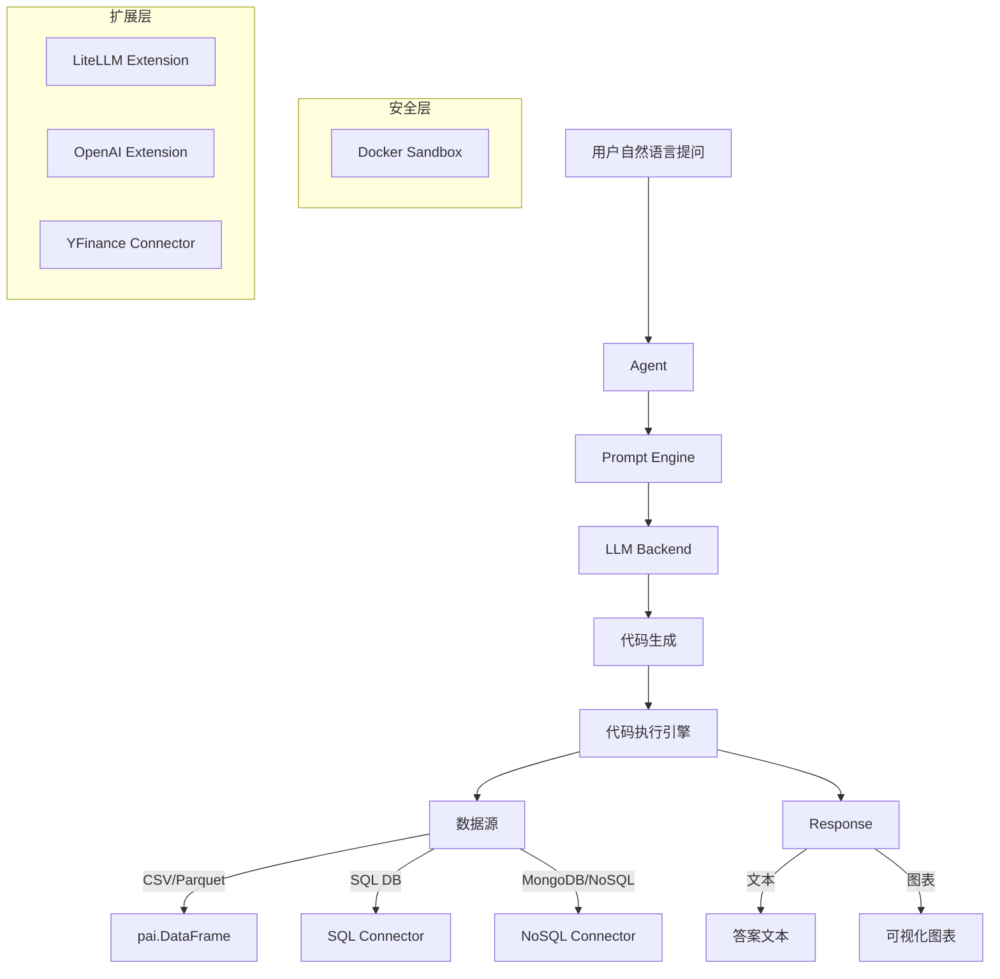

# PandasAI 项目调研报告

## 1. 项目概述

**PandasAI** 是一个 Python 开源库，让用户能用自然语言与数据交互。它将 LLM（大语言模型）与 Pandas DataFrame / SQL 数据库 / CSV / Parquet 等数据源连接，实现"对话式数据分析"。

- **仓库**: [sinaptik-ai/pandas-ai](https://github.com/sinaptik-ai/pandas-ai)
- **版本**: v3.0.0
- **作者**: Gabriele Venturi (gventuri)
- **公司**: Sinaptik AI
- **许可**: MIT (核心) + 自定义许可 (`ee/` 目录)
- **Stars**: 23,475 | **Forks**: 2,301 | **Open Issues**: 17
- **语言**: Python | **创建时间**: 2023-04-22 | **最近推送**: 2025-10-28
- **Topics**: `ai`, `csv`, `data-analysis`, `data-science`, `data-visualization`, `database`, `datalake`, `gpt-4`, `llm`, `pandas`, `sql`, `text-to-sql`

## 2. 核心定位与价值主张

PandasAI 的核心口号是 **"Chat with your database"**。它解决的核心痛点：

| 传统方式 | PandasAI 方式 |
|---------|-------------|
| 写 SQL / Pandas 代码查数据 | 用自然语言提问 |
| 15-30 分钟完成一次分析 | 1-2 分钟完成探索性分析 |
| 需要编程技能 | 非技术用户也能用 |

**目标用户**: 数据分析师、产品经理、业务人员、数据科学家（快速探索阶段）

## 3. 核心架构与模块



### 3.1 主要模块

| 模块 | 路径 | 功能 |
|------|------|------|
| Agent | `pandasai/agent/` | 对话管理、状态跟踪、多轮交互 |
| Core | `pandasai/core/` | Prompt 构建、代码生成、代码执行、响应处理 |
| DataFrame | `pandasai/dataframe/` | 自定义 DataFrame (pai.DataFrame)，支持 `.chat()` |
| Data Loader | `pandasai/data_loader/` | 数据加载 + Semantic Layer Schema |
| LLM | `pandasai/llm/` | LLM 基类 |
| Sandbox | `pandasai/sandbox/` | 安全执行环境 |
| Vector Store | `pandasai/vectorstores/` | RAG 向量存储 |
| Query Builder | `pandasai/query_builders/` | SQL 查询构建 |
| CLI | `pandasai/cli/` | 命令行工具 (`pai` 命令) |
| EE (Enterprise) | `pandasai/ee/` | 企业版功能 (Skills 等) |

### 3.2 扩展系统

| 扩展类型 | 已实现 |
|---------|--------|
| LLM | LiteLLM (统一接口, 支持 100+ 模型)、OpenAI |
| Connector | SQL (MySQL/PostgreSQL/DuckDB/Oracle 等)、YFinance |
| Sandbox | Docker (安全隔离执行) |

扩展采用独立包模式 (`pandasai-litellm`, `pandasai-docker`)，按需安装。

## 4. 关键技术特性

### 4.1 双模式代码生成

- **Python 模式**: 生成 Pandas 代码直接操作 DataFrame
- **SQL 模式**: 通过 DuckDB / SQL 引擎生成 SQL 查询，适合大数据量场景

两种模式由不同的 Prompt Template 驱动 (`generate_python_code.tmpl` vs `generate_python_code_with_sql.tmpl`)。

### 4.2 Semantic Layer (语义层)

v3.0 引入了 **Semantic Layer Schema**，允许用户定义：

- 列的类型、描述、表达式
- 数据源 (Source) 配置
- 关系 (Relation) — 多表关联
- 变换 (Transformation) — fill_na、map_values 等
- 聚合 (group_by)

这让 LLM 能理解数据的语义，而非仅看列名。

### 4.3 安全机制

- **Docker Sandbox**: LLM 生成的代码在 Docker 容器中执行，隔离宿主机
- **隐私保护**: `enforce_privacy: True` 不将原始数据发送给 LLM
- **行数限制**: `max_rows` 控制发送给 LLM 的数据量

### 4.4 数据集管理 (Dataset Layer)

v3.0 提供 `pai.create()`, `pai.load()` 等接口，将数据集组织为 `datasets/org/dataset_name/` 目录结构，每个数据集有 `schema.yaml` + `data.parquet`。

### 4.5 Skills 系统 (EE)

企业版提供 Skills 扩展机制，允许注册自定义技能到 Agent。

## 5. API 设计演进

### v2.x (旧版)

```python
from pandasai import SmartDataframe
df = SmartDataframe(data, config={"llm": llm})
df.chat("question")
```

### v3.0 (当前)

```python
import pandasai as pai
from pandasai_litellm.litellm import LiteLLM

llm = LiteLLM(model="gpt-4.1-mini", api_key="...")
pai.config.set({"llm": llm})

df = pai.read_csv("data.csv")
df.chat("What is the average revenue by region?")
```

**关键变化**:
- 从 `SmartDataframe` → `pai.DataFrame`
- 全局 config 模式 (`pai.config.set()`)
- LiteLLM 作为统一 LLM 接口 (不再内置各家 SDK)
- 新增 Dataset Layer (`create/load`)
- 新增 Semantic Layer Schema

## 6. 依赖生态

| 依赖 | 版本 | 作用 |
|------|------|------|
| pandas | ^2.0.3 | DataFrame 核心 |
| duckdb | ^1.0.0 | SQL 引擎 / 大数据查询 |
| pydantic | ^2.6.4 | Schema 验证 |
| matplotlib | 3.7.1-3.7.x | 图表生成 |
| seaborn | ^0.12.2 | 统计可视化 |
| jinja2 | ^3.1.3 | Prompt 模板 |
| sqlglot | ^25.0.3 | SQL 解析/转换 |
| numpy | ^1.17 | 数值计算 |
| pillow | ^10.1.0 | 图像处理 |
| pyarrow | 14-18.x | Parquet 支持 |

**Python 版本**: 3.8+ ~ 3.11 (不支持 3.12+，这是限制)

## 7. 社区与活跃度

### 7.1 开发节奏

- **最近 commit**: 2025-10-28 (修复文档中的 deprecated 方法)
- **commit 活动**: 项目经历了活跃开发期 (2023-2024 高频)，2025 年以来节奏放缓
- **PR 合并**: 近期多个社区 PR 未合并 (#1876, #1877, #1880, #1882 等)

### 7.2 当前 Open Issues 关键问题

| Issue | 类型 | 状态 |
|-------|------|------|
| #1855 | Bug: `chat()` 不重置代码上下文 (state residue) | PR #1877 已提交但未合并 |
| #1856 | Bug: SQL 模式丢失对话历史 | 已关闭又 reopen |
| #1853 | Bug: `agent.description` 是 dead-code | PR #1876 已提交但未合并 |
| #1886 | Security: Pillow CVE (CVE-2023-50447, CVE-2024-28219) | PR 已提交但未合并 |

**观察**: 项目维护者响应较慢，多个重要 bug fix PR 长期未合并。

### 7.3 社区规模

- 230+ Contributors (contributors.rocks 统计)
- Discord 活跃社区
- PyPI 累计下载量显著 (pepy.tech badge)

## 8. 竞品对比

| 项目 | 核心差异 | Stars |
|------|---------|-------|
| **PandasAI** | Pandas 生态 + Agent 模式 + Semantic Layer | 23.4k |
| **LangChain** | 通用 Agent 框架，数据查询是子功能 | ~90k |
| **Vanna AI** | 专注 text-to-SQL，训练自定义 RAG 模型 | ~8k |
| **DataGPT** | 商业产品，对话式数据分析 | 商业 |
| **ChatGPT Code Interpreter** | 通用代码执行，非专用数据分析 | OpenAI |
| **Marvin** | AI Functions 模式，轻量 | ~4k |

PandasAI 的差异化在于：
1. **原生 Pandas 体验** — `pai.DataFrame` 直接继承 DataFrame 交互模式
2. **Semantic Layer** — v3.0 引入的数据语义定义层
3. **双模式 (Python + SQL)** — 同时支持两种代码生成路径

## 9. 优势与局限

### 9.1 优势

- **用户体验好**: `df.chat("question")` 一行代码即可用
- **多数据源**: CSV / Parquet / SQL / Excel / MongoDB 等
- **可视化**: 自动生成 matplotlib/seaborn 图表
- **多 DataFrame**: 支持跨表查询 (`pai.chat("...", df1, df2)`)
- **安全执行**: Docker Sandbox 防止恶意代码
- **LiteLLM**: 统一接口支持 100+ LLM provider
- **Semantic Layer**: 让 LLM 更好理解数据语义

### 9.2 局限与风险

| 层面 | 问题 | 影响 |
|------|------|------|
| **Python 版本** | 仅支持 3.8-3.11 | 无法用 Python 3.12+ 新特性 |
| **维护节奏** | 2025 年以来开发放缓 | bug fix PR 未及时合并 |
| **复杂查询** | 复杂聚合/多步分析易失败 | 需回退传统 Pandas |
| **准确性** | LLM 生成的代码不一定正确 | 必须人工验证，不适合关键决策 |
| **成本** | 每次查询调用 LLM API | 大量查询时成本高 |
| **SQL 模式 bug** | 对话历史丢失 + description dead-code | 多轮对话不可靠 |
| **State 管理** | `clear_memory` 不完整 | 前轮对话残留影响后续结果 |
| **数据隐私** | 默认模式将数据发送给 LLM | 企业使用需开启 enforce_privacy |

## 10. 适用场景评估

### 推荐使用

- **探索性数据分析 (EDA)**: 快速了解数据分布、趋势
- **非技术用户自助查询**: 业务人员无需写 SQL/Pandas
- **仪表盘 / BI 辅助**: 快速生成可视化
- **数据科学教学**: 让初学者用自然语言开始数据分析

### 不推荐使用

- **生产级数据管道**: LLM 生成代码不确定性太高
- **精确计算场景**: 财务报表、合规计算等需要确定性结果
- **高频查询**: API 成本不可控
- **敏感数据处理**: 除非开启 Docker Sandbox + enforce_privacy

## 11. 发展趋势与 Roadmap

根据文档和 PR 信息，v3.x 的方向：

- **Fine-tuning recipe**: 1 小时脚本微调模型到特定表格/列术语
- **更多 Connector**: Oracle (#1880)、MiniMax LLM (#1882) 等
- **Skills 扩展**: EE 版 Skills 系统完善
- **Cloud 版**: PandasAI Cloud 托管服务
- **自托管 Enterprise**: 企业版部署方案

## 12. 总结评估

| 维度 | 评分 (1-5) | 说明 |
|------|-----------|------|
| 创新性 | 4 | Semantic Layer + 双模式是差异化亮点 |
| 易用性 | 4.5 | API 设计简洁，`df.chat()` 极低门槛 |
| 成熟度 | 3 | v3.0 大重构后仍有 bug，维护节奏放缓 |
| 社区 | 3.5 | 23k stars 但核心维护者响应慢 |
| 可靠性 | 2.5 | SQL 模式关键 bug 未修，LLM 生成代码不可靠 |
| 生态 | 3 | LiteLLM 统一接口好，但 Connector 类型有限 |
| 企业适用 | 2 | 需 EE 版才有 Skills、安全治理等 |

**总体判断**: PandasAI 是一个有创意的项目，在"对话式数据分析"领域有差异化价值。但当前版本 (v3.0) 在多轮对话可靠性、维护节奏、Python 版本兼容性方面存在明显短板。适合个人探索和原型验证，不适合直接用于生产环境。建议关注 v3.2+ 版本的演进，特别是 bug fix 合入和 fine-tuning recipe 的落地。

---

## 参考资料

- [GitHub 仓库](https://github.com/sinaptik-ai/pandas-ai)
- [官方文档](https://docs.pandas-ai.com/)
- [PyPI](https://pypi.org/project/pandasai/)
- [Discord](https://discord.gg/KYKj9F2FRH)
- [PandasAI Cloud](https://pandas-ai.com)