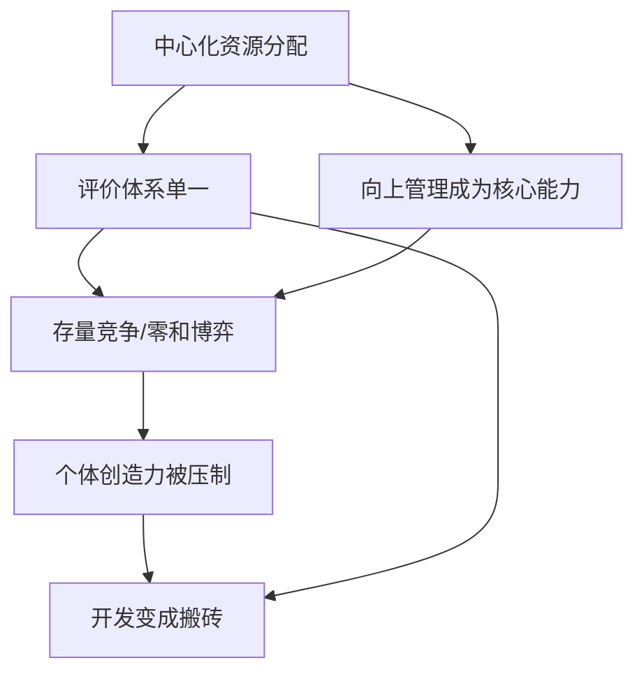
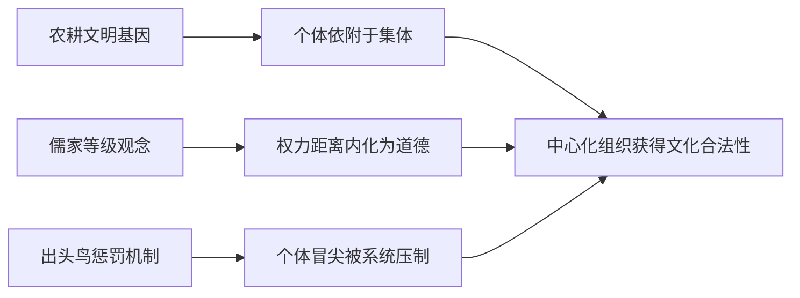
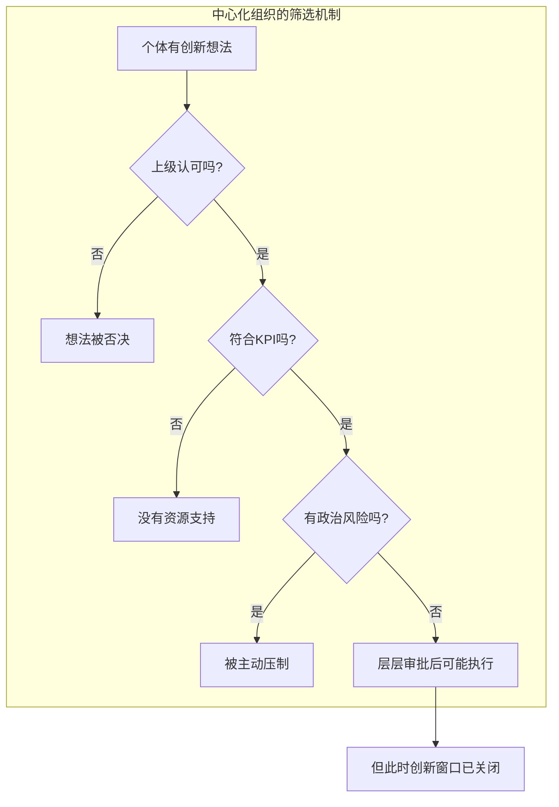

## 核心观点

在中国当开发，跟在工地搬砖没有区别。**文化属性会渗透到每一个中心化的组织里**，而组织再反过来塑造每一个身处其中的人。这不是个体能力的差距，而是文化土壤、组织形态、资源分配方式共同作用的结果。

---

## 一、工地逻辑的深层结构

### 表象

你看那些开发，一个个跟农民一样埋头苦干，有时候为了所谓的 KPI 还互相打压。

### 本质

这不是个别公司的问题，而是**中心化资源分配模式的必然产物**：

- **KPI 驱动、向上管理、存量竞争**——资源从"上面"分下来，不存在增量，只能抢存量。当晋升名额、年终奖池、核心项目都是固定蛋糕时，同事天然是竞争对手，而非合作者。
- **本质上就是工地逻辑**——搬砖有人数，搬少了挨骂，搬多了没人管你搬的是墙还是坟。代码行数、commit 数量、PR 数量成了衡量标准，至于这些代码有没有价值、有没有创造力，不在考核体系里。
- **互相打压的根源**——不是因为人性恶，而是因为**评价体系单一**且**资源分配中心化**。当"领导觉得你好"是唯一上升通道，打压竞争者就成了理性选择。这本质上是一个零和博弈，参见 [[社会运行的双重规则与认知分野]]。
- **中心化组织天然排斥个体创造力**——个体太强 = 组织不可控。一个能独立做出重大贡献的人，在中心化组织里是威胁，不是资产。组织需要的是"可替换的零件"，不是"不可替代的灵魂"。

### 工地逻辑的五个特征



这五个特征形成一个自我强化的闭环：评价体系越单一，向上管理越重要；向上管理越重要，存量竞争越激烈；存量竞争越激烈，个体创造力越没有生存空间。

---

## 二、文化属性的根源

### 农耕文明的深层烙印

中国文化属性的核心，可以追溯到**几千年的农耕文明**。农耕文明有几个关键特征：

1. **定居与依附**——农民依附于土地，土地依附于地主/朝廷。个体没有独立生存的可能，必须依附于更大的集体。这与游牧文明、海洋文明的"逐水草而居"形成鲜明对比。
2. **经验至上**——农业靠天吃饭，经验比创新重要。祖祖辈辈都是这么种的，你凭什么创新？这种思维深刻影响了中国人的风险偏好和对"离经叛道"的态度。
3. **差序格局**——费孝通提出的核心概念。中国人的社会关系是同心圆结构：自己→家人→熟人→陌生人。一切规则因"关系远近"而变化，不存在普适的、对所有人一视同仁的规则。这直接导致了组织中"向上管理"的极端重要性——因为规则不是普适的，领导对你的态度决定了一切。

### 儒家等级观与 [[权力距离信念]]

儒家文化塑造了中国社会极高的**权力距离**（Power Distance）：

- 君君臣臣、父父子子——每个人在等级体系中都有固定位置
- "尊卑有序"被视为天经地义，挑战权威本身是道德缺陷
- 这种文化基因进入组织后，变成了：**领导永远是对的，质疑领导就是不会做人**

这与 [[权力距离信念]] 直接相关——在中国文化中，权力距离不是"问题"，而是"秩序"。当权力距离被内化为道德规范，中心化组织就有了文化合法性。

### "枪打出头鸟"与 [[群嘲-集体嘲讽的社会动力学]]

中国社会对个体冒尖有一种**系统性的压制机制**：

- 木秀于林，风必摧之——这不是警示，是**描述性事实**
- 集体嘲讽（tall poppy syndrome）是中国社会的底层操作系统之一
- 参见 [[群嘲-集体嘲讽的社会动力学]]——当一个人试图超越群体，群体的第一反应是拉他回来，而不是推他上去

这种机制在组织中的表现就是：**你越强，越容易被孤立**。不是因为你做错了什么，而是因为你的存在本身打破了群体的平衡。

### 总结：文化的三重锁



这三重文化锁使得中心化组织不仅"存在"，而且"理所当然"。在中国，很少有人会质疑"为什么组织必须是中心化的"——因为几千年的文化已经让这变成了**默认设置**。

---

## 三、组织形态的必然性

### 为什么中国企业天然走向中心化？

不是中国企业家"喜欢"中心化，而是**文化土壤只允许中心化组织存活**：

1. **信任半径短**——差序格局导致信任只在熟人圈内有效。超出熟人圈，必须用制度（而非信任）来管理。制度 = 层级 = 中心化。
2. **去中心化的前提不存在**——去中心化组织（如开源社区、DAO）依赖于：普适规则、陌生人协作、个体自主性。这些前提在中国文化中恰好是**最薄弱的环节**。
3. **资本结构决定组织形态**——中国互联网公司的资本结构（VIE架构、国资背景、政策依赖）本身就限制了组织可以采用的形态。一个随时可能被政策调整影响的公司，天然倾向于"可控"而非"创新"。

### 中心化组织的宿命：从工具到目的

中心化组织有一个**不可逆的演化方向**：

```
初创期：组织是达成目标的工具
    ↓
成长期：组织开始有了自己的利益
    ↓
成熟期：维护组织本身成为最高目标
    ↓
衰落期：组织利益压倒一切，创新能力枯竭
```

当组织本身成为目的，个体就成了**耗材**。代码写得再好，也只是在维护一个已经失去灵魂的系统。这就是"工地搬砖"的本质——你搬的每一块砖，都在加固一个与你无关的结构。

### [[主体性丧失]]：组织如何吞噬个体

中心化组织通过以下机制系统性剥夺个体的主体性：

1. **目标替代**——你的目标不再是"做出好东西"，而是"完成 KPI"
2. **意义剥离**——你不再理解自己工作的意义，意义由上面定义
3. **能力窄化**——你被训练成只擅长组织内部流程的人，离开组织就失去价值
4. **身份绑定**——你的自我认同与组织绑定，"大厂员工"成了你的身份标签

参见 [[主体性丧失]] 和 [[心智不属于自己]]。

---

## 四、中心化 vs 个体创造力

### 个体创造力需要什么土壤？

个体创造力不是凭空产生的，它需要特定的环境条件：

| 条件 | 中心化组织 | 去中心化环境 |
|------|-----------|-------------|
| 自主性 | 低——任务由上级分配 | 高——个体自主选择方向 |
| 容错空间 | 低——失败影响 KPI 和晋升 | 高——失败是学习的一部分 |
| 资源获取 | 需审批，流程漫长 | 开放获取，低门槛 |
| 评价体系 | 单一——上级评价 | 多元——同行评价、社区认可 |
| 时间尺度 | 短——季度/年度考核 | 长——可以投入数年打磨 |
| 协作模式 | 被分配的团队 | 自发形成的社区 |

### Linus Torvalds 为什么不可能出现在中国？

这不是一个"如果"的问题，而是一个**结构性不可能**的问题。Linus 创造 Linux 的条件在中国一个都不存在：

1. **自主性**——Linus 做 Linux "just for fun"，没有领导批准，没有 KPI 考核。在中国，一个计算机系学生如果不做导师的项目、不做"有用"的东西，会被认为不务正业。
2. **时间尺度**——Linux 从 1991 年开始，至今仍在迭代。中心化组织无法容忍这种"无明确交付日期"的创造。
3. **协作模式**——Linux 靠邮件列表 + 社区信任协作，不需要"审批"。中国文化中，[[信任半径]] 不足以支撑这种陌生人协作。
4. **容错空间**——Linus 最初的技术选择（宏内核而非微内核）被学界嘲笑，但没有"领导"因此否定他。在中国，一个被同行否定的方案基本没有继续的可能。

### 创造力的结构性排斥



真正有创造力的个体，在经过这五层筛选后，要么被淘汰，要么被驯化，要么主动离开。留下的，是**最适合搬砖的人**。

---

## 五、美国模式：个体可以成事

### 案例：一个人改变世界

美国的开发文化中，个体可以成事不是神话，而是**反复发生的事实**：

- **Linus Torvalds**（芬兰裔，但在美国文化生态中繁荣）——一个人造了 Linux 内核，现在跑在几十亿台设备上
- **Guido van Rossum**（荷兰裔）——一个人造了 Python，影响了整个人工智能时代
- **Bjarne Stroustrup**（丹麦裔）——一个人造了 C++，奠定了系统编程的基础
- **Ken Thompson & Dennis Ritchie**——两个人造了 Unix 和 C 语言
- **John Carmack**——一个人写出的游戏引擎推动了整个 3D 游戏产业
- **Satoshi Nakamoto**——一个人（或小团队）造了比特币，创造了一个万亿美元的市场
- **Aaron Swartz**——一个人定义了 RSS 1.0，参与创建 Reddit，推动了开放获取运动

> 注意：这些人的国籍多样，但**他们都在美国的文化生态中实现了创造**。这本身就说明问题不在人种，而在环境。

### 美国模式的关键特征

这些案例背后有共同的支撑条件：

1. **车库文化**——不需要大组织背书，一个人 + 一台电脑就能开始
2. **风险资本**——硅谷的 VC 愿意投"一个人 + 一个想法"，不需要"你有多少资源"
3. **开源生态**——社区评价代替了组织评价，你写的代码好不好，社区说了算，不是领导说了算
4. **对失败的宽容**——破产不是道德污点，是"经验"
5. **知识产权保护**——个体的创造受到法律保护，不会因为"公司比你大"就被拿走

### 这不是"美国人更聪明"

> 注意：Linus 是芬兰人，Guido 是荷兰人，Bjarne 是丹麦人，Satoshi 可能是日本人。他们都不是美国人，但他们都在**美国式的文化生态**中实现了创造。

这说明：**不是人种，不是国籍，是文化土壤**。把这些人放在中国大厂里，他们大概率也会变成搬砖工。

---

## 六、中美差异的深层结构

### 系统对比

| 维度 | 中国 | 美国 |
|------|------|------|
| **文化根源** | 农耕文明 → 定居依附 → 集体主义 | 清教徒移民 → 自我依赖 → 个人主义 |
| **权力距离** | 极高（儒家等级） | 低（平等主义传统） |
| **信任模式** | 差序格局（熟人信任） | 普适信任（制度信任） |
| **组织形态** | 中心化层级制 | 网络化扁平化 |
| **资源分配** | 自上而下，审批制 | 市场驱动，VC 制 |
| **失败容忍** | 低（失败 = 丢脸） | 高（失败 = 经验） |
| **评价体系** | 上级评价 | 多元评价（市场/社区/同行） |
| **时间尺度** | 短期（季度/年度） | 长期（可以亏损多年） |
| **个体定位** | 组织中的螺丝钉 | 独立的价值创造者 |

### 深层差异：规则 vs 关系

中国和美国最根本的差异不在表面，而在**社会运行的底层操作系统**：

- **中国：关系驱动**——规则因关系而变化。有关系的，规则是保护伞；没关系的，规则是绊脚石。这导致个体的核心能力不是"创造力"，而是"搞关系"。参见 [[社会运行的双重规则与认知分野]]。
- **美国：规则驱动**——规则对所有人（理论上）一视同仁。这降低了个体的博弈成本——你不用花 80% 的精力去"搞关系"，可以花 80% 的精力去"搞创造"。

### 教育体系的差异

- **中国**：应试教育 → 标准答案思维 → 服从权威 → 创造力被系统性修剪
- **美国**：通识教育 → 批判性思维 → 质疑权威 → 创造力被鼓励（至少理论上是这样）

一个从小被训练"只有一个正确答案"的人，很难在成年后突然学会"创造从未存在过的东西"。

---

## 七、历史案例与数据

### 开源世界的国籍分布

以 GitHub 2024 年最活跃的开源项目贡献者国籍分布为例：

| 排名 | 国家 | 活跃贡献者占比 |
|------|------|---------------|
| 1 | 美国 | ~32% |
| 2 | 德国 | ~8% |
| 3 | 英国 | ~7% |
| 4 | 印度 | ~6% |
| 5 | 中国 | ~5% |

中国贡献者数量庞大（绝对值），但**人均产出和影响力**远低于美国。大量中国贡献者是"在公司的要求下"做开源（KPI 驱动），而非"出于热爱"做开源（兴趣驱动）。

### 中国大厂的开源悖论

中国大厂近年来大量"拥抱开源"：

- 阿里巴巴：Ant Design、Dubbo、Nacos
- 腾讯：TDesign、Tinker
- 字节跳动：Monoio、CloudWeGo

但问题在于：

1. **开源是 PR 行为**——大多数项目是"公司战略"而非"个体创造"，开源是为了招聘、品牌、生态锁定
2. **核心决策权不开放**——项目名义上是开源的，实际上由公司内部团队控制，社区贡献者没有实质影响力
3. **个体被隐去**——项目属于公司，不鼓励个体 Committer 建立个人品牌。你贡献再多，也是"某公司员工"而非"某项目的核心维护者"

真正有影响力的开源项目，几乎都是**个体主导**的：Linux (Linus)、Python (Guido)、Git (Linus)、React (Jordan Walke)、Vue.js (尤雨溪)。注意 Vue.js 是中国人创造的，但尤雨溪不是在中国的中心化组织里做的——他是在 Google 和作为独立开发者完成的。

### 中国有没有例外？

有，但极少，且都有共同特征——**脱离中心化组织**：

- **尤雨溪（Vue.js）**——在 Google 工作期间开始，后作为独立开发者全职维护
- **阮一峰**——独立技术写作者，不属于任何大厂
- **云风（吴云洋）**——网易工作期间创造了诸多开源项目，但他本人是极其罕见的"被组织容忍的个体强者"

这些例外的共同点：他们要么脱离了中心化组织，要么在组织中获得了**极其罕见的自由度**（通常是创始人级别的信任）。这不是"制度"的胜利，而是"例外"的幸存。

---

## 八、在中心化组织中保持个体创造力

### 现实约束

大多数中国开发者无法"不干了去搞开源"，现实约束是真实的：
- 房贷、家庭、社会期待
- 离开大厂意味着失去平台和资源
- 独立开发在中国缺乏成熟的变现路径

### 可能的策略

以下策略不是"解决方案"，而是**在约束下的生存策略**：

1. **建立外部身份**——在组织之外建立自己的技术品牌（博客、开源项目、技术社区）。不是为了"跳槽"，而是为了**不把自我价值完全绑定在组织评价上**。
2. **保护自己的 20% 时间**——Google 的 20% 时间政策（虽然已被削弱）的核心逻辑是：给个体留出不被 KPI 占据的时间。即使公司不给，自己也要留。
3. **选择"有创造空间"的组织**——不是所有组织都是工地。有些组织（通常是早期创业公司、小而美的团队）仍然允许个体创造力。识别它们，选择它们。
4. **培养"可迁移能力"**——避免能力窄化。不要只学公司内部工具和流程，要保持对行业通用技术的敏感度。参见 [[主权个人——信息时代的底层生存逻辑]]。
5. **接受"双轨人生"**——白天搬砖，晚上创造。历史上很多重要作品都是在"业余时间"完成的。这不是理想方案，但在现实约束下是最可行的。
6. **识别真正的机会窗口**——AI 时代降低了个体创造的门槛。一个人 + AI 可以做的事情，正在指数级增长。当搬砖的门槛越来越低（AI 也能搬砖），创造力的溢价会越来越高。

### 最重要的心态

> **不要等待组织给你创造空间。组织不会给。** 空间是自己挣出来的——在你完成 KPI 之后，在没人注意的角落，在周末的早晨。这不是消极的逃避，而是**积极的生存策略**。

---

## 思考

- 为什么中国出不了 Linus、Guido 这样的人？**不是能力问题，是土壤问题。**
- 文化土壤允许个体成事吗？**目前不允许，但土壤是可以改变的。** 文化属性不是永恒不变的"国民性"，而是可以随着经济结构、技术变革、代际更替而演进。
- 在中心化组织里，怎么保持个体创造力？**不要把鸡蛋放在一个篮子里。** 组织是你的收入来源，不是你的全部身份。你的创造力需要另一个出口。
- AI 时代会改变这个格局吗？**会。** 当一个人 + AI 可以做到过去需要一个团队才能做到的事情，中心化组织的价值会下降。组织的"规模优势"在 AI 时代可能变成"规模包袱"。这可能是中国开发者摆脱"工地搬砖"命运的最大变量。
- 但要注意：**工具不能替代文化土壤**。AI 给了你更强的能力，但如果你的思维仍然被"标准答案"、"上级认可"、"KPI 对齐"所框定，AI 只是让你搬砖更快，而不是让你不再搬砖。

---

## 相关笔记

- [[权力距离信念]] — 文化如何塑造组织中的权力认知
- [[主体性丧失]] — 组织如何系统性剥夺个体的主体性
- [[社会运行的双重规则与认知分野]] — 关系社会 vs 规则社会
- [[高认知穷人-清醒地看到自己为什么穷]] — 看得懂但跳不出
- [[主权个人——信息时代的底层生存逻辑]] — 个体如何在信息时代建立独立性
- [[心智不属于自己]] — 文化如何塑造你的思维框架
- [[群嘲-集体嘲讽的社会动力学]] — 中国社会对个体冒尖的压制机制
- [[农夫与猎人]] — 两种不同的生存策略和思维模式
- [[三种退化]] — 在系统中能力退化的三种形式
- [[思维防火墙]] — 被植入的思维限制
- [[人类为何渴望被统治-演化与心理机制分析]] — 为什么人们接受中心化
- [[被贬低的力量-从刘靖康穿短裤被怼说起]] — 中国社会对个体表达的压制
- [[为什么那些被看低的人，却能颠覆命运？]] — 体系外的突围