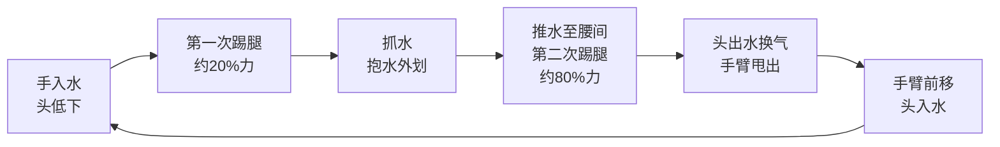
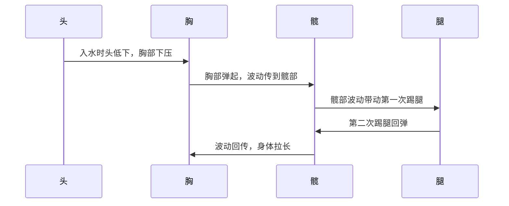

## 核心动作循环

蝶泳一个完整动作周期包含：**一次划水 + 两次踢腿 + 一次换气**。

## 两次踢腿分工

| 踢腿 | 时机 | 力度 | 功能 |
|:---|:---|:---|:---|
| 第一次踢腿 | 手入水后、头低下瞬间 | 约 20%（柔和有控制） | 维持髋部高位、保持身体波浪节奏、防止入水后下沉 |
| 第二次踢腿 | 手推至腰间、头即将出水时 | 约 80%（爆发有力） | 主要推进力，配合推水产生最大加速度 |

### 为什么第二次踢腿是主力

蝶泳与自由泳不同——蝶泳没有持续打腿，两次踢腿之间有明显停顿。第二次踢腿时：

- 手臂正处于推水末段（力量最大）
- 身体波浪刚好到髋部，踢腿与躯干波动同步
- 头即将出水换气，踢腿提供向上的升力

这三个因素叠加，使第二次踢腿成为整个动作循环的**爆发点**。

## 手臂动作

### 水下阶段（推进）

1. **入水**：双手与肩同宽或略宽，拇指先入水，手臂前伸
2. **抓水/抱水**：手臂向外划开，手掌向外旋转，形成"Y"字形抱水
3. **推水**：手掌转向内后方向，沿身体两侧用力推至大腿根部

> 推水阶段是手臂产生推进力的主要阶段——从胸下到腰间这一段。

### 空中阶段（恢复）

- 手臂从大腿侧甩出水面
- **低而平**地前移，肩带放松
- 手臂在空中伸直，迅速回到入水位置

> ⚠️ 常见错误：手臂在空中抬得过高（浪费体力）或手臂弯曲前移（增加风阻）

## 身体波浪（海豚式波动）

蝶泳的核心不是"用力游"，而是**用身体的波浪去游**。

### 关键要点

- 波动从头部开始，经过胸、髋、腿依次传递
- **髋部是波动的中枢**——髋位高则阻力小，髋位塌则全垮
- 第一次踢腿的目的就是**防止入水后髋部下塌**

## 换气时机

- 头在第二次踢腿和推水结束时自然抬起
- 下巴贴水面，不要抬头过高
- 手臂前移时头迅速入水，恢复流线型

> ⚠️ 常见错误：抬头过高导致髋部下塌，破坏身体波浪

## 常见问题与纠正

| 问题 | 原因 | 纠正 |
|:---|:---|:---|
| 髋部下塌、游得很沉 | 第一次踢腿太弱或时机不对 | 入水后立刻轻踢维持髋位 |
| 换气困难、抬头费力 | 第二次踢腿力度不够 | 加强推水+踢腿的同步爆发 |
| 手臂前移砸水 | 前移时手臂太紧或太高 | 低平前移，肩带放松 |
| 游不远就累 | 两次踢腿力度均等 | 第一次放松，把体力留给第二次 |

## 训练建议

1. **海豚式波动练习**：不划手，只做身体波浪+踢腿，感受波动传递
2. **单臂蝶泳**：一侧手臂不动，另一侧做完整划水，专注踢腿配合
3. **2-2-2 练习**：2次左臂 + 2次右臂 + 2次完整蝶泳，逐步过渡
4. **短距离冲刺**：25m 蝶泳 x N，专注第二次踢腿的爆发力